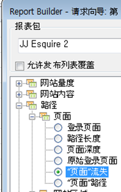
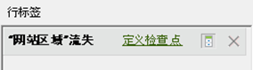

# 使用请求向导过滤流失报告

描述如何将过滤器应用到流失报表的步骤。

此示例显示了页面流失报表。

1. In Adobe Report Builder, click **[!UICONTROL Create]** to open the Request Wizard.
1. 选择适当的报表包。
1. In the tree view on the left, select **[!UICONTROL Paths]** &gt; **[!UICONTROL Page]** &gt; **[!UICONTROL Page Fallout]**.

   

1. Configure the appropriate [date ranges](../../../../analyze/report-builder/data-requests/configuring-report-dates/custom-calendar.md).
1. Click **[!UICONTROL Next]**.
1. In Step 2 of the Wizard, under **[!UICONTROL Row Labels]**, click the **[!UICONTROL Define Checkpoints]** link. （在流失报表中，您始终必须定义路径元素，这与预先应用了模式的路径报表不同。）

   

1. Select the **[!UICONTROL Filter]** option.

1. In the **[!UICONTROL Define Site Section Fallout Checkpoints]** dialog, define checkpoints from a range of cells or from a list. Then click **[!UICONTROL OK]**.
1. 确定从单元格范围还是列表进行选择。
1. If you select from a list, click **[!UICONTROL Add]** to select checkpoints to add to the fallout path. 您可以定义 3 至 8 个检查点。(Search for available elements by clicking **[!UICONTROL More]**.)

   For more information on refining the filter, see [Filter Dimensions](../../../../analyze/report-builder/layout/c-filter-dimensions/filter-dimensions.md#concept_9C0518E2CF604AADA97DDBB1B4ECAAF8). 1. Move **[!UICONTROL Available Elements]** from the left column to the right by selecting them and clicking the orange arrow.
1. Click **[!UICONTROL OK]** three times, then click **[!UICONTROL Finish]**.

   现在应当刷新了报表。