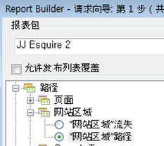
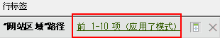
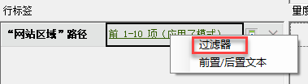
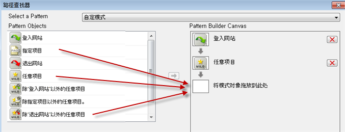
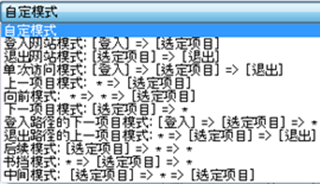
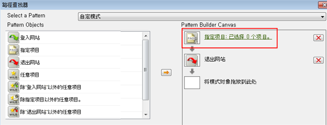
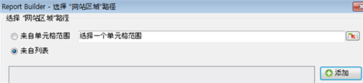
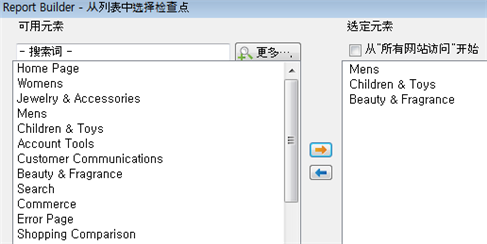

# 使用请求向导过滤路径报告

描述如何将过滤器应用到路径报表的步骤。

此示例使用“网站区域路径”。

1. In Adobe Report Builder, click **[!UICONTROL Create]** to open the Request Wizard.
1. 选择适当的报表包。
1. In the tree view on the left, select **[!UICONTROL Paths]** &gt; **[!UICONTROL Site Sections]** &gt; **[!UICONTROL Site Section Paths]**.

   

1. 指定适当的日期。
1. Click **[!UICONTROL Next]**.
1. In Step 2 of the Wizard, under **[!UICONTROL Row Labels]**, click the **[!UICONTROL Top 1-10 (pattern applied)]** link. 默认情况下，路径报表中已应用模式。

   

1. Select the **[!UICONTROL Filter]** option.

   

1. In the **[!UICONTROL Define 'Site Section Paths' Path Pattern]** dialog, you can specify
   1. 第一个报表的起始排名。
   1. 要在此报表中显示的条目数。
1. Click **[!UICONTROL Edit]** to define a path pattern.
1. If you want a custom pattern, drag and drop any **[!UICONTROL Pattern Objects]** from the list on the left into the **[!UICONTROL Pattern Build Canvas]** on the right.

   

1. You can also select a predefined pattern from the **[!UICONTROL Select a Pattern]** drop-down list and modify it. 下面显示了可用的模式：

   

   其中，某些模式是特定于 Report Builder 的：登入路径的下一项目模式、退出路径的上一项目模式、下一项目模式。
1. 要编辑预定义模式，请执行以下操作：
   1. 选择模式。For example, select the **[!UICONTROL Exited Site Pattern]**: 

   1. 现在，您应当定义用户在退出前所遵循的网站区域路径。Click **[!UICONTROL Specific Item(s): 0 selected]**. 您可以通过从单元格范围（如果您在编辑现有请求）或区域列表进行选择来定义此路径。
   1. To select from a range of cells from a previous request, select **[!UICONTROL From range of cells]** and click the cell selector icon. Then pick the cells from the report. 

   1. To select from a list of site sections, select **[!UICONTROL From list]** and click **[!UICONTROL Add]**.
   1. Move elements from the **[!UICONTROL Available Elements]** column to the **[!UICONTROL Selected Elements]** column by selecting them and clicking the orange arrow. The click **[!UICONTROL OK]**. 

   1. To save the pattern you just established, click **[!UICONTROL Save]**.
   1. Click **[!UICONTROL OK]** three times and then click **[!UICONTROL Finish]**. 此时会生成过滤的路径请求。
