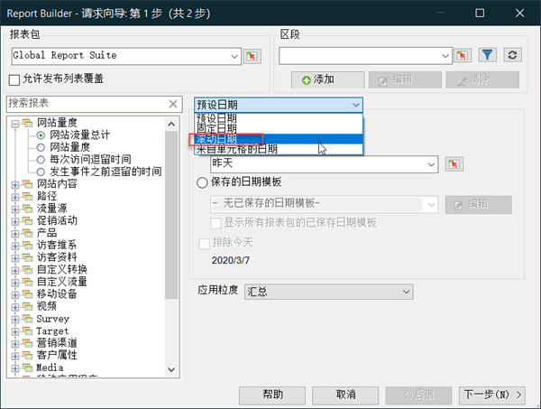
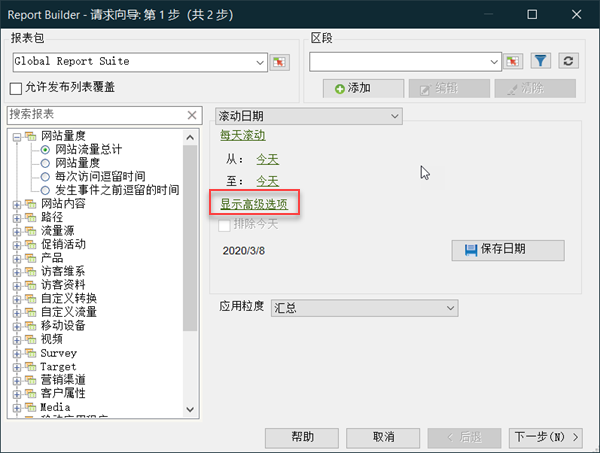
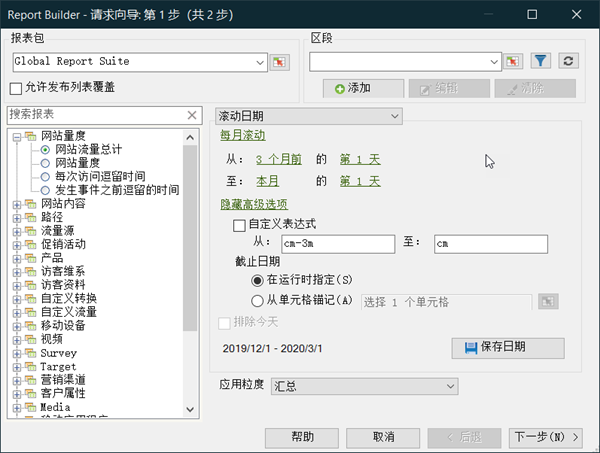
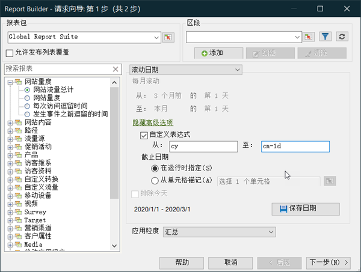

# 自定义的日期表达式 - 概述

您可以通过构建自定义表达式指定复杂的日期范围。

我们建议您在构建表达式时参考日历，以正确指定周数和天数。 Excel 具有一些内置函数，您可以通过这些函数计算两个日期之间的天数、工作日数、月数和年数。您可以在公式中使用这些函数计算其他间隔，如周数和季度数。

**启用自定义表达式**

这是一个使用的示例 **[!UICONTROL Rolling Dates]**。

1. 在上 [!UICONTROL Request Wizard: Step 1]选择，而不是使 **[!UICONTROL Preset Dates]**&#x200B;用 **[!UICONTROL Rolling Dates]**。

   

1. 切换为每周、每月、每季或每年滚动。 注意以下选项的变化情况。
1. 有关更多自定义选项，请单击 **[!UICONTROL Show Advanced Options]**。

   

1. 例如，如果将上述日期从三个月前的第一天更改为每月滚动，则提前选项部分中的日期会自行更新，以反映以下情况：

   

1. 启用 **[!UICONTROL Customize Expression]**. 通过选择下方的选 **[!UICONTROL Rolling Dates]**&#x200B;项，您可以轻松查看自定义日期表达式的语法。

   

   您可以使用高级选项来混合和匹配自定义日期表达式。 例如，如果要查看从年初到上个完整月末的数据，可以输入以下内容： `From: cy``To: cm-1d`. 在向导中，这些日期显示为2020年1月1日-1月31日。
