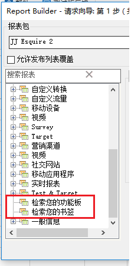

# 导入书签报告和仪表板缩图报表

现在，所有标为书签的报表和功能板报表都作为维度列在“请求向导”的第 1 步中，并且可以导入为 Report Builder 请求。

当您选择标为书签的报表时，“请求向导”会填充用于定义此标为书签的报表的所有维度和量度。日期范围、粒度和选定的区段也会根据选定的书签进行更新。。

下面显示了“请求向导”的第 1 步是如何显示功能板及其缩图报表的：

When you click **[!UICONTROL Retrieve your Dashboards]** or **[!UICONTROL Retrieve your Bookmarks]**, your existing dashboard and/or bookmark data is retrieved and pasted in the worksheet.

>[!NOTE]
>
>在Report Builder中，可用仪表板和书签的列表仅限用户，以及适用于您在向导步骤中选择的报告套件的书签。与此相反，在市场营销 Reports &amp; Analytics 中，您可以访问所有可用的书签和功能板，无论这些功能板和书签使用哪些报表包。

>[!NOTE]
>
>只导入数据，因此如果书签包含图表，或者仪表板缩图报表只包含图表，则只导入用于填充图表的数据。

通过导入功能板缩图报表（或书签）创建请求后，该请求将会关联到缩图报表（或书签）的主要维度。因此，如果您编辑请求，树视图将不再选择功能板缩图报表树视图节点（或书签节点）：而是会选择其主要维度。

导入的小书签会将报表包、选定的区段、维度和选定的量度相应设置为 Reports &amp; Analytics 书签中显示的相同参数。

>[!IMPORTANT]
>
>日期范围将设置为同一日期范围，但将设置为静态日期范围-即使此日期范围是Reports和Analytics书签中的滚动日期范围。

