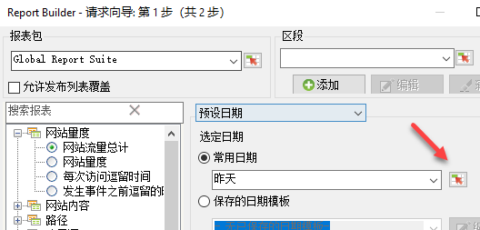
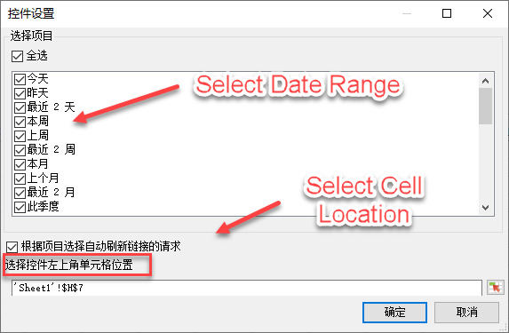
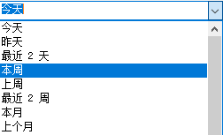
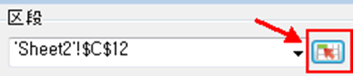
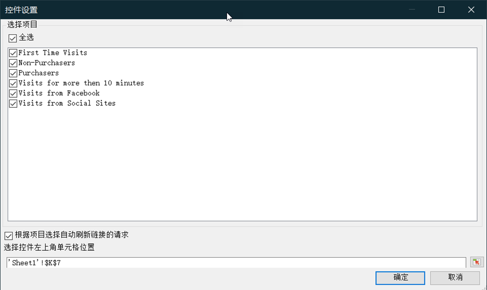
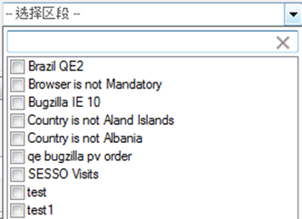

# 交互式控件

交互控件允许您直接从工作表编辑一个或多个请求的区段和日期范围。这使您可以更加灵活地更新 Report Builder 请求。

交互控件是为了响应分析人员创建工作簿并将这些工作簿与营销组织共享的常见工作流程而创建的。使用交互控件，营销人员无需深入了解 Report Builder 的工作方式，便能够修改和刷新请求。（请注意，要刷新请求，工作簿收件人必须为 Report Builder 用户。）这些控件在计划工作簿内部使用。目前提供了两种类型的交互控件：

* 滚动日期范围
* 客户群

>[!IMPORTANT]
>
>必须安装Report Builder v5.0才能使用交互式控件。&gt;
>* 如果您在 Windows 上运行 Microsoft Excel，但是运行较低版本的 Report Builder，或者如果您未安装 Report Builder：您可以更改交互控件中的值，但这不会刷新关联的请求，也不会更新请求的关联参数。
>* 如果您在 Mac 上运行 Excel，则更改控件中的值将会导致显示以下消息：“找不到宏‘Adobe.ReportBuilder.Bridge.FormControlClick.Event’。”
>

>[!IMPORTANT]
>
>请勿窜改控件名称。（要查看名称，请将焦点置于控件上，此时控件名称便会出现在左上角 Excel 网格的正上方。）

## Implement interactive date range control {#section_39B228F2D2C44985863D31424C953280}

1. 在“请求向导”的第 1 步中，例如，选择&#x200B;**[!UICONTROL 页面]报表。**
1. 在&#x200B;**[!UICONTROL 常用日期]**&#x200B;下拉列表的旁边，单击&#x200B;**控件设置]图标：[!UICONTROL **

   

1. 在“控件设置”对话框中，选择要在交互控件中显示的所有日期范围项。此外，指定控件的左上角单元格位置。

   

1. 请注意“根据项目选择自动刷新链接的请求”选项。

   * 如果选中，则会刷新使用此控件的所有请求。
   * 如果不选中，则会更新关联的请求参数，而不会刷新请求。

1. Click **[!UICONTROL OK]**. 控件出现在您指定的单元格位置：

   

1. 现在，您可以更改日期范围，请求将根据此日期范围进行刷新。
1. 您还可以复制请求，然后单击鼠标右键以使用两个“粘贴请求”选项之一：

   * **[!UICONTROL 粘贴请求]** &gt; **[!UICONTROL 使用绝对输入单元格]**。这意味着复制的请求将指向与原始请求相同的交互日期范围控件。

   * **[!UICONTROL 粘贴请求]**&gt; **[!UICONTROL 使用相对输入单元格]**。这意味着复制的请求将指向其自身的控件。

      >[!NOTE]
      >
      >您可以使用本机Microsoft Excel剪切/复制/粘贴控制功能。Report Builder 会自动识别新添加的控件。

## Implement interactive segment control {#section_5003D3F724644280BF1BCD6E1B0CB784}

实施交互区段控件与实施日期范围控件类似。

1. 在“请求向导”的第 1 步中，在&#x200B;**[!UICONTROL 区段]下拉列表旁边选择“区段控件设置”图标：**

   

1. 在“区段控件设置”对话框中，选择要包含在下拉列表中的区段。此外，指定控件的左上角单元格位置。

   

1. 现在，新的交互控件将显示在工作簿中：

   

