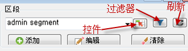
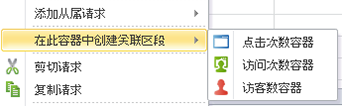
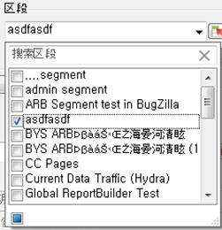
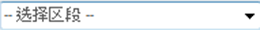
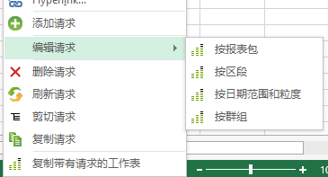

# 管理区段

如何在 Report Builder 中添加、编辑、应用和过滤 Adobe Analytics 区段。

Report Builder 在“请求向导”的第 1 步中具有一个分段面板，在该面板中您可以创建和管理区段。

## 添加或编辑区段 {#section_B2BC136F9A53498D90C7C2ECC5DB892B}

>[!NOTE]
>
>要添加或编辑区段，Report Builder区段界面在Microsoft Internet Explorer窗口中启动Analytics区段生成器。您的 Report Builder 会话将保持活动状态。此操作不支持使用 Internet Explorer 以外的浏览器。

1. In the segment panel of Step 1 of the Request Wizard, click **[!UICONTROL Add]**.
1. 将启动一个 Internet Explorer 窗口，其中可打开 Analytics 区段生成器界面。有关如何构建区段的信息，请参阅 [https://marketing.adobe.com/resources/help/zh_CN/analytics/segment/](https://marketing.adobe.com/resources/help/en_US/analytics/segment/)。
1. 定义并保存区段后，返回至“请求向导”。
1. 单击“刷新”图标以刷新区段列表。

>[!IMPORTANT]
>
>此列表将被缓存，新创建的区段将不会显示，除非您进行刷新。

## 创建关联区段 {#section_6DD2C663B2854469AA1075438F907678}

您可能希望将特定的报表维度组合转换为区段。您可以从 Report Builder 界面创建这些区段。例如，从页面请求输出中选择一些页面，然后基于这些值创建一个区段。

1. 选择要转换为区段的报表输出项。
1. 单击鼠标右键以选择&#x200B;**[!UICONTROL 在此容器中创建关联区段]，并指定适当的容器（点击次数容器、访问次数容器、访客数容器）。**

   

   有关容器的详细信息，请参阅[分段指南](https://marketing.adobe.com/resources/help/en_US/analytics/segment/)。

1. 此时将在 Internet Explorer 中启动区段生成器用户界面。区段生成器用户界面将使用您指定的容器和过滤器进行初始化。
1. 向区段添加名称和描述后，保存该区段。
1. 返回至 Report Builder，并单击“刷新”图标以刷新区段列表。
1. 现在，您可以应用此区段。

## 搜索和应用区段 {#section_CACA269B48E94CFD91C2D5A15E9C77B7}

此区段列表中会显示在 Reports &amp; Analytics、Ad Hoc Analysis、Report Builder 或 Data Warehouse 中创建的所有区段。To refresh the list, click the Refresh icon ( .

您可以将一个或多个区段应用到任意给定请求。这包括连续区段。

1. Go to the **[!UICONTROL Segment]** drop-down list and click the small down arrow in the **[!UICONTROL Choose Segment]**box to display all the segments.

   

1. 选中要应用的区段。

>[!NOTE]
>
>无论您是管理员还是非管理员，在Report Builder中，您都只能看到您拥有和已与您共享的区段。（在市场营销 Reports &amp; Analytics 用户界面中，管理员可以查看组织中的所有区段）。

## 过滤区段 {#section_376E986D3E684999A7CDB08E53854159}

通过单击“过滤器”图标 **，可以**&#x200B;过滤

可用的过滤器包括：

| 过滤器名称 | 描述 |
|---|---|
| 标签 | 允许您过滤具有特定标签的区段。请注意，“标签”过滤器使用 AND 运算符。如果您选中两个标签，右侧窗格会显示&#x200B;**同时**&#x200B;具有这两个标签的区段。 |
| 所有者 | 允许您按所有者过滤区段。请注意，“所有者”过滤器使用 OR 运算符。如果您选中两个所有者，右侧窗格会显示&#x200B;**每个**&#x200B;所有者拥有的区段。 |
| 其他过滤器 &gt; 仅&#x200B;*报表包名称* | If you apply the "Only *report suite name*" filter in the Segment Builder in [!DNL marketing reports & analytics], and then display the Advanced Filter in [!DNL report builder], the Advanced filter will display the segment for the selected report suite only. |
| “其他过滤器”&gt;“我的” | 显示您拥有的所有区段。 |
| 其他过滤器 &gt; 已与我共享 | 显示他人与您共享的所有区段。 |
| 其他过滤器 &gt; 收藏夹 | 显示您标记为收藏项目的所有区段。 |
| 其他过滤器 &gt; 已批准 | 显示所有正式批准的区段。 |

## 将区段控件添加到工作簿 {#section_E3E5149A8464441FA5445A98DBD520AC}

通过添加区段控件，您可以从工作簿中切换区段，而不必转至“请求向导”。

1. Click the Control icon ( ) next to the segment drop-down.

   

1. Check all the segments that you want to appear in the segment control, or check **[!UICONTROL Select All]**.
1. Notice the option **[!UICONTROL Automatically refresh linked requests upon item selection]**.

   * 如果选中，则会刷新使用此控件的所有请求。
   * 如果不选中，则会更新关联的请求参数，而不会刷新请求。

1. 指定区段控件的左上角单元格位置。
1. 单击&#x200B;**[!UICONTROL 确定]，此时区段控件便会出现在指定的位置。**

   

## 刷新区段列表 {#section_22E4A86789444B4A998532396B476EFB}

Any time you add a new segment or edit an existing one, you should click the Refresh icon (  to refresh the cached list of segments.

## 跨请求管理区段 {#section_C3D63FCBE1A94369A319243313B03C93}

在 v5.4 之前，Report Builder 允许用户更改多个请求中的区段。但是，此流程始终会替换现有区段。希望向每个请求添加一个新区段的用户无法执行此操作，因为添加区段将会删除之前已分配给每个请求的区段集。

Report Builder 5.4 允许您添加、删除和替换区段，以及替换多个请求内的所有区段：

1. 在工作簿中选择多个请求。
1. Right-click and select **[!UICONTROL Edit Requests]** &gt; **[!UICONTROL By Segment]**.

   

1. 在“编辑群组”对话框中，选择四个选项之一：

   | 选项 | 描述 |
   |---|---|
   | 添加区段 | 允许您选择一个或多个区段，以添加到当前区段列表中。 |
   | 替换区段 | 允许您选择要用一个或多个区段替换的区段。 |
   | 将所有区段替换为 | 允许您选择要替换当前区段的一个或多个区段。 |
   | 删除区段 | 允许您从请求中删除区段。 |

