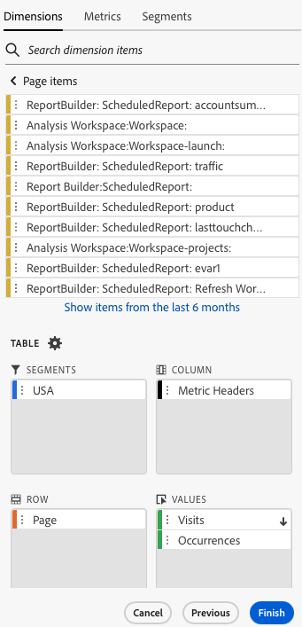

# 过滤器维度

默认情况下，表中的每个维度项最多返回该维度的 10 项。

要更改为每个维度返回的维度项，请执行以下操作：

1. 在数据块中选择单元格。

1. 在面板中选择&#x200B;**[!UICONTROL 编辑]** **[!UICONTROL 编辑数据块]**。

1. 选择&#x200B;**[!UICONTROL 下一步]**&#x200B;以显示&#x200B;**[!UICONTROL 维度]**&#x200B;选项卡。

1. 选择表中组件名称旁边的。

   {zoomable="yes"}

1. 在弹出菜单中选择&#x200B;**[!UICONTROL 筛选器维度]**&#x200B;以显示&#x200B;**[!UICONTROL 筛选器维度]**&#x200B;窗格。

1. 选择&#x200B;**最受欢迎**&#x200B;或&#x200B;**特定**&#x200B;作为&#x200B;**[!UICONTROL 类型]**。

   {zoomable="yes"}

1. 根据所选的[筛选器类型](#filter-type)选择相应的选项。

1. 选择&#x200B;**[!UICONTROL 应用]**&#x200B;以添加筛选器。

1. Report Builder 显示通知以确认添加了过滤器。

要显示应用的过滤器，请将光标悬停在维度上。应用了筛选器的维度在维度名称旁显示筛选器图标。

## 更改过滤器和排序顺序

用于筛选和排序数据块的量度旁边出现或。 箭头的方向指示量度是按升序还是降序排序。

要更改排序顺序，请执行以下操作：

- 选择指标旁边的或以切换排序顺序。

要更改用于筛选和排序数据块的量度，请执行以下操作：

1. 在表生成器中，将光标悬停在所需的量度组件旁以显示其他选项。

2. 选择作为首选量度。

   {zoomable="yes"}

## 过滤器类型

有两种筛选维度项的方法：[最受欢迎](#most-popular)和[特定](#specific-filtering)

### **[!UICONTROL 最受欢迎]**

**[!UICONTROL 最受欢迎]**&#x200B;选项允许您根据量度值动态筛选维度项。 “最受欢迎”量度根据量度值返回排名最高的维度项目。 默认情况下列出前 10 个维度项，按照添加到数据块的第一个量度排序。

{zoomable="yes"}

#### “页面”和“行”选项

使用&#x200B;**[!UICONTROL 页面]**&#x200B;和&#x200B;**[!UICONTROL 行]**&#x200B;字段将数据划分为顺序组或页面。通过此功能，您可以将排名的行值而不是最高的值提取到报表中。 并且对于提取超过50,000行限制的数据特别有用。

页面的默认值为`1`，行的默认值为`10`。 这些默认值表示每页有10行数据。 页面 1 返回前 10 项，页面 2 返回接下来的 10 项，以此类推。

下表列出了页面和行值的示例以及生成的输出。

| 页面 | 行 | 输出 |
|------|--------|----------------------|
| 1 | 10 | 前 10 项 |
| 2 | 10 | 项 11-20 |
| 1 | 100 | 前 100 项 |
| 2 | 100 | 项 101-200 |
| 2 | 50,000 | 项 50,001-100,000 |

下表列出了页面和行的最小值和最大值。

|       | 最小值 | 最大值 |
|-------|---------------:|---------------:|
| 起始页 | 1 | 5000万 |
| 行数 | 1 | 50,000 |

#### 包括“无值”

在Customer Journey Analytics中，某些维度收集&#x200B;*没有值*&#x200B;条目。 **[!UICONTROL 包括“无值”]**&#x200B;设置允许您从报表中排除这些值。 例如，您可以创建分类，例如基于产品 SKU 键的产品名称分类。如果特定产品SKU未设置其特定产品名称分类，则其产品名称值设置为&#x200B;*无值*。

默认情况下选中&#x200B;**[!UICONTROL 包括“无值”]**。 取消选择此选项可排除无值的条目。

#### 按条件筛选

可以根据是满足所有条件还是满足任意条件来筛选维度项。

要设置筛选条件，请执行以下操作：

1. 从运算符下拉菜单中选择运算符。 默认情况下，已选择&#x200B;**[!UICONTROL 包含短语]**

   {zoomable="yes"}

1. 输入搜索词。

1. 选择 **[!UICONTROL 添加行]**&#x200B;以确认选择并添加另一个条件项。

1. 选择以删除条件项。

最多可以包括 10 个条件项。

### **[!UICONTROL 特定]**

**[!UICONTROL 特定]**&#x200B;选项允许您为每个维度创建固定的维度项列表。 使用&#x200B;**[!UICONTROL 特定]**&#x200B;筛选类型指定要包括在过滤器中的确切维度项。可从列表或从单元格范围中选择项。

{zoomable="yes"}

#### 从列表

1. 选择&#x200B;**[!UICONTROL 从列表]**&#x200B;选项以搜索和选择维度项。

   选择&#x200B;**从列表**&#x200B;选项时，**[!UICONTROL Dimension项]**&#x200B;列表中填充了按事件数排序的维度项。

   {zoomable="yes"}

1. 在 **[!UICONTROL _添加项_]**&#x200B;中输入搜索词以搜索列表。

1. 要搜索未包含在过去90天数据中的项，请选择&#x200B;**[!UICONTROL 显示过去6个月的项]**&#x200B;以扩展搜索。 加载了过去6个月的数据后，Report Builder将链接更新为&#x200B;**[!UICONTROL 显示过去18个月的项]**。

1. 若要从&#x200B;**[!UICONTROL 选定项]**&#x200B;列表中删除项，请选择。

1. 要移动&#x200B;**[!UICONTROL 选定项]**&#x200B;列表中的项，请拖放该项或选择以显示上下文菜单并从移动选项中选择。

1. 选择&#x200B;**[!UICONTROL 应用]**。

Report Builder 更新列表以显示所应用的特定筛选。

#### 从单元格范围

选择&#x200B;**从单元格范围**&#x200B;选项可选择包含要匹配的维度项列表的单元格范围。

{zoomable="yes"}

选择单元格范围时，请考虑以下限制：

- 范围必须至少有一个单元格。
- 范围不能超过 50,000 个单元格。
- 范围必须位于单个无中断的行或列中。

选区可以包含空单元格或者其值与特定维度项不匹配的单元格。

### 快速筛选维度

要过滤当前未应用过滤器的维度，请执行以下操作：

1. 为维度选择。 例如，**[!UICONTROL 交互渠道]**。

1. 双击要添加到筛选器的维度项。 或者，选择一个或多个维度项，并将所选内容拖放到 **[!UICONTROL Row]**&#x200B;部分中。

   {zoomable="yes"}

<!--

By default, each dimension item in the table returns the top 10 items for that dimension.

To change the dimension items returned for each dimension

1. Click **[!UICONTROL Manage]** and select a data block from the list.

   

1. Click **[!UICONTROL Edit data block]** in the COMMANDS panel.

1. Click **[!UICONTROL Next]** to display the Dimensions tab.

1. Click the **...** icon next to a component name in the table.

    

1. Select **[!UICONTROL Filter dimension]** in the pop-up menu to display the **[!UICONTROL Filter dimension]** pane.

1. Select **[!UICONTROL Most popular]** or **[!UICONTROL Specific]**.

    

1. Select appropriate options based on the filter type chosen.

1. Click **[!UICONTROL Apply]** to add the filter.

    Report Builder displays a notification to confirm the added filter.

To display applied filters, hover over a dimension. Dimensions with applied filters display a filter icon to the right of the Dimension name.

## Filter Type

There are two ways to filter dimension items: Most popular and Specific.

## Most popular

The [!UICONTROL Most popular] option allows you to dynamically filter dimension items based on metric values. [!UICONTROL Most popular] filtering returns the highest ranked dimension items based on metric values. By default, the first 10 dimensions items are listed, sorted by the first metric added to the data block.

 

### Page and Rows options

Use the **Page** and **Rows** fields to divide data into sequential groups or pages. This allows you to pull ranked row values other than the top-most values into your report. This feature is especially useful for pulling data beyond the 50,000 row limit.

#### Page and Rows defaults

- Page = 1
- Rows = 10

The Page and Rows default settings identify that each page has 10 rows of data. Page 1 returns the top 10 items, page 2 returns the next 10 items, and so on.

The table below lists examples of page and row values and the resulting output.

| Page | Row    | Output               |
|------|--------|----------------------|
| 1    | 10     | Top 10 items         |
| 2    | 10     | Items 11-20          |
| 1    | 100    | Top 100 items        |
| 2    | 100    | Items 101-200        |
| 2    | 50,000 | Items 50,001-100,000 |

#### Minimum and maximum values

- Starting page: Min = 1, Max: 50 million
- Number of rows: Min = 1, Max: 50,000

### Include "No value"

In Adobe Analytics, some dimensions collect a "no value" entry. This filter allows you to exclude these values from reports. For example, you can create a classification such as the Product Name classification based on the Product SKU key. If a specific product SKU has not been set up with its specific Product Name classification, its Product Name value is set to "no value".

Include "**No value**" is selected by default. Deselect this option to exclude entries with no value.

### Filter by Criteria

You can filter dimension items based on whether all criteria are met or if any criteria are met.

To set filtering criteria

1. Select an operator from the drop-down list.

    

1. Enter a value into the search field.

1. Click **[!UICONTROL Add row]** to confirm the selection and add another criteria item.

1. Click the delete icon to remove a criteria item.

    You can include up to 10 criteria items.

### Change the filter and sort order

An arrow appears next to the metric used to filter and sort the data block. The direction of the arrow indicates whether the metric is sorted greatest to least or least to greatest.

To change the sort direction, click the arrow next to the metric.

To change the metric used to filter and sort the data block,

1. Hover over the desired metric component in the Table builder to display additional options.

2. Click the arrow on the preferred metric.

   

## Specific filtering

The Specific option allows you to create a fixed list of dimension items for each dimension. Use the **[!UICONTROL Specific]** filtering type to specify the exact dimension items to include in your filter. You can select items from a list or from a range of cells.

### From list

1. Select the **[!UICONTROL From list]** option to search for and select dimension items.

    When you select the **[!UICONTROL From list]** option, the list is populated with dimension items with the most events first.

    

    The **[!UICONTROL Available items]** list is ordered from dimension items with the most events to those with the least.

1. Enter a search term in the **[!UICONTROL Add item]** field to search the list.

1. To search for an item not included in the last 90 days of data, click **[!UICONTROL Show items for the last 6 months]** to extend the search.

    

    After data from the past 6 months loads, Report Builder updates the link to **[!UICONTROL Show items for last 18 months]**.

1. Select a dimension item.

    Selected dimension items are automatically added to the **[!UICONTROL Selected items]** list.

    

    To delete an item from the list, click the delete icon to remove the item from the list.

    To move an item in the list, drag and drop the item or click ... to display the move menu.

    

1. Click **[!UICONTROL Apply]**

    Report Builder updates the list to show the specific filtering you applied.

### From range of cells

Select the **[!UICONTROL From range of cells]** option to choose a range of cell that contain the list of dimensions items to match.

 

When you select a range of cells, consider the following restrictions:

- The range must have at least one cell.
- The range can't have more than 50,000 cells.
- The range must be in a single uninterrupted row, or column.

Your selection can contain empty cells or cells with values that don't match with a specific dimension item.

### From the Dimensions tab in the Table builder

From the **[!UICONTROL Dimensions]** tab, click the chevron icon next to a dimension name to view the list of dimension items.

 

You can drag and drop items onto the **[!UICONTROL Table]** or double-click an item name to add it to the **[!UICONTROL Table]** builder.

-->