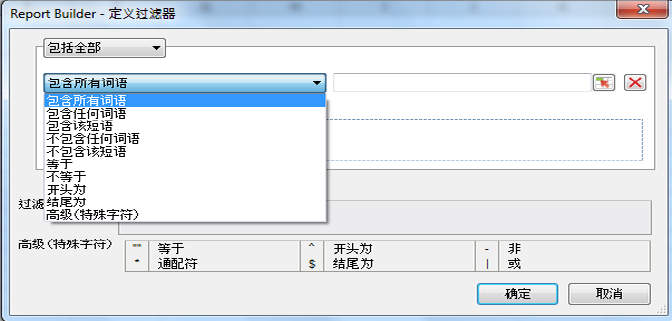

# 过滤器维度概述

您可以过滤添加到“行标签”网格中的维度。过滤器可减少请求返回的数据，并且可以从引导布局或自定义布局中进行应用。通过引导布局配置维度过滤时，您还可以指定单元格中的条目数。

选定过滤器表单会基于 Report Builder 请求中选择的元素和量度来填充。

## Define filter - values and special characters {#section_15840216A4044C40974945FAA435AD93}

Information about filters in the **[!UICONTROL Most Popular Filter]** &gt; **[!UICONTROL Define Filter]** panel.

以下各表提供了有关过滤器的示例和信息：

<table id="table_8AC3A26FF02143DBA949B30F2A46CF11"> 
 <thead> 
  <tr> 
   <th colname="col1" class="entry"> 过滤器 </th> 
   <th colname="col02" class="entry"> 描述 </th> 
   <th colname="col2" class="entry"> 示例过滤器 </th> 
   <th colname="col3" class="entry"> 匹配结果 </th> 
  </tr> 
 </thead>
 <tbody> 
  <tr> 
   <td colname="col1"> 
包含所有词语 
 </td> 
   <td colname="col02"> 
包含按任意顺序排列的每个以空格分隔的值。 
 </td> 
   <td colname="col2"> 
a b c 
 </td> 
   <td colname="col3"> 
匹配 b cand b a c，依此类推。 
 </td> 
  </tr> 
  <tr> 
   <td colname="col1"> 
包含任何词语 
 </td> 
   <td colname="col02"> 
包含其中至少一个过滤器（以空格分隔）。 
 </td> 
   <td colname="col2"> 
A B C 
 </td> 
   <td colname="col3"> 
匹配 A1、  B2、  C3，但不  是D4。 
 </td> 
  </tr> 
  <tr> 
   <td colname="col1"> 
包含该短语 
 </td> 
   <td colname="col02"> 
包含搜索过滤器，同时也可能包含其他词语。 
 </td> 
   <td colname="col2"> 
abc 
 </td> 
   <td colname="col3"> 
匹配 abc 和  abc def。 
 </td> 
  </tr> 
  <tr> 
   <td colname="col1"> 
不包含任何词语 
 </td> 
   <td colname="col02"> 
返回所有不包含输入值的结果。 
 </td> 
   <td colname="col2"> 
a b c 
 </td> 
   <td colname="col3"> 
匹配 d e f 但not  c d e f。 
 </td> 
  </tr> 
  <tr> 
   <td colname="col1"> 
不包含该短语 
 </td> 
   <td colname="col02"> 
返回所有不包含该短语的结果。 
 </td> 
   <td colname="col2"> 
abc 
 </td> 
   <td colname="col3"> 
不包含 abc、  abc def 和匹配  def 
 </td> 
  </tr> 
  <tr> 
   <td colname="col1"> 
等于 
 </td> 
   <td colname="col02"> 
返回精确匹配结果。 
 </td> 
   <td colname="col2"> 
abc 
 </td> 
   <td colname="col3"> 
  abc is return，no other. 
 </td> 
  </tr> 
  <tr> 
   <td colname="col1"> 
不等于 
 </td> 
   <td colname="col02"> 
返回任何与输入值不精确匹配的结果。 
 </td> 
   <td colname="col2"> 
a 
 </td> 
   <td colname="col3"> 
不匹配  a. 
 
Matches  a b c. 
 
Matches  abc. 
 </td> 
  </tr> 
  <tr> 
   <td colname="col1"> 
开始于 
 </td> 
   <td colname="col02"> 
返回以特定值开头的结果。 
 </td> 
   <td colname="col2"> 
abc 
 </td> 
   <td colname="col3"> 
匹配 abcd 但不  是abc 
 </td> 
  </tr> 
  <tr> 
   <td colname="col1"> 
结束于 
 </td> 
   <td colname="col02"> 
返回以特定值结尾的结果。 
 </td> 
   <td colname="col2"> 
xyz 
 </td> 
   <td colname="col3"> 
匹配 wxyz 但not  wxyz0 
 </td> 
  </tr> 
  <tr> 
   <td colname="col1"> 
高级（特殊字符） 
 </td> 
   <td colname="col02"> 
允许您使用以下正则表达式字符： 
 
 <code> "", ^, -, *, $, | </code> 
 </td> 
   <td colname="col2"> 
"^Home*Page$" | sports 
 </td> 
   <td colname="col3"> 
 它定义以 主页，然后查找零个或多个字符，然后以  页面结尾。 
 
Also, any page with  sports in it. 
 
以下是一些匹配示例： 
 
    <ul id="ul_72D76C5AFEAF405E8A0E4E3C604D10AE"> 
     <li id="li_4D490059B667450DA8A0103167C7B391">HomePage </li> 
     <li id="li_1351619156274092AEB2771D882AD357">Home（其他字符）Page </li> 
     <li id="li_940EAA99A8CF49308E8471065EB317B1">Home sports </li> 
     <li id="li_50A895F14A454BE9BF06EE0F07F99B3B">sports Page </li> 
     <li id="li_F3CE0D07941D4C2485D2DE0B73E00677">sports </li> 
     <li id="li_E84C15C061824A5D922D9900392F2996">xyz sports abc </li> 
    </ul> </td> 
  </tr> 
 </tbody> 
</table>

<table id="table_8BBB06C8860745DEA41B39673699DC0F"> 
 <thead> 
  <tr> 
   <th colname="col1" class="entry"> 特殊字符 </th> 
   <th colname="col2" class="entry"> 用途 </th> 
   <th colname="col3" class="entry"> 注释 </th> 
  </tr> 
 </thead>
 <tbody> 
  <tr> 
   <td colname="col1"> " " </td> 
   <td colname="col2"> 等于 </td> 
   <td colname="col3"> 
不会转义，除非引号未配对使用。例如， 17“显示 不是短语。 
 </td> 
  </tr> 
  <tr> 
   <td colname="col1"> * </td> 
   <td colname="col2"> 通配符 </td> 
   <td colname="col3"> 
与正则表达式中使用的星号用途相同。 
 </td> 
  </tr> 
  <tr> 
   <td colname="col1"> ^ </td> 
   <td colname="col2"> 开始于 </td> 
   <td colname="col3"> </td> 
  </tr> 
  <tr> 
   <td colname="col1"> $ </td> 
   <td colname="col2"> 结束于 </td> 
   <td colname="col3"> </td> 
  </tr> 
  <tr> 
   <td colname="col1"> - </td> 
   <td colname="col2"> 非 </td> 
   <td colname="col3"> </td> 
  </tr> 
  <tr> 
   <td colname="col1"> | </td> 
   <td colname="col2"> 或 </td> 
   <td colname="col3"> 
仅在 高级(特殊字符) 筛选器。 
 </td> 
  </tr> 
 </tbody> 
</table>