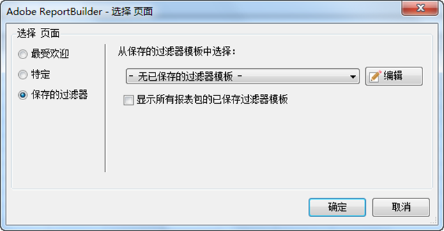

# 保存的过滤器

您可以在 Report Builder 中保存过滤器或其他参数，然后将其用于其他工作表或工作簿中。这些参数会保存到 Analytics，以确保可供其他计算机上的其他 Report Builder 用户使用。

您可以在创建过滤器时通过“[!UICONTROL 选择页面]”窗体保存过滤器。有关此过程的示例，请参阅 [特定过滤器](../../../../analyze/report-builder/layout/c-filter-dimensions/t-specific-filters.md#task_AD91873FD9FF4399A62EAB495DFFA12C).

