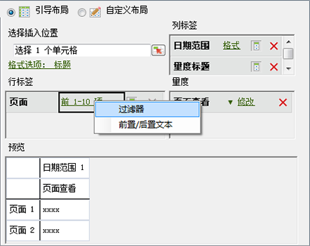
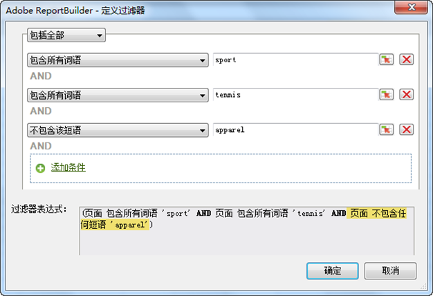
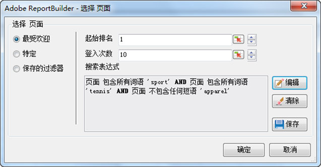

# 最流行的过滤功能

使用 AND/OR 搜索表达式通过布尔逻辑配置的排名和条件过滤器。

Most Popular filters are expression filters that you configure using Boolean logic with AND/OR conditions, such as [!UICONTROL Page does not contain]*`<product name>`* with conditions or groups of conditions like [!UICONTROL Includes All], [!UICONTROL Includes Any], or [!UICONTROL Excludes All]. You can [save](../../../../analyze/report-builder/layout/c-filter-dimensions/saved-filters.md#concept_562AC2C5628247909FBA5E1867BB6AE5) these expressions for other request in this workbook, or in other workbooks.

**创建最受欢迎的过滤器**

1. 创建或编辑请求，然后进入“[!UICONTROL 请求向导: 第 2 步]”。

   

1. On the [!UICONTROL Request Wizard: Step 2], click the link next to the dimension in the grid, then choose **[!UICONTROL Filter]**.
1. 在“[!UICONTROL 选择页面]**”窗体中，启用[!UICONTROL 最受欢迎]**，然后配置下列选项：

   **起始排名：**&#x200B;维度的起始排名。默认排名 1 表示在报告的数据列表中排在第 1 位的项目。例如，对于维度“[!UICONTROL 页面]”，起始标记 1 表示您网站中请求次数最多的单个页面。您可以指定 10 或另一值作为起始排名单元格，这样会生成将 10 作为最高排名的报表。量度按降序排列，以便系统首先在列表中报告具有最高活动频率的行项目。如果您在一个请求中需要超过 50,000 个页面名称，但是您已要求系统报告数千个页面的数据，则可以复制请求并更改起始排名，以在 50,000 个数据块中检索相应数据。

   **条目数：**（仅[!UICONTROL 引导布局]）定义针对特定量度在某日期范围内报告的项目数。一些量度可能会列出上百个条目，而其他量度可能只显示几个条目。例如，对于维度“[!UICONTROL 网站展示位置]”，条目数 25 表示报表显示 25 个访问次数最多的页面。

   您可以通过箭头更改工作表中第一个数据点的“[!UICONTROL 起始排名]”和“[!UICONTROL 条目数]”。默认情况下，“[!UICONTROL 起始排名]”设置为 1，“[!UICONTROL 条目数]”设置为 10。对于某些量度，这些值可在 1（下限）到 50,000（上限）之间调整。每个量度都有自己的“[!UICONTROL 条目数]”上限。不允许在这些字段中使用负值或 0。如果为“[!UICONTROL 起始排名]”选择 15，为“[!UICONTROL 条目数]”选择 10，则该量度的数据请求返回 10 个访问次数最多的页面，并且第 1 个访问次数最多的页面是特定日期范围内在列表中排在第 15 位的页面。系统按降序列出排名介于 15 至 25 之间的所有请求次数最多的页面。

   >[!NOTE]
   >
   >将过滤器应用于现有请求会导致显示的数据发生更改。假定将前 10 个[!UICONTROL 页面]映射到单元格 $A$1 至 $A$10，并且“[!UICONTROL 起始排名]”为 1，“[!UICONTROL 条目数]”为 10。如果将“[!UICONTROL 起始排名]”的值更改为 1，将“[!UICONTROL 条目数]”的值更改为 3，则先前填充单元格 $A$4 至 $A$10 的数据将不再显示。

1. To create a search expression, click **[!UICONTROL Add]**.

   

1. 在“[!UICONTROL 定义过滤器]”窗体中，根据您的需要配置条件。

   ：允许您查找在单元格值中定义的条件。

   **添加条件：**向表达式中添加条件。可添加的条件数没有限制。

1. Click **[!UICONTROL OK]**.

   

1. 在“[!UICONTROL 选择页面]**”窗体上，单击[!UICONTROL 保存]**&#x200B;以保存表达式。
1. Click **[!UICONTROL OK]**.
