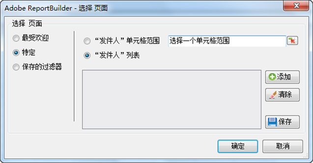

# 特定滤镜

应用特定维度词的过滤器。

通过创建符合严密条件的过滤器，您可以搜索特定维度项目。For example, you can create the following type of filter: page in [!DNL homepage.htm], [!DNL contact_us.html], [!DNL corporate_info.html].

**创建特定过滤器**

1. 创建或编辑请求，然后进入“[!UICONTROL 请求向导: 第 2 步]”。

   

1. On the [!UICONTROL Request Wizard: Step 2], click the link next to the dimension in the grid, then choose **[!UICONTROL Filter]**.

   

1. Enable **[!UICONTROL Specific]**, then enable one of the following options:

   * **来自单元格范围：**&#x200B;允许您从单元格中选择数据。您可以选择︰
   * **范围中的所有单元格：**&#x200B;允许您映射范围中的每个单元格。描述性文本解释您必须选择多少组单元格。要映射多组单元格，请在按住 Ctrl 键的同时进行连续选择。如果必须映射的范围仅包含一个单元格，那么只能使用此选项。
   * **范围的第 1 个单元格：**&#x200B;只需选择范围中左上角的单元格，然后选择数据方向即可。此外，如果请求包含多个时段，则需要选择时段的方向并选择是否要在两个时段之间跳过一定的单元格数。
   * **来自列表：**&#x200B;允许您从列表中选择数据，您可以向列表中添加数据。
1. If you enable **[!UICONTROL From List]**, select any available listed items or click **[!UICONTROL Add]**.

   单击&#x200B;**[!UICONTROL 添加]**&#x200B;时，“[!UICONTROL 从列表中选择]”窗体会显示当前请求日期范围的可用维度值列表（仅限前 10,000 项）。您可以在这些项目中搜索，或者单击&#x200B;**[!UICONTROL 更多...]**，这样会显示[!UICONTROL 搜索窗体]，以便您可以创建更详细的维度搜索条件。
1. On the [!UICONTROL Select From List], click **[!UICONTROL OK]**.
1. On the [!UICONTROL Choose Page] form, save your Specific filter if you want, then click **[!UICONTROL OK]**.
