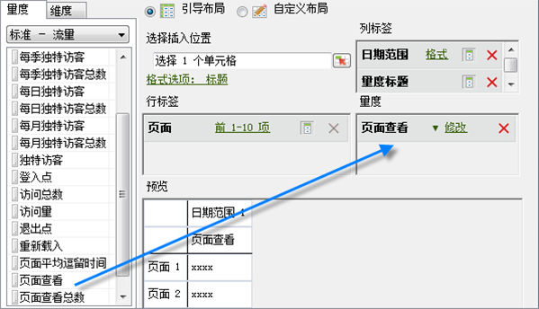
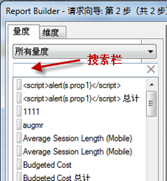
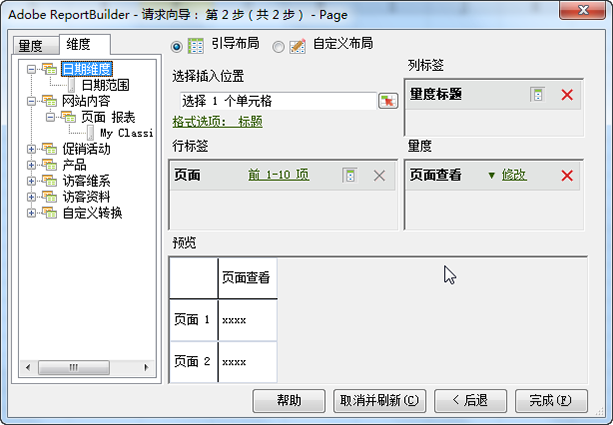

# 添加指标和维度

向请求添加量度和维度的步骤。

1. [在请求向导](../../../../analyze/report-builder/data-requests/data-requests.md#concept_E14C1E6B63C44D02BF8D80021B4B0F89) 上创建 [!UICONTROL 数据请求：第步，]然后单击“ **[!UICONTROL 下一]**&#x200B;步”。
1. 在“[!UICONTROL 请求向导: 第 2 步]”上，双击量度，或者将量度拖动到所需的位置。

   

   添加量度时，不会将其从“[!UICONTROL 量度]”选项卡中删除，因为您可能会在一个请求中多次显示量度。例如，除了每个值外，您还可以显示量度小计。然而，每次添加或删除维度时，可用量度列表都会发生变化。

   只能将量度添加到“[!UICONTROL 量度]”布局部分。量度会作为“[!UICONTROL 量度标题]”添加到“[!UICONTROL 列标签]”布局。如果将“[!UICONTROL 量度标题]”从“[!UICONTROL 列布局]”移到“[!UICONTROL 行布局]”，它将在该处显示并用作划分的量度。

   请注意，在“量度”选项卡中的“量度”列表正上方会显示搜索栏。

   

   请牢记这一点：

   * 当输入搜索词时，列表将自动更新，只显示标签与搜索词相匹配的量度。
   * 匹配不区分大小写，等同于“包含”搜索。
   * 不支持全词搜索或其他特定的搜索标记（“以...开始”、“以...结束”、“和”、“或”等）。

      如果退出请求向导（即单击“完成”或“取消”）、返回请求向导的第 1 步或者更改量度类别，那么搜索词将被清除。

      在下列情况中，搜索词不会被清除：

   * 从列表中拖放（或双击）一个量度项目，以将其添加到引导布局/自定义布局量度面板。
   * 从引导布局/自定义布局量度面板删除一个量度项目。
   * 单击“维度”选项卡，然后返回“量度”选项卡。
   * 在退出时调用其他子表单（模式或非模式）将会返回到请求向导的第 2 步。这些表单的示例包括

      * 维度过滤器表单
      * 日期范围格式表单
      * 格式选项表单
      * 前置-后置文本表单
      * 输出范围位置表单

1. （可选）要按量度排列请求，只需单击量度标签即可。
1. 使用与添加量度相同的方法添加维度。

在“[!UICONTROL 维度]”选项卡上，系统会显示划分的各个维度，或者是在第 1 步和报表包配置时选择的任何基本报表的分类。将维度放到布局网格时，会将其从树视图中删除，并重新计算剩余可用维度的列表。

“[!UICONTROL 日期]”维度由系统自动添加。可用日期维度会因在“[!UICONTROL 请求向导: 第 1 步]”中选择的粒度而有所不同。(有效值为：

    *小时
    *天
    *周
    *月
    *年
    *日期范围(未指定粒度时)

1. Modify metrics and dimensions by configuring [format options](../../../../analyze/report-builder/layout/t-format-display-headers.md#task_45C7C4938C2C47FCB02634A1248AA831) and filters.
1. Click **[!UICONTROL Finish]**.
在以下示例中，维度与“[!UICONTROL 页面]”量度相关联。其中，[!UICONTROL 反向链接域]维度会在[!UICONTROL 页面]和[!UICONTROL 反向链接域]之间创建划分报表。[!UICONTROL 维度]选项卡会进行更新，以便只显示可添加到划分报表的维度。

