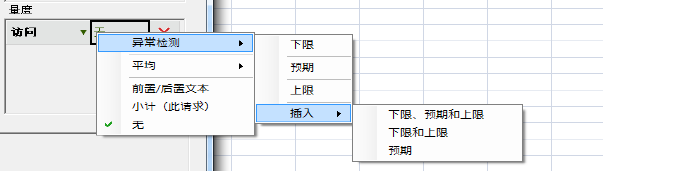
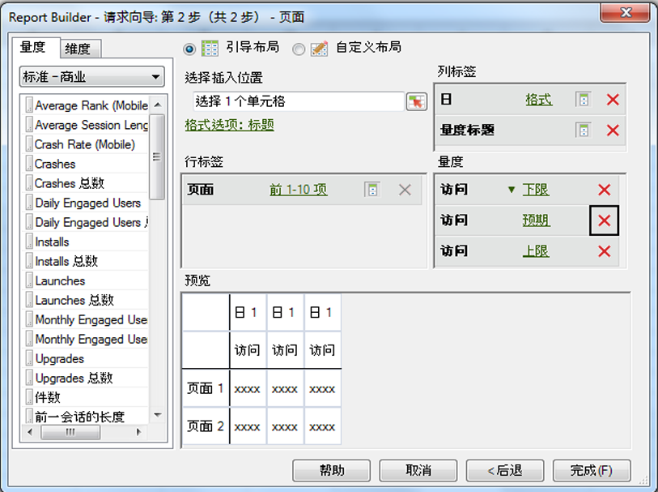

# 配置异常检测请求

用于描述如何在 Report Builder 中创建异常检测请求的步骤。

1. 选择一个趋势报表，如&#x200B;**网站量度** &gt; **[!UICONTROL 流量]**&#x200B;报表。
1. In the [!UICONTROL Apply Granularity] menu, select **[!UICONTROL Day]**.

   >[!NOTE]
   >
   >[!UICONTROL “异常检测] ”菜单仅在您选择“天”粒度时可用。无论您选择什么日期范围，前 30 天的数据都会用作统计数据培训期。

1. After configuring date ranges, click **[!UICONTROL Next]**.

   Step Result1.On the Request Wizard: Step 2 of 2, add a metric, such as **[!UICONTROL Visits]**.

   Step Result1.For the added metric, click the **[!UICONTROL None]** link.

   

1. Select **[!UICONTROL Anomaly Detection]** &gt; **[!UICONTROL `<selection>`]**.

   

   当您选择其中一个选项时，系统会创建原始量度的“异常检测”副本。例如，对于“访问”量度，系统会将“访问下限”量度添加到“[!UICONTROL 量度]”群组中。
1. Click **[!UICONTROL Finish]** and select the cell for output to Excel.

   See [Anomaly Detection](../../../analyze/analysis-workspace/virtual-analyst/c-anomaly-detection/anomaly-detection.md#concept_9476D6C093334B1A8044AE63835BDBE7) for definitions.
