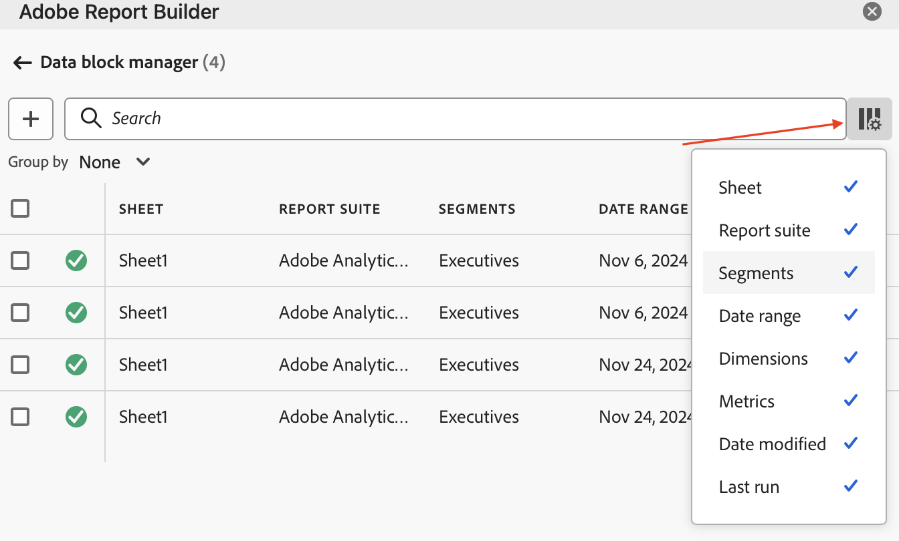

# 管理数据块

您可以使用[!UICONTROL 数据块管理器]查看和管理工作簿中的所有数据块。 [!UICONTROL 数据块管理器]提供搜索、过滤和排序功能，允许您查找特定数据块。 选择一个或多个数据块后，可以对选中的数据块进行编辑、删除或刷新。

## 查看数据块

要查看工作簿中列出了所有数据块的表，请选择 **[!UICONTROL 管理]**。

{zoomable="yes"}

**[!UICONTROL 数据块管理器]**&#x200B;显示的工作簿中包含所有数据块的表。

{zoomable="yes"}

您可以使用选择要显示的列。

## 排序数据块

您可以按显示的列对数据块表进行排序。 例如，您可以按报表包、区段、日期范围和其他变量对数据块进行排序。

要对数据块表进行排序，请选择列标题。 选择相同的列标题以反转排序顺序。

## 搜索数据块

使用 **[!UICONTROL _搜索_]**&#x200B;字段在数据块表中查找任何内容。 例如，您可以搜索数据块或报告包中包含的指标。 您还可以搜索出现在日期范围、修改日期或上次运行日期列中的日期。

## 编辑数据块

您可以编辑数据块的报表包和日期范围。 或应用于数据块的区段。

例如，您可以用一个或多个数据块中的新区段替换现有区段。

1. 选择要更新的数据块。您可以选中顶级复选框以选择所有数据块，也可以选择单个数据块。

   {zoomable="yes"}

1. 选择以显示&#x200B;**[!UICONTROL 快速编辑]**&#x200B;窗口。

   {zoomable="yes"}

1. 选择链接以更新报表包、日期范围或区段。 在&#x200B;**[!UICONTROL 快速编辑]** - **[!UICONTROL 区段]**&#x200B;中，您可以添加、删除或更新所选数据块的区段。

   {zoomable="yes"}

## 刷新数据块

选择以刷新数据块表。

要验证数据块是否已刷新，请查看刷新状态图标：

- 成功刷新的数据块显示。

- 刷新失败的数据块显示。

## 删除数据块

要删除一个或多个数据块，请执行以下操作：

1. 选择一个或多个数据块。
1. 选择。
1. 在&#x200B;**[!UICONTROL 删除数据块]**&#x200B;对话框中选择&#x200B;**[!UICONTROL 删除]**&#x200B;或选择&#x200B;**[!UICONTROL 取消]**&#x200B;以取消删除。

## 将数据块分组

您可以使用&#x200B;**[!UICONTROL 分组依据]**&#x200B;下拉菜单对数据块进行分组，也可以选择列标题。

要按列对数据块进行排序，请选择列标题。 要按组对数据块进行分组，请从&#x200B;**[!UICONTROL 分组]**&#x200B;下拉菜单中选择组名。例如，下面的屏幕截图显示了按报表包分组的数据块。

您可以使用分组快速选择要修改其公共元素（如区段）的数据块。

{zoomable="yes"}

<!--

# Manage Data Blocks in Report Builder

You can view and manage all data blocks in a workbook using the Data Block Manager. The Data Block Manager provides search, filter, and sort capabilities that allow you to quickly locate specific data blocks. After selecting one or more data blocks, you can edit, delete, or refresh the selected data blocks.

## View Data Blocks

Click **Manage** to view a list of all data blocks in a workbook.

The Data Block Manager lists all data blocks present in a workbook. 

## Sort the Data Blocks list

You can sort the data block list by a displayed column. For example, you can sort the data block list by report suites, segments, date range, and other variables.

To sort the data block list, click a column heading.

## Search the Data Block list

Use the Search field to locate anything in the data block table. For example, you could search for metrics contained in the data blocks or report suite. You can also search for dates appearing in the date range, date modified, or last run date columns.

## Edit Data Blocks

You can edit the report suite, date range, or the segments applied to one or more data blocks.

For example, you can replace an existing segment with a new segment in one or more data blocks.

1. Select the data blocks that you want to update. You can select the top-level check box to select all data blocks or you can select individual data blocks.

   

1. Click the edit icon to display the Quick edit window.

   

1. Select a segment link to update report suites, date ranges, or segments.

   

## Refresh Data Blocks

Click the refresh icon to refresh the data blocks in the list.

To verify if a data block is refreshed, view the refresh status icon. 

A successfully refreshed data block displays a checkmark in a green circle: . 

A data block that has failed to refresh displays a warning icon: .This makes it easy to identify if any data blocks have errors.

## Delete a Data Block

1. Select a data block in the Data Block manager. 
1. Click the trash can icon to delete the selected data block.

## Group Data Blocks

You can group data blocks using the **Group by** drop-down menu or you can click a column title. To sort data blocks by column, click the column title. To group data blocks by groups, select a group name from the **Group by** drop-down menu. For example, the screenshot below shows data blocks grouped by Sheet. It shows data blocks grouped by Sheet1 and Sheet2.  This is useful, for example, in the segment-replacing use case. If you have multiple segments applied to each data block, it is helpful to create a group containing all the data blocks that you want to replace. Then you can easily select and edit them all at once.

## Modify the Data Block Manager view

You can modify which columns are visible in the Data Block Manager window.

Click the column list  icon to select which columns are listed in the Data Block Manager. Select a column name to display the column. Deselect the column name to remove the column from view.

-->