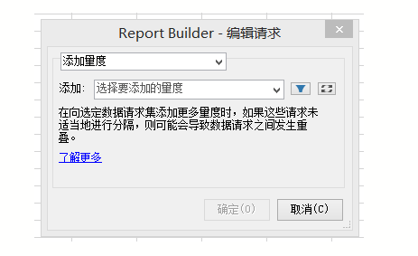
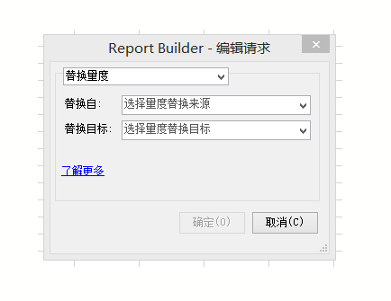
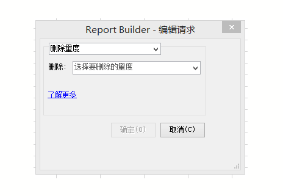

# 跨多个请求编辑指标

通过“编辑跨越多个请求的量度”功能，您可以在一个预先存在的请求中或一组请求间轻松地移动、删除或替换量度。

## Add metrics {#section_3FBDA9668039404895059618D70FCBCD}

请记住以下事项

* 只能将量度添加到引导布局请求中。如果某些选定的请求为自定义布局，则无法添加量度。其原因在于，由于布局进行了自定义，Report Builder 不知道将新量度放置到电子表格中的哪个地方。
* 因此，如果您只选择自定义布局请求，则&#x200B;**[!UICONTROL 添加量度]选项不可用。**
* 添加量度将增加请求的大小，并且可能会导致与其他请求重叠。请确保您的请求周围有足够的空间以允许添加量度。
* 如果添加的量度已存在于某一个选定的请求中，则不会将其添加到该请求。

要添加一个或多个量度，请执行以下操作：

1. Select one or more requests in Excel and right-click to select **[!UICONTROL Edit Metrics]**. (Or, click **[!UICONTROL Manage]** &gt; **[!UICONTROL Edit Multiple]** &gt; **[!UICONTROL[choose metric]]** &gt; **[!UICONTROL Edit Group]** **** to select the group of requests to modify.)

1. Select **[!UICONTROL Add Metric(s)]**and select the metrics to add.

   

1. 刷新请求以查看实际数据。在刷新之前，您看到的都是脱机数据。

## Replace metric {#section_D773AAC7B30C4FBEBDB66B203C217818}

请记住以下事项

* 只允许一对一替换，不允许一对多或多对一替换。
* 如果要替换的选定量度不存在于某一个选定的请求中，则该请求将保持不变。
* 新量度将置于和被替换量度相同的位置。这意味着：

   * **在引导布局中**：如果引导布局请求输出日期、访问、访客和每日独特，并将“访客”被替换为“收入”，则更新的请求布局将为：日期、访问、收入、每日独特。
   * **在自定义布局中：**&#x200B;如果“访客”量度是单元格 F11 中的输出，则更新的请求布局将在同一单元格 F11 中显示“收入”。

* 如果被替换的量度已经应用了一些操作（平均、前置文本、后置文本、生成 Microchart），这些操作也将随之应用于新量度。

替换量度

1. Select one or more requests in Excel and right-click to select **[!UICONTROL Edit Metrics]**. (Or, click **[!UICONTROL Manage]** &gt; **[!UICONTROL Edit Multiple]** &gt; **[!UICONTROL[choose metric]]** &gt; **[!UICONTROL Edit Group]** **** to select the group of requests to modify.)

1. Select **[!UICONTROL Replace Metric]**.

   

1. 选择要替换的量度和替换它的量度。
1. 刷新请求。在刷新之前，您看到的都是脱机数据。

## Remove metrics {#section_D3CD5BAC7670416593B633B2B8423C60}

请记住以下事项

* 如有任何一个要删除的选定量度不存在于某一个选定的请求中，该请求将保持不变。
* 在引导布局中，删除量度会导致布局中位于被删除量度之后的量度发生移动。

   **示例：**：如果引导布局请求输出日期、访问、访客和每日独特，并删除“访问”，则更新的请求布局将显示：日期、访客、每日独特。

要删除量度，请执行以下步骤：

1. Select one or more requests in Excel and right-click to select **[!UICONTROL Edit Metrics]**. (Or, click **[!UICONTROL Manage]** &gt; **[!UICONTROL Edit Multiple]** &gt; **[!UICONTROL[choose metric]]** &gt; **[!UICONTROL Edit Group]** **** to select the group of requests to modify.)

1. Select **[!UICONTROL Remove Metric(s)]**.

   

1. 从请求中选择一个或多个要删除的量度。
1. 刷新请求。在刷新之前，您看到的都是脱机数据。

