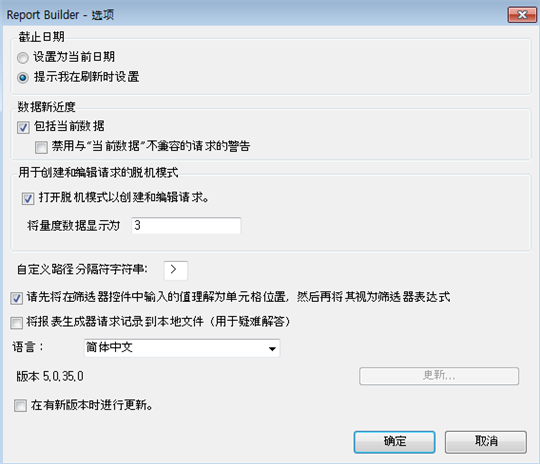
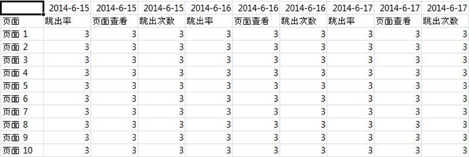

# 用于创建和编辑请求的脱机模式

脱机模式会返回占位符数据，从而加快创建和编辑请求的过程。

当您创建或编辑新请求时，会调用报表 API 以检索响应。这会减慢请求创建过程，因为您必须等待返回数据后才能继续执行下一步。脱机模式仅返回占位符数据，因此不必调用任何 API。

要启用脱机模式，请执行以下操作：

1. 单击 Report Builder 菜单中的&#x200B;**[!UICONTROL 选项]。**

   

1. Check the checkbox next to **[!UICONTROL Turn on offline mode for creating and editing requests]**.
1. 在&#x200B;**[!UICONTROL 将量度数据显示为]字段中，输入要在请求中返回的占位符数据。**&#x200B;例如，输入“1”。
1. Click **[!UICONTROL OK]**.
1. 现在，使用“请求向导”创建并运行您的请求（以脱机模式）。
1. 您的以“1”作为占位符数据的请求将与以下内容类似：

   

   >[!IMPORTANT]
   >
   >请确保在使用真实数据运行请求之前禁用脱机模式。要执行此操作，只需返回至&#x200B;**[!UICONTROL 选项]，然后移除复选标记。**

