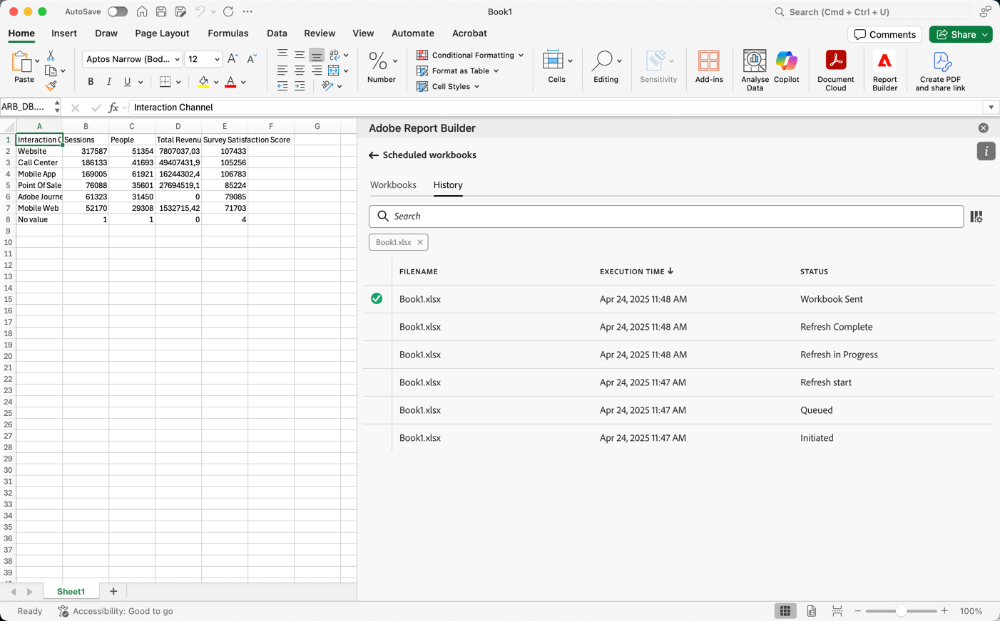

# 管理已安排的工作簿

您可以计划工作簿以通过电子邮件共享，也可以通过导出到云目标进行共享，如以下文章所述：

* [通过电子邮件共享计划工作簿](/help/analyze/report-builder/schedule-reportbuilder.md)

* [通过导出到云目标来计划工作簿](/help/analyze/report-builder/report-builder-export.md)

以下部分介绍了如何在计划工作簿后管理工作簿：

## 查看和管理计划的工作簿

您可以在&#x200B;**[!UICONTROL 工作簿]**&#x200B;选项卡中查看和管理所有计划工作簿。

1. 在Report Builder中心选择&#x200B;**[!UICONTROL 计划]**

1. 选择&#x200B;**[!UICONTROL 工作簿]**&#x200B;选项卡。 您会看到所有计划工作簿的列表。

   {zoomable="yes"}

   您可以将鼠标悬停在图标上以查看已计划工作簿的状态。

   使用搜索特定的计划工作簿。
使用定义要显示的列。

1. 选择一个或多个工作簿。

   {zoomable="yes"}

   可以使用以下选项：

   | 选项 | 描述 |
   |---|---|
   |  | 编辑所选工作簿的计划。 |
   |  | 显示所选工作簿的历史记录。 |
   |  | 暂停所选工作簿的计划。 |
   |  | 恢复所选工作簿的计划。 |
   |  | 将所选工作簿下载到新工作簿中。 |
   |  | 删除所选工作簿的计划。 |

## 计划工作簿的历史记录和状态

您可以在&#x200B;**[!UICONTROL 历史记录]**&#x200B;选项卡中查看计划工作簿的历史记录和状态。

1. 在Report Builder中心中选择&#x200B;**[!UICONTROL 计划]**。

1. 选择&#x200B;**[!UICONTROL 历史记录]**&#x200B;选项卡。 您会看到所有计划工作簿的列表。

   {zoomable="yes"}

   使用搜索列表中的特定工作簿。
使用定义要显示的列。

   使用&#x200B;**[!UICONTROL 历史记录]**&#x200B;选项卡可复查每个计划任务的状态。 单独的行记录每个计划任务的状态更改。

   * 表示工作簿已成功发送。
   * 表示出现错误。

或者，您也可以在选项卡中为一个或多个选定的工作簿选择&#x200B;**[!UICONTROL 历史记录]**。 此操作显示&#x200B;**[!UICONTROL History]**&#x200B;选项卡，该选项卡具有按您的选择过滤的列表。 选择以删除筛选器。
