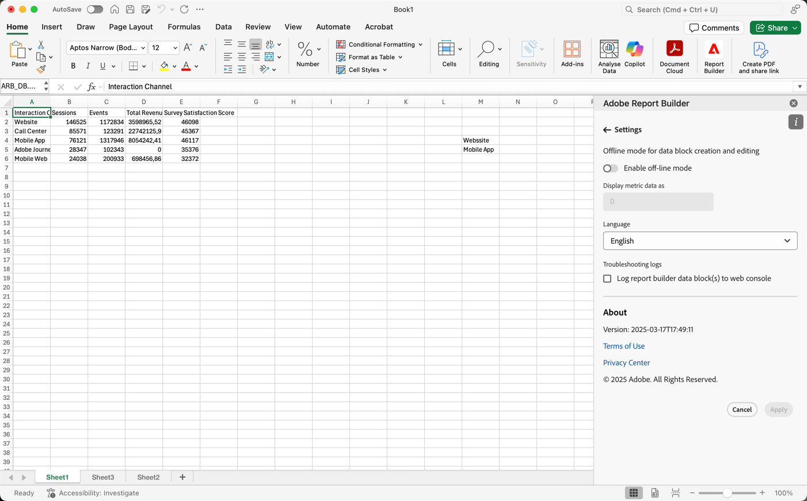

# Report Builder 设置

使用&#x200B;**设置**&#x200B;窗格可以配置应用程序级别的设置，例如 UI 显示的语言或者是否在离线模式下工作。 这些设置会立即应用，并设定用于所有未来的会话，直至发生更改。

更改 Report Builder 设置

1. 选择&#x200B;**设置**&#x200B;图标。

1. 更改[启用离线模式](#off-line-mode)、[选择语言](#language)或[启用故障排除](#troubleshooting)。

1. 选择&#x200B;**[!UICONTROL 应用]**。

   显示“取消并应用”按钮的{zoomable="yes"}

## 离线模式

在离线模式下创建和编辑数据块时，不会检索数据。 相反，会使用模拟数据，以便您可以快速工作，而无需等待请求运行。 当您重新联机时，请选择 **[!UICONTROL 刷新数据块]**&#x200B;或 **[!UICONTROL 刷新所有数据块]**&#x200B;以使用实际数据刷新数据块。

启用离线模式

1. 选择。

1. 打开&#x200B;**[!UICONTROL 启用离线模式]**。

1. 在&#x200B;**[!UICONTROL 将量度数据]**&#x200B;显示为字段中输入正整数。

1. 选择&#x200B;**[!UICONTROL 应用]**。

## 语言

您可以为Report Builder界面选择语言。 所有受支持的Customer Journey Analytics语言均可用。

要选择Report Builder界面中使用的语言，请执行以下操作：

1. 从&#x200B;**[!UICONTROL 语言]**&#x200B;下拉菜单中选择一种语言。

1. 选择&#x200B;**应用。**

## 故障排除

疑难解答和帮助解决支持票证，启用可记录Report Builder请求。 在&#x200B;**[!UICONTROL Report Builder]**&#x200B;面板中：

1. 选择。
1. 选择&#x200B;**[!UICONTROL 将Report Builder请求数据块记录到Web控制台]**。  请求将发送到您的Web浏览器控制台。 请参阅Web浏览器文档，了解如何作为Web浏览器开发人员工具的一部分打开控制台日志。

