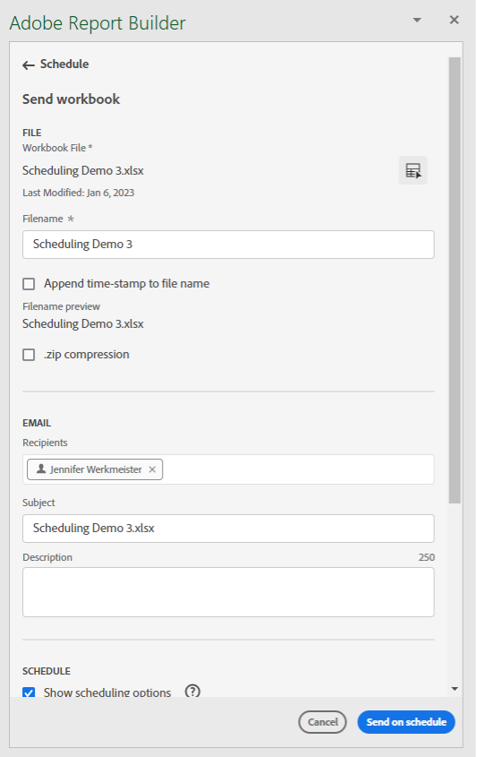
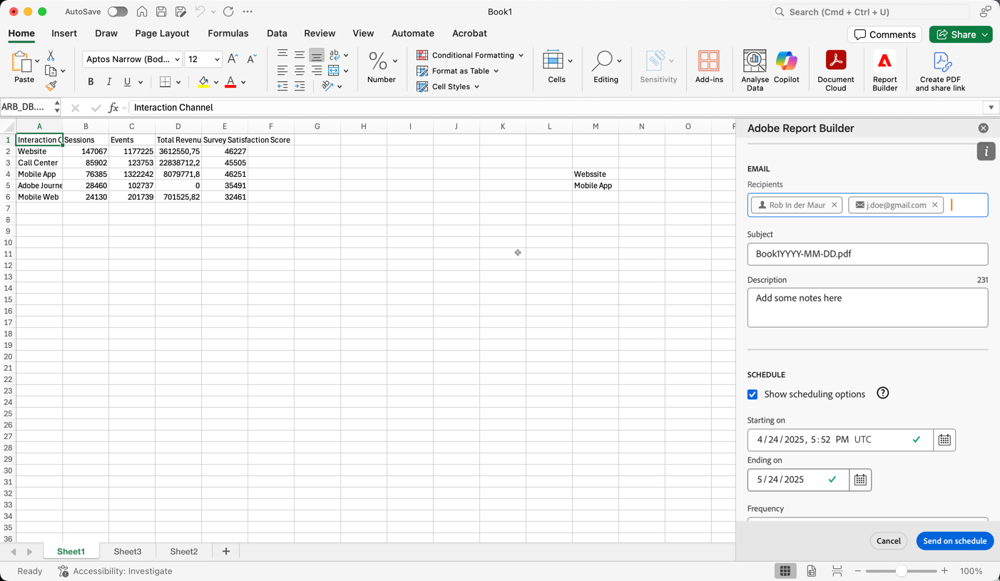

# 通过电子邮件共享来安排工作簿

>[!NOTE]
>
>除了如本节所述安排通过电子邮件共享的工作簿之外，您还可以如[安排导出到云目标的工作簿](/help/analyze/report-builder/report-builder-export.md)中所述，安排将工作簿导出到云目标。

保存工作簿并完成分析后，您可以使用计划功能轻松地与团队中的其他人共享您的工作簿。计划功能允许您创建计划，自动刷新工作簿中的数据，并在特定日期和时间将 Excel 工作簿。xlsx 文件作为附件通过电子邮件发送给指定的受众。设置时间表可为收件人自动提供定期更新。您还可以使用计划功能将工作簿发送一次，而无需计划自动更新。

您可以为单个工作簿创建多个计划。例如，您可以每天向您的团队发送一份工作簿，也可以通过创建两个不同的时间表每周一次将工作簿发送给您的经理。

计划功能还允许您为工作簿设置密码保护并编辑以前计划的工作簿。

>[!BEGINSHADEBOX]

观看演示视频，请参阅 [安排工作簿](https://video.tv.adobe.com/v/3413079?quality=12&learn=on){target="_blank"}。

>[!ENDSHADEBOX]

## 计划工作簿

要计划工作簿，请执行以下操作：

1. 在Report Builder中心中选择&#x200B;**[!UICONTROL 计划]**&#x200B;以创建计划，以便您可以自动将工作簿Excel文件(.xlsx)分发给个人或组。

   {zoomable="yes"}

1. 选择&#x200B;**[!UICONTROL 计划工作簿]**&#x200B;或以创建新的计划工作簿。

   {zoomable="yes"}

   计划窗格显示有关工作簿的一些预定义信息，例如工作簿名称和修改工作簿的最后日期。

### 文件

在&#x200B;**[!UICONTROL 文件]**&#x200B;部分中，您提供了文件类型、名称和密码的详细信息以保护文件。

{zoomable="yes"}

1. 使用选择当前工作簿（如果尚未选择）。

1. （可选）输入&#x200B;**[!UICONTROL 文件名]**。

   工作簿文件名默认为工作簿的名称，但您可以根据需要更改文件名。

1. 选择&#x200B;**[!UICONTROL 文件类型]**。

   * **[!UICONTROL Excel]**
   * **[!UICONTROL PDF]**
   * **[!UICONTROL CSV]**

   选择&#x200B;**[!UICONTROL CSV]**&#x200B;时，请注意计划工作簿是以zip附件形式发送的。 某些公司电子邮件管理部门可能会阻止包含zip附件的电子邮件。 您会看到相应的警告。

1. （可选）选择&#x200B;**[!UICONTROL 将时间戳附加到文件名]**。

   您可以将时间戳附加到文件名以标识工作簿的更新日期。时间戳有助于查看在特定日期发送的工作簿版本。 选中后，您可以在以下项之间进行选择：

   * **[!UICONTROL ISO日期格式]**，这会导致`YYYY-MM-DD`被附加到文件名中。
   * **[!UICONTROL ISO日期格式+时间戳]**，这样会将`YYYY-MM-DD_HH-MM-SS`附加到文件名中。

<!--
Does no longer seem to be an option? 
1. (Optional) Select **.zip compression** to compress the file and set up password protection on the file.

    When you make this selection, you're prompted to enter a password to open the file. This is helpful if you have concerns about data security and you want to password protect the workbook. Protecting the file with a password requires you to select **.zip compression**. The password must be at least 8 characters and contain a number and a special character.

    {zoomable="yes"}{width="55%"}
-->

1. 在&#x200B;**[!UICONTROL 密码保护工作簿]**&#x200B;中输入密码。 有效的密码需要至少8个字符、数字和特殊字符。 选择以显示密码，选择隐藏密码（默认）。

### 电子邮件

在&#x200B;**[!UICONTROL 电子邮件]**&#x200B;部分中，您提供了电子邮件的收件人、主题和说明。

{zoomable="yes"}

1. **输入收件人**。您可以输入组织中可识别的人员的姓名。 或者，您可以输入组织外部人员的电子邮件地址。

1. 输入电子邮件的&#x200B;**主题**&#x200B;和对收件人的描述。主题默认为工作簿文件名，但您可以根据需要修改主题。您可以在描述部分添加详细信息。

1. 可以选择在&#x200B;**[!UICONTROL 描述]**&#x200B;文本区域中输入描述。

### 计划

在&#x200B;**[!UICONTROL 计划]**&#x200B;部分中，您可以定义将带有工作簿的电子邮件发送给收件人的计划。

{zoomable="yes"}

1. 选择&#x200B;**[!UICONTROL 显示计划选项]**&#x200B;以定义计划。

1. 输入从&#x200B;**[!UICONTROL 开始的]**&#x200B;开始日期。 或者，选择以从日历中选择开始日期。

1. 在&#x200B;**[!UICONTROL 中输入结束日期，结束日期为]**。 或者，选择以从日历中选择结束日期。

1. 选择&#x200B;**[!UICONTROL 频率]**。 根据选定的频率，您还有其他选项。 请参阅下表。

   | 频率 | 选项 |
   |---|---|
   | **[!UICONTROL 每小时发送]** | 为&#x200B;**[!UICONTROL 发送间隔小时数]**&#x200B;输入一个值。 |
   | **[!UICONTROL 每日发送]** | 选择&#x200B;**[!UICONTROL 每日频率]**：**[!UICONTROL 每天发送]**、**[!UICONTROL 每个工作日发送]**&#x200B;或&#x200B;**[!UICONTROL 自定义频率]**。 如果您选择&#x200B;**[!UICONTROL 自定义频率]**，请为&#x200B;**[!UICONTROL 发送间隔天数]**&#x200B;输入一个值。 |
   | **[!UICONTROL 每周发送]** | 为&#x200B;**[!UICONTROL 每周]**&#x200B;发送一次，输入一个值。 然后选择&#x200B;**[!UICONTROL 星期几]**。 |
   | **[!UICONTROL 按星期几发送]** | 选择&#x200B;**[!UICONTROL 星期几]**&#x200B;和&#x200B;**[!UICONTROL 星期]**。 |
   | **[!UICONTROL 每月按月发送]** | 从&#x200B;**[!UICONTROL 发送]**&#x200B;月的这一天选择一个值。 |
   | **[!UICONTROL 按月中的日发送]** | 选择&#x200B;**[!UICONTROL 星期几]**，选择&#x200B;**[!UICONTROL 每月一周]**，然后选择&#x200B;**[!UICONTROL 每年每月一次]**。 |
   | **[!UICONTROL 按特定日期每年发送]** | 选择&#x200B;**[!UICONTROL 一年中的月份]**，然后从&#x200B;**[!UICONTROL 发送日期]**&#x200B;中选择一个值。 |

### 发送

要发送工作簿，请执行以下操作：

* 如果您尚未使用&#x200B;**[!UICONTROL 显示计划选项]**&#x200B;定义计划，请选择&#x200B;**[!UICONTROL 立即发送]**&#x200B;以立即通过电子邮件发送工作簿。
* 如果您已使用&#x200B;**[!UICONTROL 显示计划选项]**&#x200B;定义了计划，请选择&#x200B;**[!UICONTROL 按计划发送]**，以使用您定义的计划通过电子邮件发送工作簿。

在这两种情况下，Report Builder中心底部都会显示确认吐司。

若要取消发送工作簿，请选择&#x200B;**[!UICONTROL 取消]**。

## 管理旧版计划工作簿

有关管理已计划的旧版工作簿的信息，请参阅[转换计划的工作簿](/help/analyze/report-builder/convert-workbooks.md#schedule-a-converted-legacy-workbook)。

