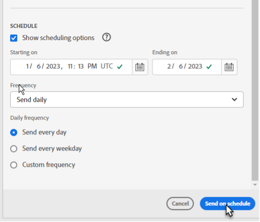

# 通过电子邮件共享计划工作簿

>[!NOTE]
>
>除了计划通过电子邮件共享的工作簿外（如本节所述），您还可以计划要导出到云目标的工作簿（如[计划导出到云目标的工作簿](/help/analyze/report-builder/report-builder-export.md)中所述）。

保存工作簿并完成分析后，您可以使用计划功能轻松地与团队中的其他人共享您的工作簿。计划功能允许您创建计划，自动刷新工作簿中的数据，并在特定日期和时间将 Excel 工作簿。xlsx 文件作为附件通过电子邮件发送给指定的受众。设置时间表可为收件人自动提供定期更新。您还可以使用计划功能将工作簿发送一次，而无需计划自动更新。

您可以为单个工作簿创建多个计划。例如，您可以每天向您的团队发送一份工作簿，也可以通过创建两个不同的时间表每周一次将工作簿发送给您的经理。

计划功能还允许您为工作簿设置密码保护并编辑以前计划的工作簿。

>[!BEGINSHADEBOX]

请参阅 [计划工作簿](https://video.tv.adobe.com/v/3413079?quality=12&learn=on){target="_blank"}以观看演示视频。

>[!ENDSHADEBOX]

## 计划工作簿

使用Report Builder中心中的“计划”按钮可快速创建计划，以便您将工作簿Excel文件(.xlsx)自动分发给个人或群组。

1. 单击 Report Builder 中心的计划按钮。

   {width="55%"}

1. 单击计划工作簿或左上角的加号按钮以创建新的计划工作簿。

   {width="55%"}

   计划窗格显示有关工作簿的一些预定义信息，例如工作簿名称和修改工作簿的最后日期。

   {width="55%"}

1. （可选）输入文件名。

   工作簿文件名默认为工作簿的名称，但您可以根据需要更改它。如果您要将同一个工作簿发送给多个受众，并且想为它命名对特定受众更友好一点的名称，您可以更改名称。

1. （可选）选择&#x200B;**将时间戳附加到文件名**。

   您可以将时间戳附加到文件名以标识工作簿的更新日期。这有助于快速查看在特定日期发送了哪个版本的工作簿。**文件名预览**&#x200B;显示分发工作簿时工作簿文件名将如何显示在电子邮件中。时间戳格式为 YYYY-MM-DD。

1. （可选）选择&#x200B;**.zip 压缩**&#x200B;压缩文件并设置密码保护。

   当您做出此选择时，系统会提示您输入密码以打开文件。如果您担心数据安全并希望使用密码保护工作簿，这将很有帮助。使用密码保护文件需要您选择 **.zip 压缩**。密码必须至少包含 8 个字符，并包含数字和特殊字符。

   {width="55%"}

1. **输入收件人**。您可以输入组织中认可的人员姓名，也可以输入组织内部或外部人员的电子邮件地址。

1. 输入电子邮件的&#x200B;**主题**&#x200B;和对收件人的描述。主题默认为工作簿文件名，但您可以根据需要修改主题。您可以在描述部分添加详细信息。

   {width="55%"}

1. 设置计划选项以设置您希望将工作簿通过电子邮件发送给收件人的日期和时间。

   选择开始和结束日期以及时间范围。可以是今天的日期或将来的日期。

   从下拉菜单中，设置&#x200B;**运算符**。您可以将频率设置为每小时、每天、每周、每月或每年的特定日期。例如，您可以设置一个时间表，在每个月的第一个星期日晚上发送工作簿，这样您的收件人将在星期一早上第一时间在他们的收件箱中收到电子邮件。

   {width="55%"}

1. 设置计划后，点击&#x200B;**按计划发送**。

   {width="55%"}

   您会在Report Builder中心底部看到一个确认toast，并且计划工作簿列在“工作簿”选项卡下。

   {width="55%"}

## 计划转换的工作簿 {#converted}

1. 计划[已转换](/help/analyze/report-builder/convert-workbooks.md)旧工作簿。

   此时会出现一个弹出窗口，询问您是否要使用旧工作簿中的计划元数据创建新的计划任务。

1. 如果选择&#x200B;**[!UICONTROL 使用]**，Report Builder会自动填写旧版计划信息。

1. 确保此信息正确无误并安排时间。

1. 如果要按不同的计划发送工作簿，请计划一个完全新的计划任务。

## 仅发送一次工作簿

您也可以只发送一次工作簿。

1. 取消选中 **显示计划选项**

   {width="40%"}

1. 单击&#x200B;**立即发送**。

## 管理已安排的工作簿

有关管理已计划工作簿的信息，请参阅[管理计划的工作簿](/help/analyze/report-builder/manage-schedules-reportbuilder.md)。
