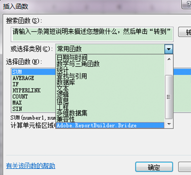
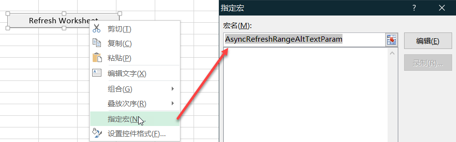
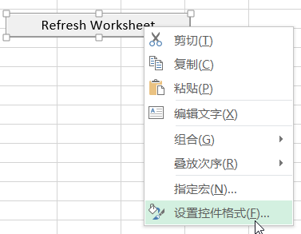
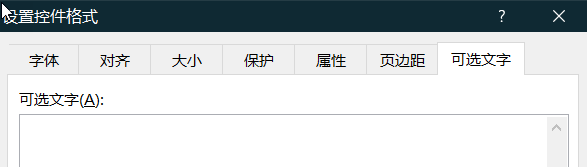

# 从Microsoft Excel函数调用Report Builder功能

此功能将 Report Builder 的使用进一步整合到常规 Excel 工作流程中，而无需您访问 Report Builder 用户界面。

例如，您可能希望自动刷新如下 Report Builder 请求：其输入过滤器基于 Excel 中从其他来源提取的数据。现在，您可以使用 RefreshRequestsInCellsRange(..) 字符串函数来实现此操作。所有调用均是异步的。它们会立即返回，而不等待调用完全执行。

>[!NOTE]
>
>必须安装Report Builder5.0(或更高版本)才能使用此功能。

下表列出了公开的函数：

| 函数名称 | 描述 |
|---|---|
| string AsyncRefreshAll() | 刷新工作簿中存在的所有 Report Builder 请求。 |
| string AsyncRefreshRange(string rangeAddressInA1Format) | 刷新指定单元格范围地址（一个以 A1 格式表示单元格范围的字符串表达式，例如“Sheet1!A2:A10”）中存在的所有 Report Builder 请求。 |
| string AsyncRefreshRangeAltTextParam() | 刷新指定单元格范围（通过 Ms 表单控件的可选文字传递）中存在的所有 Report Builder 请求。 |
| string AsyncRefreshActiveWorksheet() | 刷新活动工作表中存在的所有 Report Builder 请求。 |
| string AsyncRefreshWorksheet(string worksheetName) | 刷新指定工作表（选项卡上显示的工作表名称）中存在的所有 Report Builder 请求。 |
| string AsyncRefreshWorksheetAltTextParam(); | 刷新特定工作表名称（通过 Ms 表单控件的可选文字传递）中存在的所有 Report Builder 请求。 |
| string GetLastRunStatus() | 返回一个描述上次运行状态的字符串。 |

要访问 Report Builder 中的这些函数，请转至[!UICONTROL 公式] &gt; [!UICONTROL 插入函数]。在类别列表的底部，您会找到 Adobe.ReportBuilder.Bridge：



## Use these functions in a formula {#section_034311081C8D4D7AA9275C1435A087CD}

例如，公式

```
=IF(OR(ISTEXT(P5),ISBLANK(P5)),AsyncRefreshRange("P9"),"")
```

表示“如果单元格 P5 中的值为文本或为空，则刷新单元格 P9 中的范围”。

## Use Report Builder functions with format control {#section_26123090B5BD49748C8D8ED7A1C5ED84}

现在，您可以将宏指定到创建的控件，该控件可以是用于刷新工作簿请求的函数。例如，函数 AsyncRefreshActiveWorksheet 将刷新工作表中的所有请求。不过，有时您可能希望仅刷新特定请求，而不是全部请求。

1. 设置宏参数。
1. Right-click the control and select **[!UICONTROL Assign Macro]**.
1. 输入 Report Builder 函数名称（无参数或圆括号）。



## Pass parameters to Report Builder functions via format control {#section_ECCA1F4990D244619DFD79138064CEF0}

“设置控件格式”可以使用两个采用参数的函数，但是只能通过“可选文字”字段使用：

* AsyncRefreshRange(string rangeAddressInA1Format)
* AsyncRefreshWorksheet(string worksheetName)

1. Right-click the control and select **[!UICONTROL Format Control]**.

   

1. 单击[!UICONTROL 可选文字]选项卡。

   

1. 在[!UICONTROL 可选文字]下面，输入要刷新的单元格范围。
1. 在[!UICONTROL 公式] &gt; [!UICONTROL 插入函数] &gt; [!UICONTROL Adobe.ReportBuilder.Bridge] 下面打开 Report Builder 参数的列表。

1. Pick one of the two functions that end with AltTextParam and click **[!UICONTROL OK]**.

