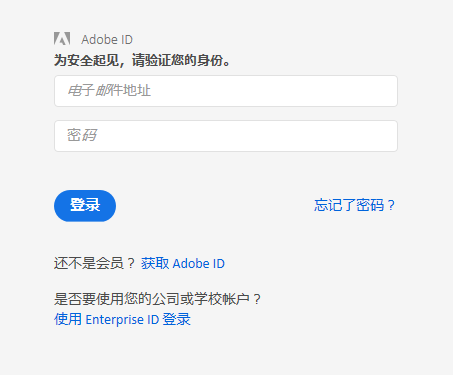

# Report Builder 登录

有关登录 Report Builder 的三种方法的信息。

当前，在单击 Report Builder 中的&#x200B;**[!UICONTROL 登录]时，可使用以下登录选项。**

* [标准](../../../analyze/report-builder/setup/login.md#section_6D54B8ADAE7F416BB83F5082B3771CFA)
* [单点登录](../../../analyze/report-builder/setup/login.md#section_6970A5F926774976B85FFE576610E85F)
* [Experience Cloud 和单点登录](../../../analyze/report-builder/setup/login.md#section_1FA230F35AB54021A874A7A28DE4C850)

## 标准 {#section_6D54B8ADAE7F416BB83F5082B3771CFA}

如果您要使用 Adobe Analytics 凭据登录 Report Builder，请使用此登录方法。

**Report Builder登录-字段定义**

| 字段 | 定义 |
|--- |--- |
| 公司 | 您用于 Adobe Analytics 的公司登录凭据。 |
| 用户名 | 您用于 Adobe Analytics 的登录用户名。用户的计划任务会链接到用户名。您可以从任何计算机查看计划任务，只要使用相同的登录凭据登录 Report Builder 即可。 |
| 密码 | 您的 Analytics 密码。 |
| 记住我 | 登录信息会加密并存储到安装了 Report Builder 的计算机上的用户配置文件中。由于登录信息已保存，因此使用同一台计算机以报表创建者身份打开包含报表的电子表格的任何人，都能够刷新和编辑数据。如果您与其他人共用一台计算机，并且不希望公开电子表格数据，请不要启用此选项。To disable your automatic login setting, click **[!UICONTROL Log in With Different Credentials]** on the Toolbar and disable **[!UICONTROL Remember Me]**. |
| 使用代理服务器 | 如果您通过代理服务器访问 Internet 并且需要提供代理用户名和密码，请启用此选项。 |

## 单点登录 {#section_6970A5F926774976B85FFE576610E85F}

此（旧版）单点登录只能登录到 Adobe Analytics，而不是整个 Experience Cloud。

您还可以输入域，系统会识别域并将您重定向到贵公司的单点登录页面，以登录 Adobe Analytics。

## Experience Cloud {#section_1FA230F35AB54021A874A7A28DE4C850}

Experience Cloud 登录允许您使用企业 ID（电子邮件和密码）登录 Adobe Experience Cloud。Click **[!UICONTROL Sign In]** &gt; **[!UICONTROL Sign in with an Enterprise ID]** to be redirected to your company's single sign-on page. 有关企业 ID 的更多信息，请单击[此处](https://helpx.adobe.com/enterprise/kb/enterprise-id-faq.html#whatis)。

>[!NOTE]
>
>Experience Cloud登录基于会话，令牌在30天后过期。

