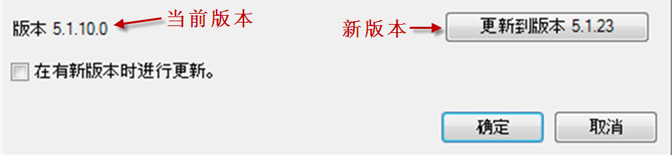
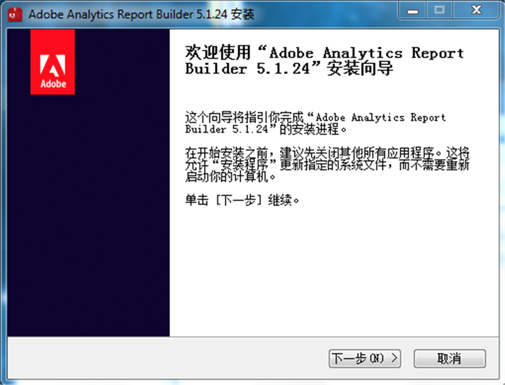

# 升级 Report Builder

关于升级 Report Builder 的步骤和注意事项。

## 有关升级的常见问题解答 {#section_AFE40FF5544C418790A1C298C25CC18A}

**问题：升级时，旧版本的 Report Builder 是否会保留？**

回答：不会，旧版本将被删除。

**问题：我是否会丢失现有报表？**

回答：不会，您目前的所有报表都将完好无损。

**问题：我是否需要向新版本重新验证身份？**

回答：不需要，您的所有设置（包括身份验证设置）都将继续有效。

## Upgrade instructions {#section_73B8110A619549189A30079735E81867}

1. 登录到当前版本的 Report Builder。
1. 转到&#x200B;**[!UICONTROL 选项]菜单以升级到最新版本。**“选项”对话框底部将显示您当前的版本号。

   

1. If a new version is available, click **[!UICONTROL Update...]**. 此按钮将显示您要更新到的新版本，例如“更新到版本 5.0.50”

   >[!NOTE]
   >
   >如果此按钮灰显，则不提供Report Builder的新版本。

1. Optionally select the **[!UICONTROL Update when a new version is available]**checkbox. 选中后，如果未来有新版本可用，那么更新流程将自动开启。
1. When the setup screen appears, click **[!UICONTROL Next &gt;]**.

   

1. 升级完成后，请重新登录 Report Builder。

## Manual upgrade instructions {#section_27A0200010DC4747A718F1A65B180599}

您随时可以在 Adobe Analytics 中获取最新版本的 Report Builder。

1. Log in to Adobe Analytics and go to **[!UICONTROL Tools]**.
1. Click **[!UICONTROL Report Builder]**.
1. 在&#x200B;**[!UICONTROL 概述]屏幕中，选择 32 位或 64 位版本。**
1. Click **[!UICONTROL Download Now!]**.

