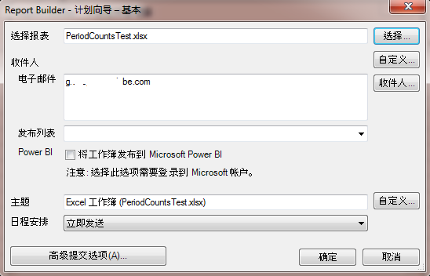

# 计划工作簿

您可以计划工作簿、指定高级交付选项、指定收件人以及查看计划历史记录。高级交付选项可让您配置要在特定时间或间隔发送的工作簿。您还可以指定发送工作簿的文件格式。

For example, you can schedule workbooks to be delivered immediately or on a recurring schedule, and specify the file format in [!DNL Advanced Delivery Options]. 上载报表时，文件大小不能超过 5 MB。

Additionally, after you create a workbook schedule in Report Builder, you can view and edit the schedule in **[!UICONTROL Analytics]** &gt; **[!UICONTROL Reports]**. （请参阅 Reports &amp; Analytics 帮助中的[报表计划和分发](/help/analyze/reports-analytics/scheduling.md)。）

>[!NOTE]
>
>必须安装Excel2007或兼容性包才能预定工作簿。每个Report Builder许可证最多可有10个计划的工作簿。但是，您可以通过减少其他许可证中的数量来增加此数量。To do so, go to **[!UICONTROL Admin]** &gt; **[!UICONTROL Company Settings]** &gt; **[!UICONTROL Report Builder Reports]**. 已计划(或上传到工作簿库)且尚未在28个月内被触控(已更新、替换)的工作簿将被删除。

**计划工作簿**

1. 生成并保存工作簿。
1. On the Report Builder Toolbar, click **[!UICONTROL Schedule]**.

   “[!UICONTROL 计划报表]”选项卡总结您已创建的所有任务，以及剩余任务的数目。
1. On the **[!UICONTROL Scheduled Reports]** tab, click **[!UICONTROL New]**.
1. “基本计划向导”显示如下：

   

1. 在“[!UICONTROL 基本计划向导]”中，配置以下选项：

* **选择报告**：工作簿的名称。对于新的计划工作簿，此字段将填充活动的工作簿名称。

<table id="table_6D5B1B832EB0451293F1902E2A1D1068"> 
 <thead> 
  <tr> 
   <th colname="col1" class="entry"> 字段 </th> 
   <th colname="col2" class="entry"> 描述 </th> 
  </tr>
 </thead>
 <tbody> 
  <tr> 
   <td colname="col1"> 
选择报表 
 </td> 
   <td colname="col2"> 
报表名称。对于新的计划报表，此字段使用活动工作簿的名称填充。 
 </td> 
  </tr> 
  <tr> 
   <td colname="col1"> 
选择 
 </td> 
   <td colname="col2"> 
显示“选择报表”页。您可以从服务器（先前计划的所有工作簿都存储在其中）选择报表，也可以从本地计算机选择报表。如果从本地驱动器选择 .xls 格式的工作簿，系统会将文件转换为 .xlsx。在转换过程中，系统会在 Excel 中打开并激活该文件。如果为计划报表选择的工作簿与当前在 Excel 中打开的工作簿具有相同的文件名，系统会选择本地文件，而不是先前上载的文件。如果从计划存储库中选择报表，则会在服务器上创建工作簿的副本并在副本文件名中附加 1，并且新创建的计划报表使用复制的工作簿。 
 </td> 
  </tr> 
  <tr> 
   <td colname="col1"> 
通过更改日期范围、 
 </td> 
   <td colname="col2"> 
允许您自定义日期格式。 
 </td> 
  </tr> 
  <tr> 
   <td colname="col1"> 
收件人 
 </td> 
   <td colname="col2"> 
显示 Outlook 通讯簿（如果适用）。 
 </td> 
  </tr> 
  <tr> 
   <td colname="col1"> 
收件人: 电子邮件 
 </td> 
   <td colname="col2"> 
工作簿的电子邮件收件人。 
 </td> 
  </tr> 
  <tr> 
   <td colname="col1"> 
收件人: 发布列表 
 </td> 
   <td colname="col2"> 
显示此公司的可用通讯组列表的列表。 
 </td> 
  </tr> 
  <tr> 
   <td colname="col1"> 
Power BI 
 </td> 
   <td colname="col2"> 
请参阅<a href="../../analyze/report-builder/c-publish-power-bi/integration-power-bi.md#section_BA137EA92A46483F83BB5C1C40FBA002" format="dita" scope="local">将工作簿发布到 Microsoft Power BI</a>，以了解更多信息。 
 </td> 
  </tr> 
  <tr> 
   <td colname="col1"> 
主题 
 </td> 
   <td colname="col2"> 
用户定义的说明。 
 </td> 
  </tr> 
  <tr> 
   <td colname="col1"> 
日程安排 
 </td> 
   <td colname="col2"> 
 允许您指定何时发送工作簿。（立即、每小时、每天、每周、每月和每年。） 
 </td> 
  </tr> 
 </tbody> 
</table>

1. Click **[!UICONTROL Advanced Delivery Options]** to configure file and publishing options:

<table id="table_1BA8A5600DE94A33B83B096E69CE15F3"> 
 <thead> 
  <tr> 
   <th colname="col1" class="entry"> 字段 </th> 
   <th colname="col2" class="entry"> 描述 </th> 
  </tr>
 </thead>
 <tbody> 
  <tr> 
   <td colname="col1"> 
<b>计划</b>选项卡 
 </td> 
   <td colname="col2"> </td> 
  </tr> 
  <tr> 
   <td colname="col1"> 
提交时间 
 </td> 
   <td colname="col2"> 
允许您立即预定工作簿或稍后安排工作簿。时间是相对于在您计算机上指定的时区而言的。 
 </td> 
  </tr> 
  <tr> 
   <td colname="col1"> 
循环模式 
 </td> 
   <td colname="col2"> 
根据您的选择发送工作簿。 
 </td> 
  </tr> 
  <tr> 
   <td colname="col1"> 
循环范围 
 </td> 
   <td colname="col2"> 
允许您指定何时开始并停止接收工作簿。 
 
 
注意：在任何当前时间段(周、月、季度或年)的第一天计划工作簿只会返回第一天的数据。 
 
 </td> 
  </tr> 
  <tr> 
   <td colname="col1"> 
<b>文件选项</b>选项卡 
 </td> 
   <td colname="col2"> </td> 
  </tr> 
  <tr> 
   <td colname="col1"> 
文件格式 
 </td> 
   <td colname="col2"> 
允许您选择提交格式：Excel 2007 (.xlsx) 或 2003 (.xls)、.pdf、.csv、.mht、.txt 和 .xml。 
 </td> 
  </tr> 
  <tr> 
   <td colname="col1"> 
 文件目标 
 </td> 
   <td colname="col2"> 
 指定电子邮件或 FTP。页面上的选项会因您的选择而有所差异。对于 FTP，必须确保可从外部使用主机。 
 </td> 
  </tr> 
  <tr> 
   <td colname="col1"> 
发布列表 
 </td> 
   <td colname="col2"> 
 如果将计划工作簿发送到多个发布列表，则工作簿为每个列表运行一次。可变报表包由分配给发布列表的报表包替换。 
 </td> 
  </tr> 
  <tr> 
   <td colname="col1"> 
文件内容语言 
 </td> 
   <td colname="col2"> 
指定您希望附信使用的语言。您可以选择中文（简体或繁体）、德语、法语、日语、韩语、巴西葡萄牙语或西班牙语。 
 </td> 
  </tr> 
  <tr> 
   <td colname="col1"> 
<b>发布选项</b>选项卡 
 </td> 
   <td colname="col2"> </td> 
  </tr> 
  <tr> 
   <td colname="col1"> 
发布到 Power BI 
 </td> 
   <td colname="col2"> 
    <ul id="ul_40697E4FB2CE4F34B857FBF153D6D6D5"> 
     <li id="li_023E4750814D415EBC899269C9EA5D46"><a href="../../analyze/report-builder/c-publish-power-bi/integration-power-bi.md#section_BA137EA92A46483F83BB5C1C40FBA002" format="dita" scope="local"> 将工作簿发布到 Power BI</a> </li> 
     <li id="li_9B684BE22AF94ABC903405EE83951A80"><a href="../../analyze/report-builder/c-publish-power-bi/integration-power-bi.md#section_E48148793E794169B766C73995897B9F" format="dita" scope="local"> 作为 Power BI 数据集表发布所有 Report Builder 请求</a> </li> 
     <li id="li_7B0BD285BC1749D1B2C65759CA97877B"><a href="../../analyze/report-builder/c-publish-power-bi/integration-power-bi.md#section_6F8422B90D3F4F7EB5D4C97BFFA807AD" format="dita" scope="local"> 作为 Power BI 数据集表发布所有带格式的表</a> </li> 
    </ul> </td> 
  </tr> 
  <tr> 
   <td colname="col1"> 
将此 Power BI 报表标记为 
 </td> 
   <td colname="col2"> 
标记详细信息 
 </td> 
  </tr> 
 </tbody> 
</table>

1. Click **[!UICONTROL OK]**, then click **[!UICONTROL Exit]**.

   Report Builder displays the scheduled workbook in the [Scheduled Task Manager](../../analyze/report-builder/r-arb-scheduled-reports.md#section_69306B8D833F4DF7BBFA53753B0E6C31).

