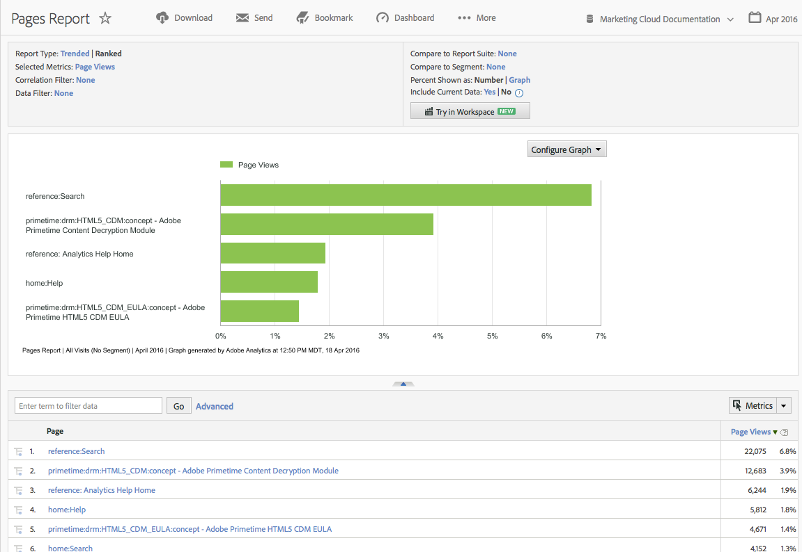

# Reports &amp; Analytics 快速入门

{{ra-eol}}

在使用 Reports &amp; Analytics 之前，请了解这些基本的登录和设置任务以及如何访问帐户信息。

报告帮助您深入了解传统 Web 渠道以及逐渐发展的新渠道，如移动、视频和社交网络。报表的部分示例包括：

* 访问网站的人数
* 其中多少访客是独特访客（只算一次）
* 访问网站的途径（例如是通过链接访问还是直接访问）
* 访客搜索网站内容所使用的关键字
* 访客在特定页面或整个网站逗留的时间
* 访客单击了哪些链接，访客离开网站的时间
* 哪些营销渠道对产生收入或转化事件效果最好
* 他们观看视频花费多长时间
* 他们访问网站使用哪些浏览器和设备

## 浏览器和系统要求

登录“Reports &amp; Analytics”界面的浏览器和系统要求。

* 首选浏览器：最新版的 Firefox、Chrome、Safari 或 Edge。
* 必须启用 Cookie 和 JavaScript。
* 具有 16 位颜色深度（或更高）的 1024 x 768 显示器分辨率。

## 登录到 Reports and Analytics

在访问界面之前，请与您的Adobe客户团队或客户关怀团队合作来设置贵公司的帐户。

## 使用 Experience Cloud 登录

要通过Adobe Experience Cloud登录，请执行以下操作：

1. 启动联网计算机的浏览器。
1. 转到 [!DNL https://login.experiencecloud.adobe.com/] 。
1.  在[!UICONTROL 登录]页面，单击&#x200B;**[!UICONTROL 单点登录]**。
1.  完成以下信息，然后单击&#x200B;**[!UICONTROL 登录]**。

   **[!UICONTROL 公司]**：指定公司 ID。

   **[!UICONTROL 用户名]**：指定您的帐户 ID。

   **[!UICONTROL 密码]**：指定您的帐户密码。
1. 从 Experience Cloud 主页转到 **Analytics > 报表**。

   在非活动状态下持续 30 分钟后，Experience Cloud 会自动将您注销。

## 运行报表

要生成报表，请执行以下操作：

1. 登录到“[!UICONTROL Reports &amp; Analytics]”。

   此时会显示“报表”菜单，或显示[功能板](/help/analyze/reports-analytics/dashboard.md)（如果已设置）。

1.  单击&#x200B;**[!UICONTROL 网站内容]** > **[!UICONTROL 页面]**（例如）。

   

   请参阅[报表功能](/help/analyze/reports-analytics/overview/report-overview.md)，以了解有关报表界面功能的信息。

## 编辑用户的帐户设置

有关编辑用户帐户、重置用户密码和编辑联系信息的信息。

您可以查看和编辑联系信息，指定密码，查看 Web 服务信息，以及从数据收集中排除此计算机。

单击右上方的“帐户”图标 ，然后单击登录名旁边的&#x200B;**[!UICONTROL 帐户设置]**（轮状）图标。

所有用户都可以访问[!UICONTROL 帐户信息]页面。可以查看或编辑以下信息：

| 信息类型 | 定义 |
| --- | --- |
| 联系方式 | 为您的帐户指定以下个人信息：<ul><li>名字（必填）</li><li>姓氏（必填）</li><li>标题</li><li>电子邮件地址（必填）</li><li>电话号码</li></ul> |
| 登录 | 显示帐户用户名，并且通过它可更改帐户密码。另请参阅：[如何重置 Reports &amp; Analytics 帐户密码](https://experienceleague.adobe.com/docs/analytics/technotes/troubleshoot-login.html?lang=zh-Hans)。 |
| Web 服务 | 显示与此帐户关联的 Web 服务用户名和共享机密。在通过 Web 服务 API 访问 Experience Cloud 时使用这些凭据。有关详细信息，请参阅 Developer Connection。**注意：**&#x200B;仅在帐户被授权为 Web 服务用户时才显示此信息。 |
| 排除此计算机 | 将一个 Cookie 应用于当前计算机，以将其从数据收集中排除。如果不想让在线活动影响域中的页面浏览次数和访客数，可使用此项。**注意：**&#x200B;要使用此功能，您的浏览器必须启用 Cookie。如果删除计算机上的 Cookie，则必须重新设置排除 Cookie。 |

## 更改界面语言

您可以更改界面语言。 您可以用所选的语言来查看 Reports &amp; Analytics 界面。

更改界面语言：

1. 登录到 Analytics，然后选择&#x200B;**[!UICONTROL 报表]**&#x200B;选项卡。
1. 在页脚中，单击&#x200B;**[!UICONTROL 语言]**&#x200B;菜单中的可用语言，然后选择您的首选语言。

您可以从 Adobe Experience Cloud 访问文档和主页。（**[!UICONTROL 帮助]** > **[!UICONTROL 帮助主页]**。）

>[!NOTE]
>本产品获准在北美和其他实际销售本产品的区域进行销售。它可能不符合其他国家或地区当地的销售要求。
