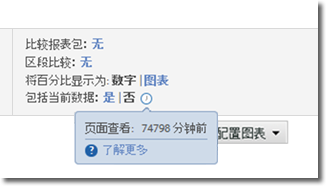

# 当前数据

Reports &amp; Analytics 中的“包括当前数据”选项通常可让您在数据经过完全处理并完成前，查看最新的 Analytics 数据。当前数据会在数分钟内显示大部分量度，为快速制定决策提供可用数据。

它作为报表设置的一部分可见：

在支持当前数据的所有报表中，默认启用当前数据。如果您希望在完全处理数据后查看所有指标，有以下几个选项：

* 使用使用完全处理数据的Analysis Workspace。
* 在当前数据报告设置中单击“否”仅可使用完全处理的数据。
* 从Admin Console中的产品配置文件中删除“当前数据”权限项目，以防止非管理员用户看到此选项。See [Analytics Tools permission items](../../admin/admin-console/permissions/analytics-tools.md) in the Admin user guide for more information.

由于数据可用性优先级，当前数据无法与区段、分类、细分、路径和某些指标一起使用。如果使用其中一项功能，则会在报告中强制使用当前数据并显示黄色通知，解释当前数据不可用的原因。

## 典型当前数据滞后

量度出现在以下三个时间范围中的任一范围中。单击“包括当前数据”切换开关旁边的时钟图标，可查看报表上每个量度的实际滞后值。

| 时间范围 | 量度 |
| --- | --- |
| 在10分钟之内 | 流量变量上的实例和页面视图 |
| 10 到 35 分钟 | 转换变量上的转换事件、实例和页面查看 |
| 45 到 120 分钟 | 所有其他数据，如访问、独特访客和参与 |

由于当前数据视图上显示的部分数据尚未完全处理，因此您可以看到在当前数据视图和已完成视图上报告的值之间的差异。在趋势报表上，数据差异通常在 1% 以内。

## 计算量度

由于计算量度可以使用具有不同滞后的量度来创建，因此近期的某些值可能会使用当前数据视图中不完整的数据来计算。

For example, you create the calculated metric 'Page Views per Visit using the formula `Page Views divided by Visits`. 页面查看通常在10分钟内显示，而访问通常在小时内出现，因此，此延迟窗口中的计算量度使用不完整的指标计算。如果您发布一个新页面，在一个小时的时间内从4000次不同的访问中获得4000次点击，则这些指标之间的延迟差异可能会导致计算不完整。

当报告新值或使用短时间帧报告时，此数据差异最明显。当报表使用较长的日期范围时，最近几小时报告中发生的滞后差异不可能对计算得出的指标产生任何显著影响。

如果您有可能受这些差异影响的计算指标，请关闭当前数据或使用相同预期滞后窗口的指标。

## 下载的报表

当您在启用当前数据视图的情况下下载报表时，会将该报表置于队列中并生成该报表，然后返回到浏览器。如果在生成报表时收集数据，报告中会显示该数据。此时间窗口可能会导致下载的报告有略微更多的数据。
