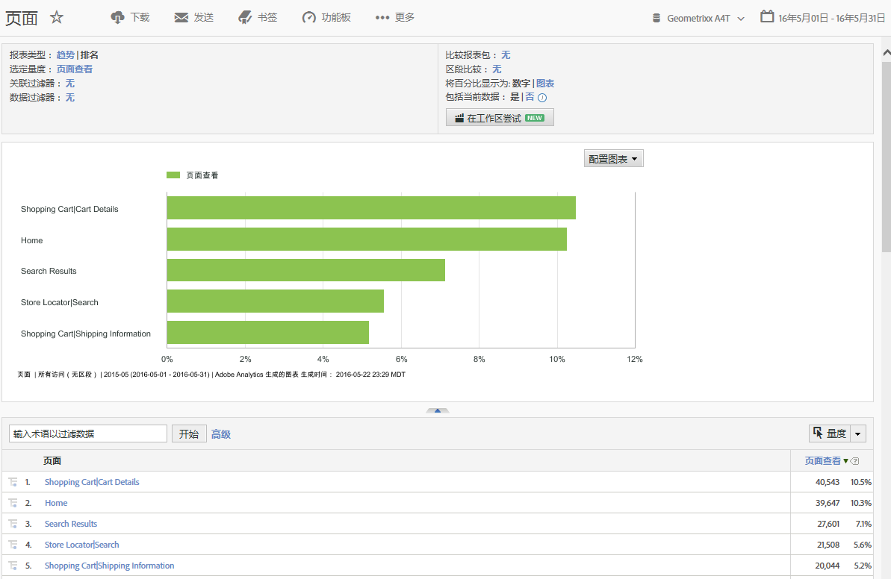
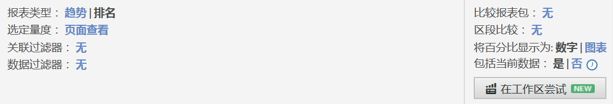
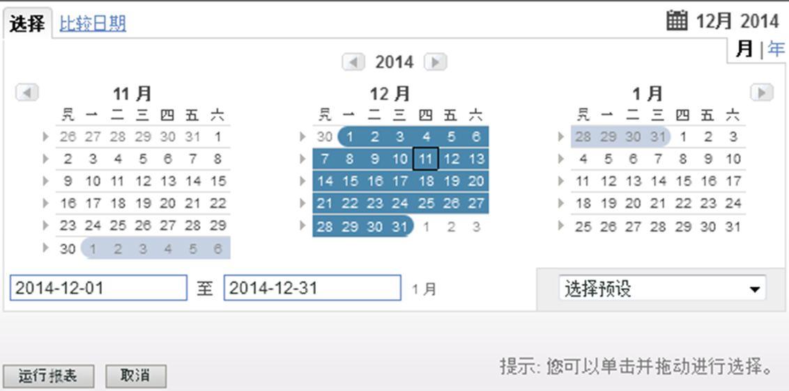
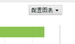
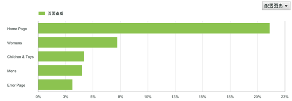
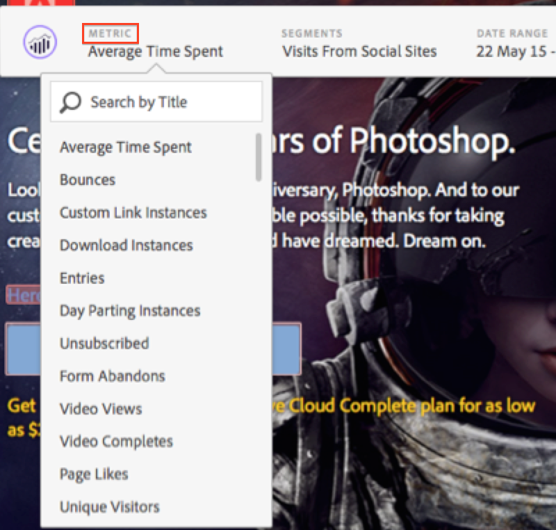
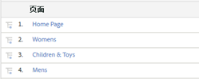

# 报表功能{#report-features}

有关报表功能（包括工具栏、日历和详细信息表）的介绍。

此示例显示了[!UICONTROL 页面报表]。配置选项可能有所差异，具体取决于运行的报表。例如，您可以在[!UICONTROL 网站内容]报表中不选择趋势或排名，而为[!UICONTROL 网站量度]报表指定粒度和页面。

## 页面报表示例 {#section_288CC85536684C2DB184141358481EF0}

An example of a Pages Report ( **[!UICONTROL Reports]** &gt; **[!UICONTROL Site Content]** &gt; **[!UICONTROL Pages Reports]** &gt; **[!UICONTROL Pages]**).

{width=“672px”}

## 报表工具栏 {#section_0D674177AE6C4A71B07234DB25910ECD}

与可根据数据更改网站或营销策略的决策人共享报表数据。

{width=“672px”}

Also refer to [Customizing a Report](../../../analyze/reports-analytics/reports-customize/customizing-reports-overview.md).

## 报表标题和设置 {#section_12A90FAE02EC43FB9F11F0E2CE8FAE8F}

显示报表设置，并且允许您配置报表类型、选择量度等。此组中的可用选项因运行的报表而变化。

{width=“672px”}

See [Customizing a Report](../../../analyze/reports-analytics/reports-customize/customizing-reports-overview.md) for more information.

## 日历 {#section_8C6C4AD84D9043E8ABD53FF8F645AAB1}

通过单击日历按钮并选择日期范围来指定日期。还可以选择两个时间范围以比较绩效。

{width=“672px”}

See [Selecting a Date or Date Range](../../../analyze/reports-analytics/reports-customize/customizing-reports-overview.md#task_9BEF7D4D839A4748B76E8500D1406C34) and [Comparing Dates](../../../analyze/reports-analytics/reports-customize/customizing-reports-overview.md#task_95155C3700774B709F5FB81AE96B0824).

## 图表类型 {#section_8B9CBA4096E64FC3B744E2E06EB83C19}

选择要查看的图表类型。

请参阅 [更改报表图表](../../../analyze/reports-analytics/reports-customize/t-reports-graphs.md#task_B290BF0B82124111AA19B3F3ACED500A).

## 图表显示 {#section_4C78ADC82C234CC6841AC92C803636F4}

根据您所选的图表类型，通常会显示详细信息列表的前几个项目。如果图表为显示不同时间段的趋势图表，则会显示所有时间段。

请参阅 [自定义报表](../../../analyze/reports-analytics/reports-customize/customizing-reports-overview.md).

## 量度 {#section_8B8F9EC72B864E29B91039E7B7381EAD}

向报表添加量度。管理员可以指定默认量度。

请参阅 [量度](../../../analyze/reports-analytics/metrics.md#concept_EB00207C07BD4481AB116E62EC24E686).

## 详细信息表 {#section_449A5DC848744F65A10DA12E189B835D}

详细信息为大量报表数据。此时列出页面，用“页面查看”测量，或以时间段内加载的次数测量。

在详细信息表中，可以过滤数据、创建划分、添加量度等。

请参阅 [自定义报表](../../../analyze/reports-analytics/reports-customize/customizing-reports-overview.md).
