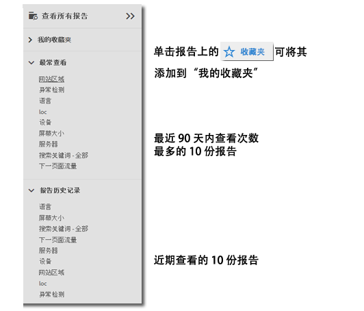
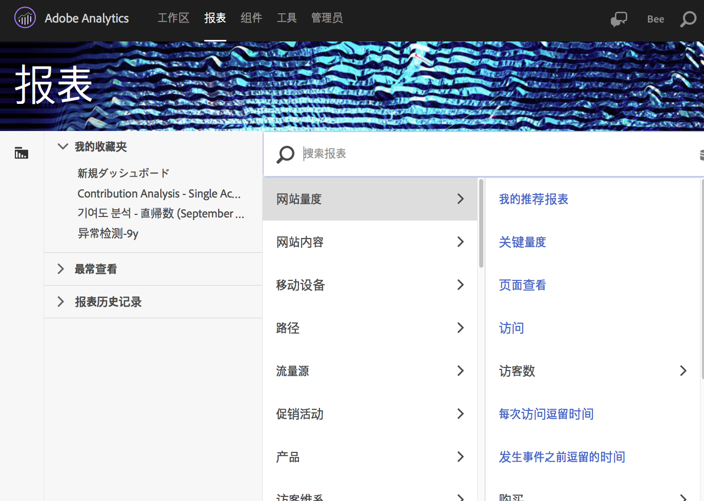
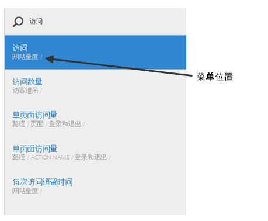

# “报表”菜单{#reports-menu}

“Reports &amp; Analytics”中的“报表”菜单概述。

“报表”菜单提供：

* 对完整报表集的访问
* 设置收藏报表以便于快速访问的功能
* 最常查看的报表
* 增强的搜索

“我的收藏夹”、“最常查看”和“报表历史记录”都是特定于报表包的。如果更改报表包，所有三个列表都将发生相应的更改。

报表是采用分层列视图导航的。Click **[!UICONTROL View All Reports]**, or press the Forward Slash key (/), and then press the Down Arrow key (?) to quickly display and navigate the menu using the Arrow keys. 按 Esc 键可在不更改当前报表的情况下关闭菜单，或按 Enter 可加载选定报表。

{width=“672px”}

有关单个报表的详细信息，请参阅[报表描述](https://marketing.adobe.com/resources/help/en_US/reference/index.html?f=reports_descriptions)。

## 搜索报表 {#section_E5EF11E36CB9451AA7B079E585CA7DB6}

“报表”菜单提供了增强的搜索体验。Click **[!UICONTROL View All Reports]** , or press the Forward Slash key (/) , and then begin typing to quickly find a report. 报表搜索已扩展到包含 Analytics 左侧导航器菜单中的所有内容（管理员，组件等）。

按 Tab 键或向下箭头键 (?) 可在报表列表中导航。按 Esc 键可在不更改当前报表的情况下关闭搜索，或按 Enter 可加载选定报表。

>[!NOTE]
>
>您还可以按prop、eVar和活动编号搜索报告列表。在搜索栏中，输入 prop、eVar 或事件编号。

## 导航概述 {#section_A6A0A369207149BABE504753B48A42D7}

<table id="table_3BA295966BBC4C94ABDC3718D1894698"> 
 <thead> 
  <tr> 
   <th colname="col1" class="entry"> 菜单项目 </th> 
   <th colname="col2" class="entry"> 描述 </th> 
  </tr>
 </thead>
 <tbody> 
  <tr> 
   <td colname="col1">Experience Cloud 解决方案菜单  </td> 
   <td colname="col2"> 单击此图标可展开Experience Cloud菜单，以便您访问其他Marketing Can解决方案。 </td> 
  </tr> 
  <tr> 
   <td colname="col1">切换“报表”菜单  </td> 
   <td colname="col2"> 单击此按钮可展开或折叠“报表”菜单，以便您使用浏览器窗口的整个宽度查看报表。 </td> 
  </tr> 
  <tr> 
   <td colname="col1">区段  </td> 
   <td colname="col2">可显示用于添加或管理区段的区段边栏。您还可以通过区段边栏访问<a href="https://marketing.adobe.com/resources/help/en_US/analytics/segment/seg_build_ui.html" format="http" scope="external">区段生成器</a>和<a href="https://marketing.adobe.com/resources/help/en_US/analytics/segment/seg_manage.html" format="http" scope="external">区段管理器</a>界面。 </td> 
  </tr> 
  <tr> 
   <td colname="col1">量度  </td> 
   <td colname="col2"> 可显示用于添加或管理量度和计算量度的量度边栏。 </td> 
  </tr> 
  <tr> 
   <td colname="col1"> 查看所有报表 </td> 
   <td colname="col2">您所有特定于报表包的报表、功能板、书签、计算量度和目标都包含在查看所有报表部分中。任何时候单击此处，都可以在所有可供您使用的内容中进行导航。 </td> 
  </tr> 
  <tr> 
   <td colname="col1">查看所有报表中的搜索栏 </td> 
   <td colname="col2"> 
 允许您搜索所需的资源。它使用所谓的“模糊”搜索，这样您就无需精确输入要查找的词语。搜索结果显示在一个整齐的列表中，您可以使用上下左右箭头在此列表中进行导航。对某个搜索结果按 Enter 可直接转至该报表。 
 </td> 
  </tr> 
  <tr> 
   <td colname="col1">我的收藏夹 </td> 
   <td colname="col2">您可以在此区域中轻松检索标记为已收藏的报表。它会基于每位用户和每个报表包，在您拥有十个以上的收藏时显示十个收藏和一个更多... 链接。 
请注意，您可以重命名“我的收藏夹”中的报表，但不能重命名功能板。 
 
收藏夹类似于书签，但它们不像书签那样存储在一个文件夹中或通过<a href="../../../analyze/reports-analytics/bookmarks.md#concept_55B5E0DF20B14AAF8819CB8244464406" format="dita" scope="local">书签管理器</a>进行管理。 
 </td> 
  </tr> 
  <tr> 
   <td colname="col1"> 最常查看 </td> 
   <td colname="col2"> Adobe Analytics 可以跟踪您在过去 90 天内最常运行的十个报表，并在此处按照它们的运行频度顺序显示这些报表。如果您超过 90 天未使用此报表包，它会在列表中填充十个普遍最受欢迎的报表。 </td> 
  </tr> 
  <tr> 
   <td colname="col1"> 报表历史记录 </td> 
   <td colname="col2"> 在此处，您可以查找过去 90 天内最近访问的十个报表或功能板。您可以轻松返回分析或报表中之前的步骤。 </td> 
  </tr> 
  <tr> 
   <td colname="col1"> 下载 </td> 
   <td colname="col2">允许您下载 PDF、CSV、Excel 和 Word 格式的报表。 </td> 
  </tr> 
  <tr> 
   <td colname="col1"> 发送 </td> 
   <td colname="col2">允许您立即通过电子邮件发送报表，或者计划一次性或重复发送。格式选项包括 PDF、CSV、Excel、HTML、Word 或 Mobile（纯文本）。</td> 
  </tr> 
  <tr> 
   <td colname="col1"> 书签... </td> 
   <td colname="col2">Lets you <a href="../../../analyze/reports-analytics/bookmarks.md#concept_55B5E0DF20B14AAF8819CB8244464406" format="dita" scope="local"> bookmark</a> the report. </td> 
  </tr> 
  <tr> 
   <td colname="col1"> 功能板... </td> 
   <td colname="col2">Lets you add the report to a <a href="../../../analyze/reports-analytics/dashboard.md#concept_8CD3ACA2830A4994A68A31D8773B57E0" format="dita" scope="local"> dashboard</a>. </td> 
  </tr> 
  <tr> 
   <td colname="col1">更多信息... </td> 
   <td colname="col2"> 允许您执行以下全部或部分操作：打印报表、从报表中提取数据、向报表中添加警报、创建自定义报表、复制图形、关联此报表以及打开新窗口。 </td> 
  </tr> 
  <tr> 
   <td colname="col1">报表包选择器  </td> 
   <td colname="col2">允许您选择<a href="https://marketing.adobe.com/resources/help/en_US/reference/report_suites_admin.html" format="https" scope="external">基本报表包</a>或<a href="https://marketing.adobe.com/resources/help/en_US/reference/virtual-report-suites.html" format="https" scope="external">虚拟报表包</a>。 </td> 
  </tr> 
  <tr> 
   <td colname="col1">日历  </td> 
   <td colname="col2">可显示<a href="../../../analyze/reports-analytics/overview/report-overview.md#section_8C6C4AD84D9043E8ABD53FF8F645AAB1" format="dita" scope="local">日历</a>，让您能够确定报告周期。 </td> 
  </tr> 
 </tbody> 
</table>

## 自定义所有报表菜单 {#section_7E47312747564FBE8A55EE5726B7DFF4}

管理员可以更改“报表”菜单中包含的报表。请参阅“管理参考”中的[菜单自定义](https://marketing.adobe.com/resources/help/en_US/reference/index.html?f=customize_menus)。
