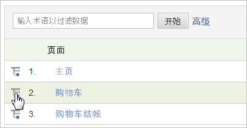

# 划分

当您想要详细了解报表项目或区段如何与其他报表关联时，可使用划分。这通常称为按其他报表“划分”报表。

例如，划分名为“年龄组”的自定义流量报表，您已在该报表中通过调查收集了网站访客的年龄。此报表可供您查看网站上创造最大流量的年龄组。但是，如果您已经捕获了访客年龄等数据，则除页面查看以外，您可能还想了解更多详情。您可以生成划分报表，说明访客使用的搜索引擎类型、所用关键词，或所处地理位置。您可以将年龄组与搜索引擎关联。

如果您按 *`Referrer Type`*, you might see a data point for *`Inside Your Site`*. 此值指示“内部 URL 过滤器”列表中的连接页面。请参阅“管理参考”中的[内部 URL 过滤器](https://marketing.adobe.com/resources/help/en_US/reference/internal_URL_filter.html)。

您可以按任何其他变量划分所有 Analytics 变量（eVar 或 prop）。报表表格中的“**[!UICONTROL 划分依据]”菜单与标准 Analytics 报告菜单匹配，从而保持选择的一致性。**

## 运行划分报表 {#task_F685624830E64C829C8BE6435A107F69}

描述有关如何运行划分报表的步骤。

<!-- 

t_reports_breakdown.xml

 -->

1. Open report, such as **[!UICONTROL Analytics]** &gt; **[!UICONTROL Reports]** &gt; **[!UICONTROL Site Content]** &gt; **[!UICONTROL Pages]**.
1. In the report table, click the **[!UICONTROL Breakdown By]** icon.

   如果&#x200B;**[!UICONTROL 划分依据]图标不显示，则该功能不可用，或者尚未启用。**

   

   **[!UICONTROL 划分依据]菜单显示当前报表可以使用的所有划分选项。**
