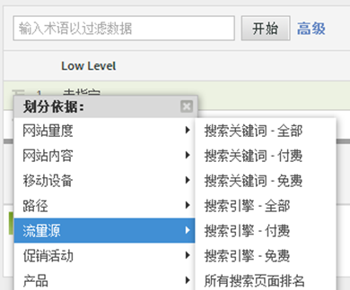
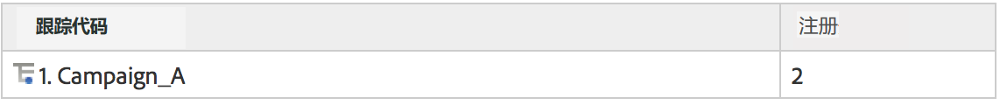
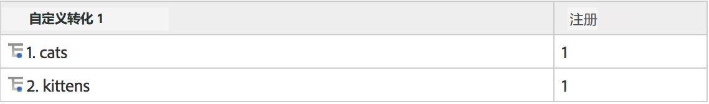
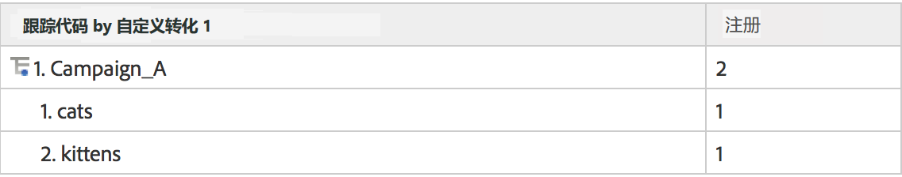

# 子关系

完全子关系会在所有转化报表中启用，因此任意一个 eVar 都可以由另一 eVar 划分。报表表格中的“划分依据”菜单与标准 Analytics 报告菜单匹配，从而保持选择的一致性。

## 子关系的工作原理 {#section_5BD862BB74FE411B96B59204520E4631}

为了便于解释子关系的工作原理，请思考以下示例：

1. 一位用户通过 Campaign_A 来到您的网站并抵达主页。
1. 这位用户搜索“cats”并看到搜索结果。eVar1 用于记录内部搜索词。
1. 这位用户订阅电子邮件发送清单，此操作使用 event1 进行追踪。
1. 另外一位用户也是通过 Campaign_A 来到您的网站并抵达主页。
1. 这位用户搜索“kittens”并看到搜索结果 (eVar1)，同样也订阅了电子邮件发送清单 (event1)。

如果您生成跟踪代码报表，就会看到以下内容：

如果您生成 eVar1 报表，会看到以下内容：

如果您通过 eVar1 与促销活动报表建立子关系，会得到以下内容：

如果您通过促销活动与 eVar1 报表建立子关系，会得到以下内容：

由于转化变量具有持续性，因此共有两个数据列用于存储 eVar 值：触发的值，以及持续保留的值。如果我们要查看本示例的原始数据导出，它看起来会是这个样子（为本示例进行了简化）：

我们的后端通过允许 post_campaign 和 post_evar1 持续保留促销活动和 evar1 中定义的值来运作。子关系报表专门关注包含成功事件的点击（以浅黄色突出显示的行）。然后，它们会根据持续保留的值，填充子关系报表（在本示例中，post_campaign 和 post_evar1 是以浅黄色突出显示的单元格）。

基本上，子关系会按照以下步骤来填充报表：

* 将包含您正在报表中查看的成功事件的图像请求隔离。
* 从子关系中使用的各个转化变量返回持续保留的值。
* 根据子关系的顺序组织值。如果某个变量没有持续保留的值（例如，如果某个 eVar 从未被定义或从未过期），则会被存储在“无”的下面。

