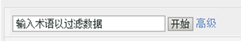
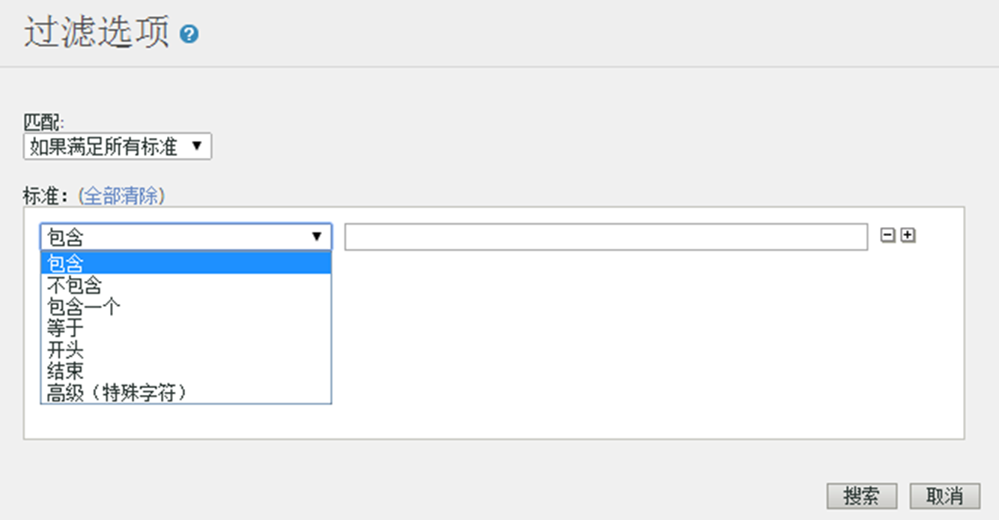

# Filter Report Data {#concept_09DC5B986A644738B12204DAC76A90E1}

使用这些过滤器可以限制报表的内容，使其包括或排除与过滤器匹配的行项目。

## 简单过滤器 {#section_5C4DE873F8D5484BB77F38A4AEB57B4A}



大多数报表中都显示了简单过滤器，您可以利用它快速查找特定的行项目。Simple filters do not use any special characters, so `-, ", ', +` and other special characters match the literal value in the report. 可以使用空格查找包含多个词语的行项目。

例如：

```
help search
```

匹配下列页面：

```
help:Search
help:Paid Search Detection
help:Configure paid search detection
help:Search Keywords Report
help:Internal Search Term
```

## 高级过滤器 {#section_E016626C084640E8A066B2FDA5B932BF}

使用高级过滤器，您可以通过一组过滤器来控制搜索范围。您可以选择匹配所有过滤器，或者匹配任意过滤器。



**包含**

如果在行项目的任意位置找到了相关词语，则匹配成功。它的操作方式与简单过滤器相同。

>[!NOTE]
>
>无法在过滤器中使用空格，因为搜索中的空格是分隔符

**不包含**

如果在行项目的所有位置都找不到相关词语，则匹配成功。You can filter "unspecified", "none", "keyword unavailable" and other [special values](https://marketing.adobe.com/resources/help/en_US/reference/none-unspecified-unknown-other.html) from reports using "does not contain".

不包含: `none`

要获得更精确的过滤器，可使用高级（特殊字符）过滤器：

* 高级（特殊字符） 上方添加以下代码：`-^none$`
* Advanced (Special Character): `-"keyword unavailable"`

例如，下面的行项目是按照“不包含”条件过滤的，而没有按照“高级（特殊字符）”条件进行过滤：

```
help:Rename the None classification key
```

**包含一个**

如果在行项目中找到用空格分隔的词语中的任何一个，则匹配成功。下面的过滤器显示所有包含“mens”或“sale”的页面。

包含一个 上方添加以下代码：`mens sale`

匹配下列页面：

```
Womens
Mens
Mens:Desk & TravelJewelry & Accessories:Accessories:Hats:Mens
Sale & Values
```

**等于**

如果整个行项目（包括空格和其他字符）与指定的短语匹配，则匹配成功。

等于 上方添加以下代码：`mens:desk & travel`

`Mens:Desk & Travel`

**开始于**

如果行项目（包括空格和其他字符）以指定的短语开头，则匹配成功。

开始于 上方添加以下代码：`mens`

匹配下列页面：

```
Mens
Mens:Desk & Travel
Mens:Apparel
Mens Perfume Spray
Mens Hemp/Bamboo Flip Flops
```

**结束于**

如果行项目（包括空格和其他字符）以指定的短语结尾，则匹配成功。

结束于 上方添加以下代码：`jean`

匹配下列页面：

```
Bell Bottom Jean
Velvet Dream Skinny Leg Jean
Dark Slimmer Jean
Bling Belt High Waist Jean
Ocean Blue Jean
```

## Advanced (Special Character) {#section_83DA3B6C23EB4C119DB6D74062DB501D}

使用“高级”可以执行通配符和其他复杂的搜索。

| 高级（特殊字符） | 描述 |
|--- |--- |
| `" "` | 匹配确切的短语。 |
| `*` | 通配符，属于贪婪匹配。<br>例如 `r*p` ，匹配“注册注册”。 |
| `^` | 开始于. <br>不要在特殊字符与搜索短语之间包括空格。 |
| `$` | 结束于. <br>不要在特殊字符与搜索短语之间包括空格。 |
| `-` | 非. <br>不要在特殊字符与搜索短语之间包括空格。 |
| `|` | Or<br>Note:  you must include a space on each side of the pipe character, `" | "`. |

## 创建特定于报表的过滤器 {#task_DEBB0632411D4CA8AA0B3BA267A5B35F}

描述如何为报表创建过滤器的步骤。

<!-- 

t_reports_filter_specific.xml

 -->

某些报表含有该报表特定的过滤器。例如，[!UICONTROL 购买转化漏斗]报表可让您按网页进行过滤。[!UICONTROL 地域划分]报表可让您按地域进行过滤。其他一些报表含有各自特定的过滤器。

访问这些过滤器时，您可以看到列表中指定项目的报表量度。

**创建特定于报表的过滤器**

1. Generate a report, such as a [!UICONTROL Purchase Report] ( **[!UICONTROL Site Metrics]** &gt; **[!UICONTROL Purchases]** &gt; **[!UICONTROL Purchase Conversion Funnel]**).
1.  在报表标题中，点击&#x200B;**过滤器**&#x200B;链接。
1.  在[!UICONTROL 过滤器选择器]**页面，单击[!UICONTROL 应用过滤器]**，然后选择一个过滤器类型。
1.  要搜索项目，请在&#x200B;**搜索**&#x200B;字段中键入字符串。
1. Click **[!UICONTROL OK]**.

## 添加关联过滤器 {#task_065042E384DA4BF3864C58AF2B88D6E2}

描述如何添加关联过滤器的步骤。

<!-- 

t_reports_correlation_filter.xml

 -->

某些报表可让您添加自定义关联过滤器。例如，若您正在查看将“网站区域”与女性产品页面相关联的报表包中的[!UICONTROL 页面报表]，则可创建一个过滤器规则，以生成显示“网站区域 ＝ 女性产品”的最受欢迎页面的报表。

可过滤关联报表（使用任何可用关联）中显示的数据。此示例显示添加搜索引擎关联过滤器的方法。

**添加关联过滤器**

1. 运行支持关联的报表。(See [Running a Breakdown Report](../../../analyze/reports-analytics/reports-customize/breakdowns.md#task_F685624830E64C829C8BE6435A107F69).)
1. In the report header, click the **[!UICONTROL Correlation Filter]** link.
1. 在[!UICONTROL “过滤器规则生成器”]下，选择要与某项目关联的类别。
1. Click **[!UICONTROL OK.]**
