# 更改报表图表

描述如何自定义图表以供预定受众充分使用的步骤。

可用的图表类型取决于您运行的报表类型。例如，趋势线图表对趋势报表有用，但您还能使用带趋势线的纵条图表，可以清楚地说明天数、周数、月数等的趋势。另外，您可以选择饼图以说明已查看页面的百分比。

**更改报表图表**

1. 运行报表.
1. Click **[!UICONTROL Configure Graph]**.
1.  选择一个图表类型。

   **[!UICONTROL 趋势线]**：趋势线显示报表量度的每日趋势，可用于以每条线显示某时段一个量度的趋势分析。

   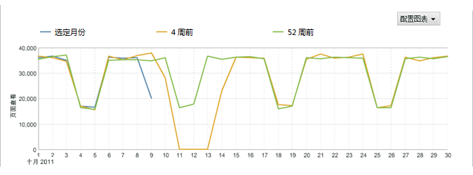

   **[!UICONTROL 平滑线]**：可在[!UICONTROL 视频详细信息]报表中使用此类图表。它会显示针对特定视频区段的查看次数或百分比。若针对特定视频区段的查看次数增加，则表示查看者已多次回访及查看此视频区段。若采用百分比，则图表中会显示所有已查看区段的百分比，而并非此区段查看者所占百分比。例如，此图表中所有报表区段数合计为 39。0 至 10 秒区段的查看次数为 10。因而，此区段的查看次数百分率约为 26%。

   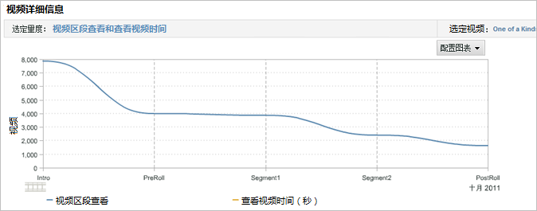

   **[!UICONTROL 区域图]**：区域图与趋势线图类似，但填充了线下区域。必须查看趋势报表才会显示区域图。

   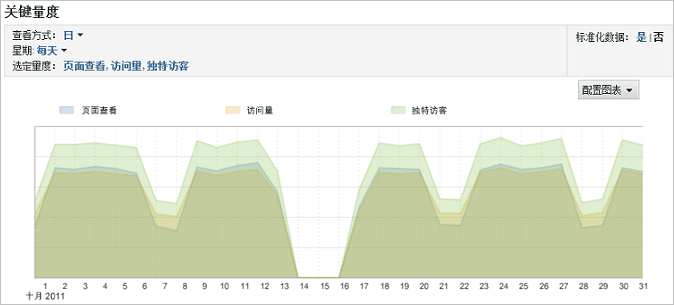

   **[!UICONTROL 堆叠式区域图]**：堆叠式区域图在显示某时间段内的数量产品或促销活动的趋势时很有用。例如，若您设置显示排名前五的产品的收入趋势，则可以快速查看在某时间内这些产品带来的总收入。您可以通过使用搜索过滤器添加或排除特定产品来改进视图。

   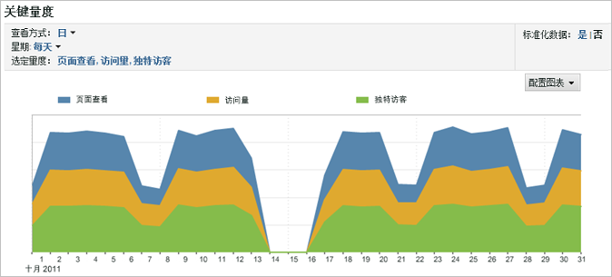

   **[!UICONTROL 垂直条]**：垂直条图显示报表量度的相关百分比。

   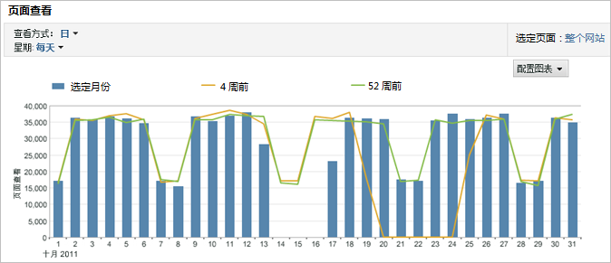

   **[!UICONTROL 堆叠的垂直条]**：堆叠相似项目，您就可快速查看一个项目的整体影响力。例如，在[!UICONTROL 促销活动报表]中，您可以堆叠类似的成功量度并查看哪个促销活动取得最大的整体成功。通过堆叠相似项目容易发现在某个量度表现并非最佳，但在量度组合中表现最佳的促销活动。

   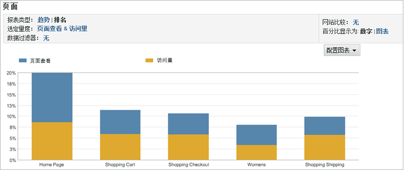

   **[!UICONTROL 水平条]**：水平条图与垂直条图类似，不过是采用水平条。

   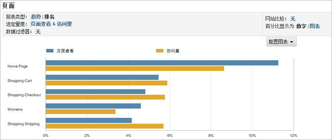

   **[!UICONTROL 堆叠的水平条]**：堆叠的水平条图与垂直条图类似，不过是采用水平条。

   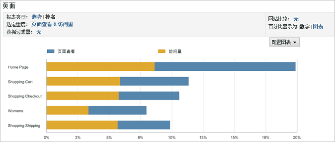

   **[!UICONTROL 饼图]**：饼图显示各大量度值之间的百分比关系，并显示所选量度与整体的百分比关系。您可显示排名报表的饼图。

   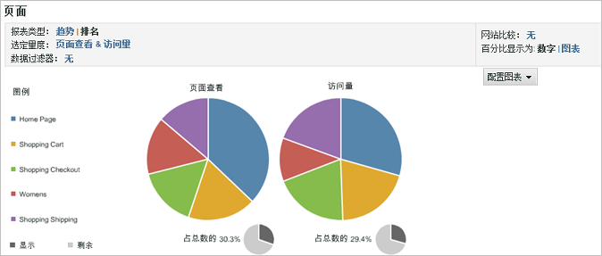

   **[!UICONTROL 散点图]**：散点图用散点显示您所选量度之间的关系。散点图以二维呈现数据，从而辨别哪些项目是异常值。

   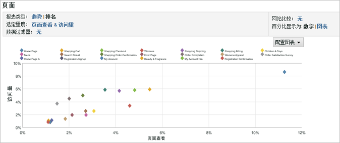

   **[!UICONTROL 气泡图]**：气泡图用气泡显示您所选量度之间的关系。气泡的位置显示横轴和纵轴上的量度关系，气泡大小体现主要的报表量度。气泡图以二维呈现数据，从而辨别哪些项目是异常值。

   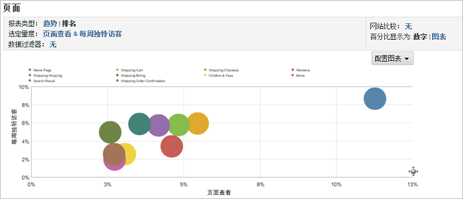

