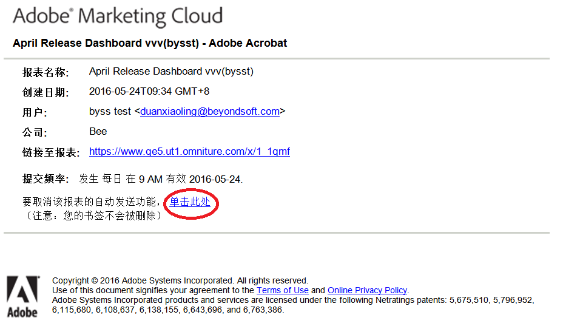

# 报告计划和分发

有关计划、下载和分发报表的信息。

## Report schedule and distribution {#concept_4EA333DFC7FD4E9CA086385A3DA10BE9}

有关计划、下载和分发报表的信息。

计划报表以提交至 Adobe Analytics 应用程序时，可以使用“计划”和“分发”工具来查看已经自动发送的文件，并修改或终止提交。

由于处理机制和平台的不同，Adobe Analytics 中各类可下载报表和计划报表对它们能够在单个请求中处理的行数上限有不同的限制。各种限制如下所示：

* Word、CSV、Excel、HTML 和 PDF：等同于报表中可见的行数。此限制默认为 50 行，但是可以增加到 200 行。划分报表的硬性限制为 50 行。
* 数据提取：50,000 行
* Data Warehouse：无限制

请注意，以上是对单个计划报表和下载报表的限制；功能板受制于缩图报表中可用的空间大小。

## 发送报表 {#task_27642CD33D484FD0BF59EBD159EEF52C}

描述如何以各种格式下载报表和通过电子邮件发送报表，以及计划报表以进行提交的步骤。

<!-- 

t_send_report.xml

 -->

1. Run a report, then click **[!UICONTROL More]** &gt; **[!UICONTROL Send]**.
1.  指定提交选项： 

   | 选项 | 描述 |
   |--- |--- |
   | 格式 | 选择“PDF”或“HTML”。 |
   | 收件人 | 提供用于接收报表的电子邮件地址。 |
   | 主题 | 电子邮件的主题。 |
   | 日程安排 | 选择立即发送报表或者在不同的间隔发送。 |

1. Click **[!UICONTROL Advanced Delivery Options]** to specify a delivery schedule.

   <table id="choicetable_2934E54FEE6E4D33B07EAC21F6DF628E"> 
   <thead class="chhead sthead"> 
   <th class="choptionhd"> 选项 </th> 
   <th class="chdeschd"> 描述 </th> 
   </thead> 
   <tr class="chrow strow"> 
   <td class="choption"><strong>报表文件名称</strong></td> 
   <td class="chdesc stentry"> 
指定报表名称。默认格式是 <code>&lt;报表名称&gt; for &lt;包&gt; - &lt;报表日期范围&gt;</code>。 
 
要指定自定义名称，请选择自定义。 
 </td> 
   </tr> 
   <tr class="chrow strow"> 
   <td class="choption"><strong>报表格式</strong></td> 
   <td class="chdesc stentry"> 
可让您指定 PDF、CSV、Excel、HTML、Word 或 Mobile 格式进行提交。如果选择 CSV，还可以为 CSV 指定编码： 
 
 
      <ul id="ul_4A2EB8D9512246589994052CF482BFD7"> 
      <li id="li_A4FC4D795A9D4F92AAB187ACDFBA180D"> 
 SHIFT-JIS：日文字符编码。 
 </li> 
      <li id="li_405C7EC97F994D649A50F84466FADA3D"> 
 EUC-JP：扩展 UNIX 代码，主要用于日语、朝鲜语和简体中文。 
 </li> 
      </ul> 
 </td> 
   </tr> 
   <tr class="chrow strow"> 
   <td class="choption"><strong>报表目录</strong></td> 
   <td class="chdesc stentry"> 
 表格中的行数：指定希望在发送的报表的表格中显示的行数。 
 
 页眉和页脚所用的语言：指定页眉和页脚的语言。 
 
 注释：指定在报表开始部分显示的文本。 
 </td> 
   </tr> 
   <tr class="chrow strow"> 
   <td class="choption"><strong>发送数字签名文件</strong></td> 
   <td class="chdesc stentry"> 
请求报表（例如书签报表或 Data Warehouse 请求）时，您可以请求数据签名。Adobe 的数字签名不限制谁能够访问数据，但数字签名文件 (.sig) 的目的是验证已提交报表文件的有效性。使用数字签名，报表的接收方可以验证文件是否来自 Adobe 且未发生更改。 
 </td> 
   </tr> 
   <tr class="chrow strow"> 
   <td class="choption"><strong>报表目标</strong></td> 
   <td class="chdesc stentry"> 
 电子邮件：可配置电子邮件地址设置、主题行及注释。 
 
 FTP：可配置 FTP 设置，包括主机、端口、目录、用户名和密码。 
 </td> 
   </tr> 
   </table>

1. Click **[!UICONTROL Scheduling Options]**.

   <table id="choicetable_589A39087F4C497D8913364FFF0125B7"> 
   <thead class="chhead sthead"> 
   <th class="choptionhd"> 选项 </th> 
   <th class="chdeschd"> 描述 </th> 
   </thead> 
   <tr class="chrow strow"> 
   <td class="choption"><strong>立即发送报表</strong></td> 
   <td class="chdesc stentry"> 
立即发送报表。 
 </td> 
   </tr> 
   <tr class="chrow strow"> 
   <td class="choption"><strong>安排以后执行</strong></td> 
   <td class="chdesc stentry"> 
显示选项以指定时间范围和提交选项。 
 </td> 
   </tr> 
   <tr class="chrow strow"> 
   <td class="choption"><strong>报表时间范围</strong></td> 
   <td class="chdesc stentry"> 
 固定：防止日期随时间变化而更改。 
 
 连续：允许日期随时间变化而更改。请注意以下事项： 
 
 
      <ul id="ul_5CDCCBEFEB364800A428614183A0E6A1"> 
      <li id="li_37B8F32A9E3B4979B5239A58F0C5A71C"> 
如果选择滚动的开始和结束日期，在选择前一天的每日报表时，将会每天收到附有前一天报表的电子邮件。 
 </li> 
      <li id="li_83FFD2400C6A453783CDD9BB3B9BA3F9"> 
如果选择固定开始日期和滚动结束日期，将会在第一天收到前一天的报表。第二天将收到前两天的报表，第三天将收到前三天的报表，依此类推。 
 </li> 
      <li id="li_28F8552D699841BC942058247D39DBB9"> 
如果选择固定的开始和结束日期，将每天收到指定日期的相同报表。 
 </li> 
      <li id="li_A594A6E2A4044ED6AC0A80F88EB203B3"> 
不能选择滚动的开始日期和固定的结束日期。 
 </li> 
      </ul> 
 </td> 
   </tr> 
   <tr class="chrow strow"> 
   <td class="choption"><strong>提交频度</strong></td> 
   <td class="chdesc stentry"> 
 每小时：提交电子邮件的时间间隔为每小时、每两小时，或任何其他以小时为单位的时间间隔。 
 
 每日：发送电子邮件的时间间隔为每日、每两日、每三日，或其他任何以日为单位的时间间隔。您也可每个工作日都发送报表电子邮件。 
 
 每周：发送电子邮件的时间间隔为每周、每两周、每三周，或其他任何以周为单位的时间间隔。您也可指定在每周某一天发送邮件。 
 
 每月：指定以月为单位的时间间隔，您也可以选择在每月的某天发送，或每月特定某周中的某天发送。 
 
 每年：指定在一年的某天发送报表，或在一年里任何一周中的某天发送报表。 
 
 一天内时段：对所选报表包的关联时区应用。 
 </td> 
   </tr> 
   <tr class="chrow strow"> 
   <td class="choption"><strong>结束传递选项</strong></td> 
   <td class="chdesc stentry"> 
 永不结束：不指定结束时间。 
 
 &lt;值&gt; 出现后结束：指定结束提交前的发生次数。 
 
 结束日期：可指定具体日期。 
 
如果您要在与报表数据相同的日期处理数据，报表将仅包含发送报表时已输入数据库的数据。一日的完整数据可能最多需要 24 小时才能完成处理，因此发送报表时完整数据可能还不可用。若要完全的数据，请始终将处理时间设为报告期结束 24 小时之后。 
 </td> 
   </tr> 
   </table>

## 打印报表 {#task_0F7CF6D6ED54462CAE4A793E271AF7E5}

描述如何打印报表的步骤。

<!-- 

t_reports_print.xml

 -->

1. 运行报表.
1. Click **[!UICONTROL More]** &gt; **[!UICONTROL Print]**.  

## 使用基本选项下载报表 {#task_43660107A1C9485D92981CD75B562577}

使用 PDF、CSV、Excel 或原始数据导出格式下载有关特定报表的详细信息。

<!-- 

t_download-report.xml

 -->

1. 在 **Analytics** &gt; **[!UICONTROL 报表]**&#x200B;中，选择要查看的报表。
1. Click **[!UICONTROL Download]**.

   

1. 为报表选择所需的格式：

   * **[!UICONTROL PDF]**：指定将以 Adobe PDF 下载报表，无论收件人运行的计算机系统如何，都可让您与其他人员共享该报表。
   * **[!UICONTROL CSV]**：指定报告将下载( [!DNL .csv] 以逗号分隔的值格式)。
   * **[!UICONTROL Excel]**：指定将以 Microsoft Excel 格式下载报表，这可让您与可以使用电子表格程序打开报表的其他人员共享该报表。
   * **[!UICONTROL Word]**：指定将以 Microsoft Word 格式下载报表。
   >[!NOTE]
   >
   >如果使用某种原始导出格式下载报告并且页面名称为空，Adobe Analytics可能没有足够的时间来处理数据。在稍后下载报表。

## 管理计划报表 {#task_C17677C543454FF2B06D10EA5652DFBC}

有关管理计划报表的信息。

<!-- 

t_schedule_manage.xml

 -->

在[!UICONTROL 计划报表管理器]中，可以编辑和删除重复的报表提交。您可以创建提交计划，通过电子邮件或 FTP 将报表发送至指定位置。您可将这些计划配置为以指定间隔在某个时间段或不定时地自动发送报表，或停止报表循环提交操作。

[!UICONTROL 计划报表管理器]显示特定用户创建的项目。若应用程序中禁用此用户帐户，则会停止所有计划的提交。

1. To access the manager, click **[!UICONTROL Analytics]** &gt; **[!UICONTROL Components]** &gt; **[!UICONTROL Scheduled Reports]**.

## 共享报表链接 {#task_9711DDE9E140451B8C914EC5513E21EC}

描述如何通过生成报表链接 (URL) 以发送给其他用户来共享报表的步骤。

<!-- 

t_reports_share_link.xml

 -->

收件人单击此链接时，系统将要求提供登录凭据（公司名称、用户名和密码）。登录后，原始用户生成的报表将显示给收件人。应用标准权限限制。

**共享报表链接**

1. 运行报表.
1. Click **[!UICONTROL More]** &gt; **[!UICONTROL Link to This Report]**.

## 取消订阅计划报表 {#concept_6B48360F935740B6851BA85D32DEF637}

您可以取消订阅计划报表。即使将您的用户名重新添加到计划报表，您也不会再收到此报表。

<!-- 

t_schedule_unsubscribe.xml

 -->

>[!IMPORTANT]
>
>为了使您再次收到报告，需要创建新的计划。

要取消订阅计划报表，请执行以下操作：

1. 找出那封电子邮件，其中包含您要取消订阅的报表的链接。

   

1. Click the **[!UICONTROL click here]** link next to **[!UICONTROL To cancel automatic delivery of this report]**.

1. 确认您要取消报表发送。

   >[!NOTE]
   >
   >无论您是报表调度程序还是报表收件人，此工作流都是相同的。

取消订阅报表并不会取消计划报表。

要取消计划报表，请导航至“计划管理器”，然后单击报表名称旁边的红色“X”。[更多信息...](../../analyze/reports-analytics/scheduling.md#task_C17677C543454FF2B06D10EA5652DFBC)
