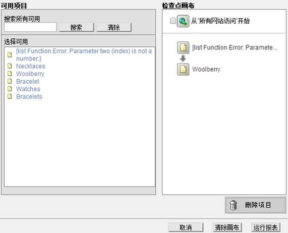
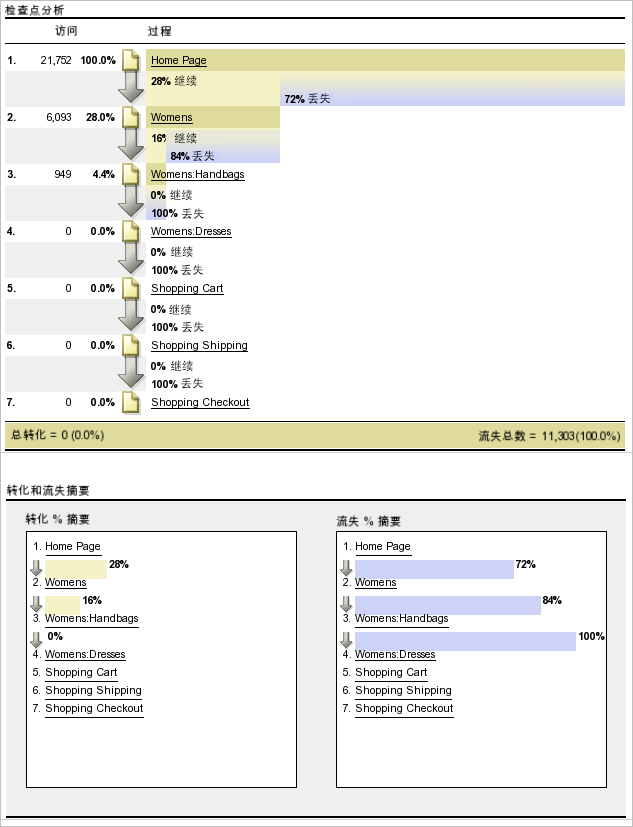
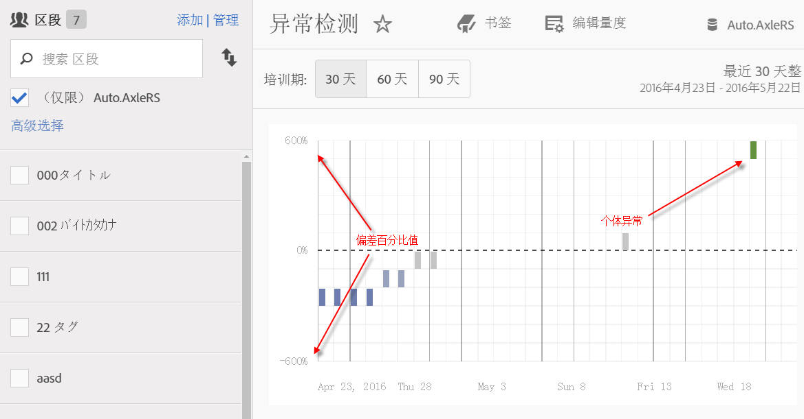
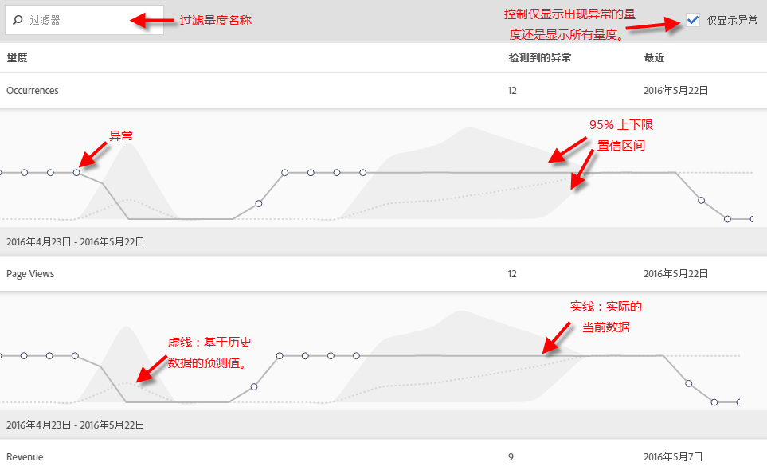
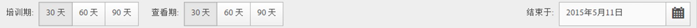
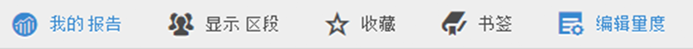
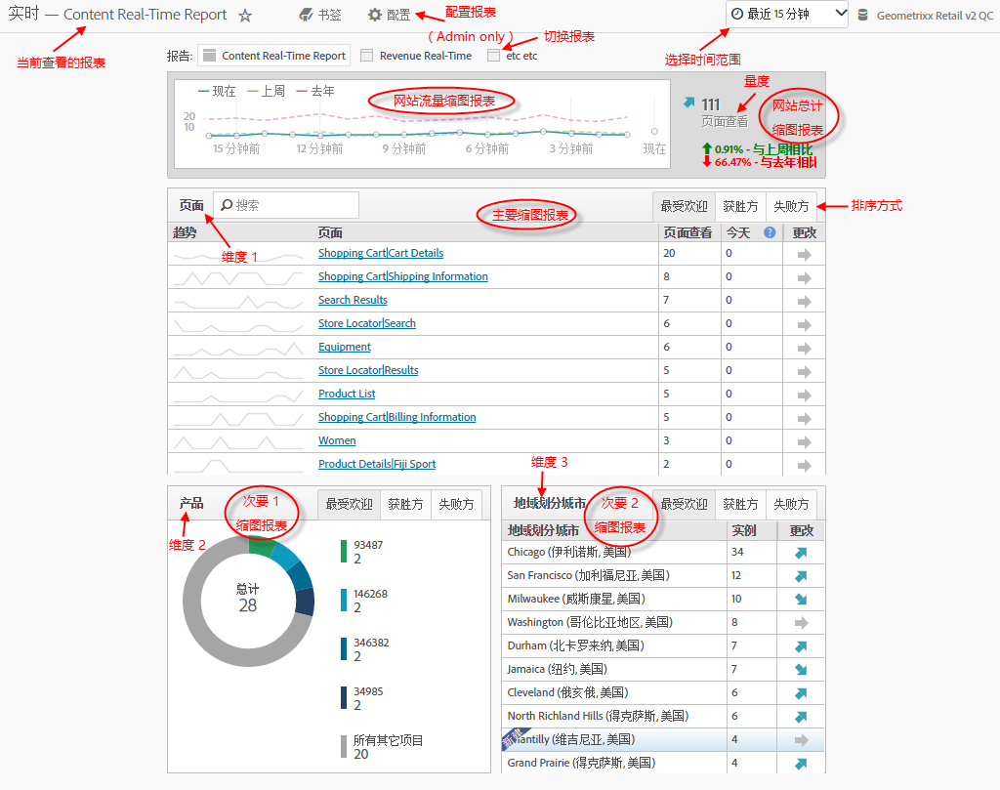
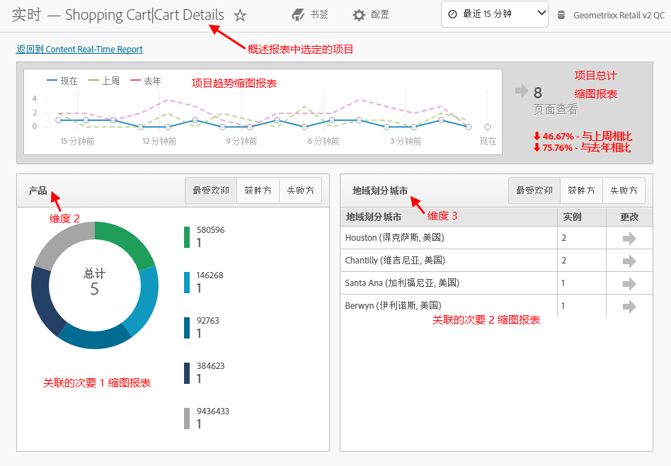

# 运行不同的报表类型

运行不同报告类型的步骤。

## 运行排名报表 {#task_C570BA4A213F4F2EB7B30E012934BE7D}

在排名报表中，表格会根据数量或百分比，显示与量度相关的报表页面排名。排名报表可以在一份报表中显示多个量度。

<!-- 

t_reports_ranked.xml

 -->

1. Generate a report, such as a [!UICONTROL Pages Report] ( **[!UICONTROL Reports]** &gt; **[!UICONTROL Site Content]** &gt; **[!UICONTROL Pages]**).
1.  在报表标题中，点击&#x200B;**[!UICONTROL 排名]。**
1.  要对报表排名，单击表格的列标题。

   排名报表的表格可列出最多 200 个项目（如产品、类别、网页等）以及十个量度（如收入、订购、查看次数等）。

## 运行趋势报表 {#task_F03B4E760B9E4EA29FC3F654E6316887}

趋势报表显示特定时段的量度。要查看某个区段从特定时段到下一时段的表现，可使用该报表类型。

<!-- 

t_reports_trended.xml

 -->

多数转换和流量报表可使用趋势视图。使用[!UICONTROL 日历]，您可显示任何时段划分的改进，包括一个月中的某些天、一年中的某些周、一个季度中的某些周、一年中的某些月等等。趋势报表显示单个量度（如收入、订购、点击次数等）的趋势，最多可显示五个项目（如产品、类别、网页等）。

**运行趋势报表**

1. Run a conversion or traffic report, such as **[!UICONTROL Reports]** &gt; **[!UICONTROL Site Content]** &gt; **[!UICONTROL Pages]**.
1. Under **[!UICONTROL Report Type]**, click **[!UICONTROL Trended.]**

## 运行转化漏斗报表 {#task_B926A74AA6A641138C2986C1635120CB}

转化漏斗报表显示经过一系列事件以执行您期望的操作的访客百分比。例如，您可能需要查看有多少访客从访问网页前进到添加商品至购物车，然后购买商品。这也显示整个过程中流失的用户人数。

<!-- 

t_reports_conversion_funnel.xml

 -->

To run this report, select a report, such as a Pages report ( **[!UICONTROL Reports]** &gt; **[!UICONTROL Campaigns]** &gt; **[!UICONTROL Tracking Code]** &gt; **[!UICONTROL Campaign Conversion Funnel]**).

有关描述，请参阅[转化报表](https://marketing.adobe.com/resources/help/en_US/reference/reports_conversion.html)。

## 运行流失报表 {#task_8FD97C8260464F9DA731A93DB8F80184}

[!UICONTROL 流失报表]显示访问预先指定的页面顺序的访客数。它还显示每个步骤之间的转化和流失百分比。

<!-- 

t_reports_fallout.xml

 -->

在 Analysis Workspace 中查看新的[流失分析](https://marketing.adobe.com/resources/help/en_US/analytics/analysis-workspace/fallout_flow.html)面板！

1. In [!UICONTROL Adobe Analytics], click **[!UICONTROL Reports]** &gt; **[!UICONTROL Paths]** &gt; **[!UICONTROL Pages]** &gt; **[!UICONTROL Fallout]**.
1. On the [!UICONTROL Fallout Report] page, click **[!UICONTROL Launch the Fallout Report Builder]**.

   

1.  在[!UICONTROL 定义检查点]页面上，指定要用于报表的检查点。
1. Click **[!UICONTROL Run Report]**.

   

>[!MORE_LIKE_THIS]
>
>* [流失报表描述](https://marketing.adobe.com/resources/help/en_US/reference/reports_fallout.html)

## 运行页面流量报表 {#task_133E8B87C3F04DA0A42D10CBA499305B}

页面流量报表显示访客访问页面和导航网站的顺序。此报表有助于解答相关问题。

<!-- 

t_reports_page_flow.xml

 -->

在 Analysis Workspace 中查看新的[流量可视化](https://marketing.adobe.com/resources/help/en_US/analytics/analysis-workspace/flow.html)！

运行[路径](https://marketing.adobe.com/resources/help/en_US/reference/reports_paths.html)报表。

For example, click **[!UICONTROL Reports]** &gt; **[!UICONTROL Paths]** &gt; **[!UICONTROL Pages]** &gt; **[!UICONTROL Next Page Flow]**.

从所选页面开始，从左到右读取该报表。在选定页面之后查看的页面以图形显示为向右侧扩展的分支。

页面名称旁将显示各后续页面的查看百分比。与下级各个页面关联的线条宽度即描述此相对百分比。

**[!UICONTROL 路径查看]**：用于指示以显示的路径查看某个页面的次数。

例如，“隐私策略”页面的总查看次数可能为 10,000，而只有 500 次与紧随主页后查看的页面关联。因而，会使用路径查看次数一词。

线条的相对宽度显示其相对百分比。默认情况下，此报表显示 5 个 2 级分支和 5 个 3 级分支。您可以将要查看的分支数量增加到 10 个 2 级分支和 5 个 3 级分支。这会增加报表的高度，而且很可能需要滚动才能查看整个图表。

## 运行漏斗报表 {#task_2BBF6FACD48F479E8B2EE458919941CB}

您可以选择成功事件并将它们添加到[!UICONTROL 购买转化漏斗]报表或[!UICONTROL 产品转化漏斗]报表。

<!-- 

t_reports_funnel.xml

 -->

1. Click **[!UICONTROL Reports]** &gt; **[!UICONTROL Products]** &gt; [Products Conversion Funnel](https://marketing.adobe.com/resources/help/en_US/reference/reports_conversion_funnel.html).

## 运行营销渠道报表 {#task_64ADED5CC75248319E06E3E029B47F78}

营销渠道报表提供第一个和最后一个渠道分配的概要报表，并显示标准的报表量度，如收入、订购和成本等。使用这些报表可以分析每个渠道产生的收入量。

<!-- 

t_reports_marketing_channel.xml

 -->

有关更多信息，请参阅[营销渠道](https://marketing.adobe.com/resources/help/en_US/mchannel/index.html)帮助系统。

## 运行异常检测报表 {#task_4808C96327354D789C075823F5C3A049}

描述如何解读异常检测中的概要图表和各个量度图表。

<!-- 

t_anomaly_view.xml

 -->

在 Analysis Workspace 中查看新的[异常检测和贡献分析](https://marketing.adobe.com/resources/help/en_US/analytics/analysis-workspace/anomaly_detection.html)功能！

**[!UICONTROL 报告]** &gt; **[!UICONTROL 站点度量]** &gt;异 **[!UICONTROL 常检测]** 。

>[!NOTE]
>
>You can also run Anomaly Detection from within Analysis Workspace projects. [更多...](https://marketing.adobe.com/resources/help/en_US/analytics/analysis-workspace/anomaly_detection.html)

有关设置异常检测的信息，请参阅《[参考指南](https://marketing.adobe.com/resources/help/en_US/sc/user/index.html#Setting_up_Anomaly_Detection)》。

异常检测显示了两种类型的图表：概要图表和单个量度图表。仅当至少检测到量度的一个异常时，才显示单个量度图表。

<table id="table_88163CD8FC164342855D90D01F9C581A"> 
 <thead> 
  <tr> 
   <th colname="col1" class="entry"> 
图表类型 
 </th> 
   <th colname="col2" class="entry"> 
作用 
 </th> 
  </tr> 
 </thead>
 <tbody> 
  <tr> 
   <td colname="col1"> 
概要图表 
 
 
 </td> 
   <td colname="col2"> 
 
     <ul id="ul_D26DA3024CD7468291369F549557B28A"> 
      <li id="li_1C22B6E02FFB479FB71EFAD89EB37A4E">每个框代表一个异常，每天跟踪一次，它对应于下面的量度。 </li> 
      <li id="li_8FC587D3FF4E452D83263CC7A10B6675">绿色表示异常数高于趋势线，蓝色表示异常数低于趋势线。 </li> 
      <li id="li_25135AB691BF443599AF2A3A60E2E71A">指示异常的强度：异常越强，数据点的颜色越深，距离趋势线越远。 </li> 
      <li id="li_0C42AFA8897D420D8AB1A5D0F65B3B3A">单击单个异常，可将该异常的单个量度图表（位于概要图表下方）置于顶部。 </li> 
      <li id="li_85C0F426952547B5A75D6BD31DE19CA5">偏差百分比值（位于图表左侧）是按照下面的方法计算的： 
       <ul id="ul_BEC0A88BFFAC4CF78BC9885FEB749694"> 
        <li id="li_1BAB2F50482745B69937DFAF1E09982E">如果上限与期望值相同，则偏差百分比为 100%。 </li> 
        <li id="li_CA48064F5788448C8646CCE196161237">否则，偏差%为(（实际值——上界值）/（上界值——预期值）)* 100 </li> 
        <li id="li_4090357A0D214BC7B1C3DE0615875554">If the lower bounds and the expected value are the same, the deviation % is -100% </li> 
        <li id="li_EF694E1A4E874ECD94E1E8F7302E494F">Otherwise the deviation % is ((lower bound value - actual value) / (expected value - lower bound value)) * -100 </li> 
       </ul> </li> 
      <li id="li_5C05EF7023484CC993E96D63E842B65C">单击显示区段可显示区段边栏，以允许您将区段应用到异常检测报表。请参阅有关分段的<a href="https://marketing.adobe.com/resources/help/en_US/analytics/segment/" format="http" scope="external">更多信息</a>。 </li> 
      <li id="li_1B41CABF13D1407886C68EE3BC201E60">单击编辑量度可让您选择和取消选择要为其检测异常的量度。 </li> 
     </ul> 
 </td> 
  </tr> 
  <tr> 
   <td colname="col1"> 
单个量度图表 
 
 
 </td> 
   <td colname="col2"> 
 
     <ul id="ul_739C5687013743A29B63089FDA763F45"> 
      <li id="li_456A0BDA4D4E46CE9CC1C3DBAA1E2220">以点的形式显示单个趋势量度（包括计算量度）的异常数据点。 </li> 
      <li id="li_89FD847C65F04F48BCA7CD38D0EC51CD">在最前面显示最近的异常，其次按照异常的数量进行排列。 </li> 
      <li id="li_98B97A9706DE4455B8D8850904CBDE03">显示一条实线以指示当前收集的实际数据。它是相对于预测和误差范围，以推断是否存在异常的数据点。 </li> 
      <li id="li_0EEA38DDDC344BF3879430E67D74EB72">显示一条虚线以表示基于历史数据（即，培训时段）的预测。 </li> 
      <li id="li_035BD2725D004AEDB630BF8DFF4DA4F3">以灰色阴影显示上限和下限 95% 的置信区间。 </li> 
      <li id="li_021A3D1F2EDB4319B9B39620EF1C038A">单击量度名称旁边的双向上箭头或双向下箭头，可以折叠和展开单个报表。 </li> 
      <li id="li_722E4B9FC21047AC96D7B143197E293D">通过向下钻取概述报表并做出相应操作，可以更改量度图表的显示顺序（参见上文） </li> 
      <li id="li_A2441169B185475AA68A64F81E6E40B8">通过使用搜索词（例如，对所有与页面相关的量度使用“页面”搜索词），可以过滤图表。 </li> 
      <li id="li_F1BBBFCA8E2A43C29658E4FCAA36C904">可以显示您定义的所有量度，或者仅显示存在异常的量度。 </li> 
     </ul> 
 </td> 
  </tr> 
 </tbody> 
</table>

## 设置异常检测 {#task_AF347B34F56E44A6AE70E019B6EB2F08}

选择报表包、量度和培训/查看时段以便进行异常检测的步骤。

<!-- 

t_anomaly_config.xml

 -->

可以为每个报表包设置单独的异常检测。

1. 导航至 **[!UICONTROL Analytics &gt; 报表 &gt; 网站量度 &gt; 异常检测]**。
1. 选择要跟踪每日异常检测情况的报表包。要显示报表包列表，请单击“报表包”选择器下拉菜单。
1. To select the metrics and/or define filtered metrics, click **[!UICONTROL Edit Metrics]**at the top right of the screen:  .

   您可以从以下位置选取量度：所有量度的列表（包括计算量度）或跟踪量度的列表。您还可以依据特定词语进行过滤，以缩小列表范围。1. Once the report has been generated, define the **[!UICONTROL Training Period]**and the **[!UICONTROL View Period]** for anomaly detection. （将培训时段看作是算法的“学习时段”。）

   

   请记住以下事项：

* 培训时段正好截止于查看时段开始之前。
* 两个时段的默认期限均为 30 天，您可以将其延长至 60 或 90 天。
* 如果延长培训时段，则会将您的数据放入一个更大的上下文中，而且可能会缩小异常的大小。

   每当您更改参数时，异常检测量度报表就会随之刷新。
1. (Optional) Apply segments to the report by clicking **[!UICONTROL Show Segments]** and selecting one or more existing segments or creating a new segment and applying it.

   

   有关创建和管理区段的详细信息，请参阅《[Analytics 分段指南](https://marketing.adobe.com/resources/help/en_US/analytics/segment/)》。1. （可选）将报表加入收藏夹或为其添加书签。
1. （可选）更改查看时段的结束日期。默认日期为昨天。
1. 您现在可以开始解读报表了。[查看异常检测图表](../../analyze/reports-analytics/t-running-report-types.md#task_4808C96327354D789C075823F5C3A049)。

## 运行实时报表 {#task_5D25929C918E40B18965222FA94176B0}

描述如何查看和解读实时报表。

<!-- 

reports_realtime.xml

 -->

**[!UICONTROL 报表 &gt; 网站量度 &gt; 实时]**。

实时报表提供了两个主要的报表 - 概述报表和详细信息报表。每个报表都包含许多缩图报表。

有关配置实时报表的信息，请参阅《[Analytics 参考指南](https://marketing.adobe.com/resources/help/en_US/reference/index.html#RealTime_Reports_Configuration)》。

1. Take a look at the **[!UICONTROL Overview]** report and its components:  

   <table id="choicetable_8586BECF55E843B2B5CD41205567EA32"> 
   <thead class="chhead sthead"> 
   <th class="choptionhd"> 用户界面组件 </th> 
   <th class="chdeschd"> 描述 </th> 
   </thead> 
   <tr class="chrow strow"> 
   <td class="choption"><strong>选择报表包</strong></td> 
   <td class="chdesc stentry"> 显示此实时报表涵盖的报表包。要更改报表包，请参阅<a href="https://marketing.adobe.com/resources/help/en_US/reference/t_realtime_admin.html" format="http" scope="external">实时报表配置</a>。 </td> 
   </tr> 
   <tr class="chrow strow"> 
   <td class="choption"><strong>切换报表</strong></td> 
   <td class="chdesc stentry"> 您可以在设置的报表（最多 3 个）间切换。 </td> 
   </tr> 
   <tr class="chrow strow"> 
   <td class="choption"><strong>选择时间范围</strong></td> 
   <td class="chdesc stentry"> 您可以选择报表中的所有缩图报表使用的整体时间范围。 </td> 
   </tr> 
   <tr class="chrow strow"> 
   <td class="choption"><strong>配置报表</strong></td> 
   <td class="chdesc stentry"> 仅当您具备管理员权限时，才能看到这个齿轮图标链接。单击该链接可访问位于管理工具 &gt; 报表包 &gt; 编辑设置 &gt; 实时中的报表包管理器。 </td> 
   </tr> 
   <tr class="chrow strow"> 
   <td class="choption"><strong>全屏视图</strong></td> 
   <td class="chdesc stentry"> 仅当您的显示器具有特定的纵横比（16:9 或 16:10）并且浏览器对此提供支持时，才能看到全屏视图图标。请注意，当屏幕处于全屏模式时，您无法与屏幕进行交互（按 Esc 可退出）。全屏模式不涉及超时。 </td> 
   </tr> 
   <tr class="chrow strow"> 
   <td class="choption"><strong>网站流量缩图报表</strong></td> 
   <td class="chdesc stentry"> 蓝色的趋势线数据显示了整个网站的总流量。除了作为实时表达而显示的当前值之外，X 轴还使用文字标签（15 分钟前、10 分钟前）。 </td> 
   </tr> 
   <tr class="chrow strow"> 
   <td class="choption"><strong>网站总计缩图报表</strong></td> 
   <td class="chdesc stentry"> 显示实时报表的选定量度在最近 N 分钟内的网站总计计数。可以通过时间范围选择器对“N”进行配置。 
箭头颜色和方向基于以下算法： 
      <ul id="ul_9F40CEA33798467393CB1266BB36D500"> 
      <li id="li_CCD01A44F912487DA5681EA50113643C">显著获胜（向上箭头）：大于 100% </li> 
      <li id="li_7402491A9A614851B7F2AE0C77BD9A97">获胜（右上箭头）：5% 至 100% </li> 
      <li id="li_BCA79C08B5714D4B9315068112C66107"> 平稳（向右箭头）：5% 至 -5% </li> 
      <li id="li_234ECBD7D83A4AE680E4A70BF288681F"> 失败（右下箭头）：-5% 至 -100% </li> 
      <li id="li_10C5EA8803604C1CA714D3DB27478B31"> 显著失败（向下箭头）：小于 -100% </li> 
      </ul> 
 
如果网站总计以“实例数”进行报告，则这些实例数反映主要缩图报表中的维度。如果存在特定于实例的名称（例如“页面查看”），则网站总计会报告该名称。 
 </td> 
   </tr> 
   <tr class="chrow strow"> 
   <td class="choption"><strong>主要缩图报表</strong></td> 
   <td class="chdesc stentry"> 有关实时报表的主要维度及其量度的报表。显示该元素在选定时间范围内的趋势线。量度总计显示完整趋势线的总和。箭头指示该项目是显著获胜、获胜、平稳、失败还是显著失败。 </td> 
   </tr> 
   <tr class="chrow strow"> 
   <td class="choption"><strong>搜索对话框</strong></td> 
   <td class="chdesc stentry"> 搜索会对所有缩图报表产生影响。在您查看报表时，搜索会持续进行。 </td> 
   </tr> 
   <tr class="chrow strow"> 
   <td class="choption"><strong>按最受欢迎/获胜方/失败方进行排序</strong></td> 
   <td class="chdesc stentry"> 您可以按最受欢迎（默认）、获胜方（显示增长最多的维度）和失败方（处于下跌轨迹的维度）切换排序。 
下面是用来确定获胜方或失败方的公式：“实时”查看最早的示例和接近最新的示例，然后执行简单的“% 变更”计算。如果选定“最近 15 分钟”，且 n 代表当前时间，则会计算 n-1 与 n-15 期间的变更情况。“实时”当前不执行任何加权操作。当前的时间（分钟）会被忽略，因为它没有完成，而且可能会产生一个错误的 % 变更。 
 
这个公式对于实时报表中用到的所有量度来说，都是一致的。 
 </td> 
   </tr> 
   <tr class="chrow strow"> 
   <td class="choption"><strong>次要 1 缩图报表</strong></td> 
   <td class="chdesc stentry"> 显示第二次配置的报表的维度和量度的实时报表。 
次要 1 缩图报表显示了前 4 个类别；第 5 个类别是关于所有剩余值的聚合。对于每个类别，缩图报表均提供了该类别的原始查看总数。此外，所有类别的总计情况显示在中心位置。 
 
 将鼠标悬停在某个区域上可突出显示相关的类别，并会在同心圆下方显示该类别的趋势线。 
 
 将鼠标悬停在某个行项目上可突出显示该行项目及其相关的区域，并会在同心圆下方显示该类别的趋势线。 
 </td> 
   </tr> 
   <tr class="chrow strow"> 
   <td class="choption"><strong>次要 2 缩图报表</strong></td> 
   <td class="chdesc stentry"> 显示第三次配置的报表的维度和量度的实时报表。将鼠标悬停在项目标签上可向右滑动标签，并为该悬停项目显示一条趋势线。 </td> 
   </tr> 
   </table>

1. Click a list item in the Primary Reportlet to launch the **[!UICONTROL Details]** view for that list item:  

   | **项目趋势缩图报表** | 显示概述报表中选定的项目在最近 N 分钟内的趋势线。可以通过时间范围选择器对 N 进行配置。 |
   |---|---|
   | **项目总计缩图报表** | 显示概述报表中选定的项目在最近 N 分钟内的量度总计数。可以通过时间范围选择器对 N 进行配置。 |
   | **关联的次要 1 缩图报表** | 此缩图报表与次要 1 缩图报表非常相似。二者唯一的区别在于用来填充此报表的数据源：在本示例中，它显示了特定页面（在概述报表的主要缩图报表中选定的页面）与查看的实例之间的关联（或划分）。 |
   | **关联的次要 2 缩图报表** | 此缩图报表与次要 2 缩图报表非常相似。二者唯一的区别在于用来填充此报表的数据源：在本示例中，它显示了特定页面（在概述报表的主要缩图报表中选定的页面）与语言维度之间的关联（或划分）。 |
