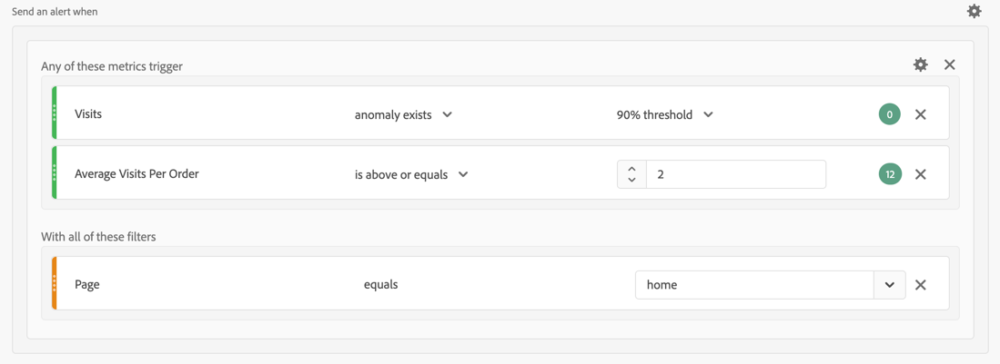

# 警报用例

您可以按照[创建警报](alert-builder.md)中所述创建警报。

以下部分说明了创建警报时需要考虑的示例用例。

## 过滤警报

您可以使用区段创建简单警报。 例如，为通过移动应用程序会话访问主页的访客定义会话数警报。

## 栈叠警报

您可以合并（栈叠）警报，而不是创建多个警报。 栈叠警报可确保合并警报，这样您就不会收到大量单独的警报。 在下面的示例中，当触发其中一个量度阈值时，将发送警报。

