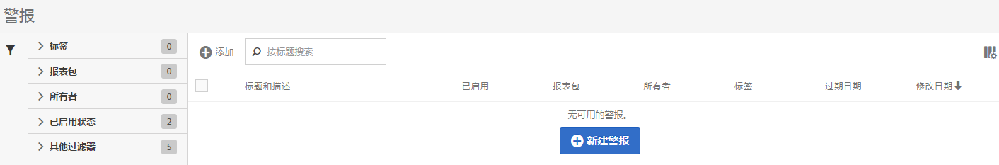

# 警报管理器

警报管理器的结构非常类似于 [区段管理器](https://experienceleague.adobe.com/docs/analytics/components/segmentation/segmentation-workflow/seg-manage.html?lang=zh-Hans) 和 [计算量度管理器](https://experienceleague.adobe.com/docs/analytics/components/calculated-metrics/calcmetric-workflow/cm-manager.html?lang=zh-Hans).

## 访问警报管理器

1. 在Adobe Analytics中，选择 [!UICONTROL **组件**] > [!UICONTROL **警报**].

## 警报管理器中的可用操作

在警报管理器中，您可以：

* 通过单击 **[!UICONTROL + 添加]**&#x200B;访问警报生成器。
* 为警报添加标签。这允许您对它们进行组织以方便使用。
* 删除警报。
* 重命名警报。
* 批准警报。
* 复制警报。
* 启用/禁用警报。
* **续订**&#x200B;警报过期日期。选择一个或多个警报后，单击&#x200B;**[!UICONTROL “续订”]**&#x200B;可续订它们。这会将它们的过期日期延长一年的时间（从单击&#x200B;**[!UICONTROL 续订]**&#x200B;之日算起，而不考虑它们的原始过期日期）。
* 将警报导出为 .CSV 文件。
* 双击警报标题以编辑警报。
* 搜索警报。
* 向其他报表包添加警报。
* 指定/更改警报的所有者。
* 添加其他过滤器。
* 定义警报&#x200B;**过期日期**。

## 配置列

通过配置显示的列，可以配置在“警报管理器”中为每个警报显示的信息。

要在警报管理器中配置可见列，请执行以下操作：

1. 在Adobe Analytics中，选择 **[!UICONTROL 组件]** 选项卡，然后选择 **[!UICONTROL 警报]**.

1. 在警报管理器中，选择 **自定义列** 图标 ，然后选择要显示在警报管理器中的列。

   以下列可供使用：

   | 列标题 | 描述 |
   |---|---|
   | 收藏 | 在每个警报旁边显示星形图标，允许您将警报标记为收藏。 <!-- For more information, see [Mark calculated metrics as favorites](/help/components/c-calcmetrics/c-workflow/cm-workflow/cm-favorite.md). --> |
   | 标题和描述 | 这些值在警报生成器中提供。 要编辑标题和描述，请选择标题链接以打开警报生成器。 |
   | 报表包 | 指示警报上次保存在哪个报表包中。 |
   | 所有者 | 指示警报的所有者。 如果您不是管理员，则只能看到您拥有的警报或与您共享的警报。 |
   | 标记 | 显示应用到警报的标记，这些标记由您自己或与您共享该警报的人添加。 |
   | 共享对象 | 列出您与其共享警报的个人或组（仅限管理员）或所有人（仅限管理员）。 |
   | 修改日期 | 指示上次修改警报的日期。 |
   | 上次使用时间 | 显示上次使用警报的日期。 
此信息可帮助您确定某个组件是否对组织中的用户有用、在何处使用该组件以及是否需要删除或修改该组件。

此信息不包括API、Report Builder或Data Warehouse的使用情况。
 |

   {style="table-layout:auto"}
