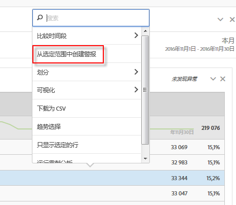
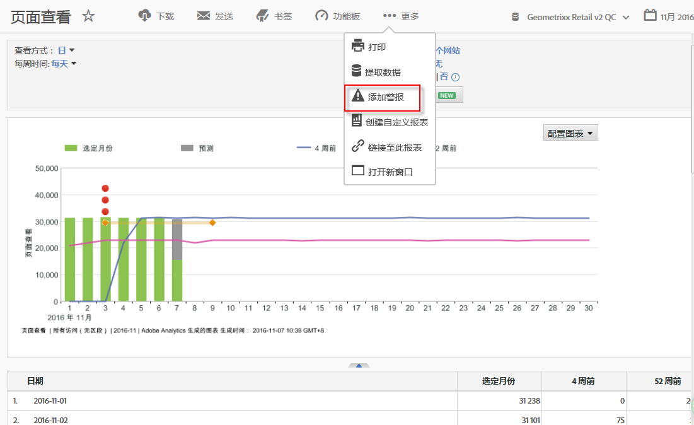

# 智能警报

智能警报系统允许对警报进行更细粒度的控制，并将异常检测与警报系统集成在一起。

以下是一段视频概述：

>[!VIDEO](https://video.tv.adobe.com/v/25446/?quality=12)

## 概述 {#section_6AC8CA81DEA94E99B0F192B60D0FDF03}

>[!IMPORTANT]
>
>智能警报仅适用于 Adobe [!DNL Analytics] Prime 和 Adobe [!DNL Analytics] Ultimate 客户。

智能警报允许您

* 构建基于异常的警报（90%、95%、99%、99.75% 或 99.9% 阈值；% 更改；以上/以下）。
* 预览警报触发的频率。
* 通过含链接的电子邮件或短信将警报发送到自动生成的 Analysis Workspace 项目。
* 创建可在一个警报中捕获了多个量度的“堆栈式”警报。

警报系统的组件包括：警报生成器、警报管理器、警报预览以及更便于创建警报的上下文关联访问。 旧的警报系统用户界面将不再可用，但警报将进行迁移。 一些旧警报功能[不再可用](https://experienceleague.adobe.com/docs/analytics/analyze/reports-analytics/alerts.html?lang=zh-Hans)。

可通过四种方式访问警报生成器：

* 在 Analysis Workspace 中使用以下快捷键：

  `ctrl (or cmd) + shift + a`
* 直接转到警报生成器：**[!UICONTROL 工作区]** > **[!UICONTROL 组件]** > **[!UICONTROL 新警报]**。
* 选择一个或多个自由格式表行项目，单击鼠标右键并选择&#x200B;**[!UICONTROL 从选定范围中创建警报]**。这将打开警报生成器，并在生成器中预填充表格中应用的相应量度和过滤器。然后，您可以根据需要编辑警报。

  

* 从 [!UICONTROL Reports &amp; Analytics] 报表中，转到&#x200B;**[!UICONTROL 更多]** > **[!UICONTROL 添加警报]**。这将打开新的警报生成器，并在生成器中预填充报表中应用的相应量度和过滤器。然后，您可以根据需要编辑警报。

  

## 常见问题解答：如何计算和触发警报 {#section_1F3B1DAF21784306953B49AAD4C3DCAB}

% 阈值代表标准偏差。例如，95% 等于 2 个标准偏差，99% 等于 3 标准偏差。根据您选择的时间粒度，将使用[不同的模型](/help/analyze/analysis-workspace/c-anomaly-detection/statistics-anomaly-detection.md)来计算每个数据点和标准值之间的间隔时间（标准偏差个数）。设定的阈值越低，异常会越多。例如，同 99% 的相比，90% 的阈值会产生更多的异常。过去，在时间粒度为每小时的情况下，为了让触发的异常保持低水平，专门设定了 99.75% 和 99.99% 这两个阈值。

<table id="table_B3AA85E1DE3543DCA34966A52E3CE4AB"> 
 <thead> 
  <tr> 
   <th colname="col1" class="entry"> 问题 </th> 
   <th colname="col2" class="entry"> 回答 </th> 
  </tr> 
 </thead>
 <tbody> 
  <tr> 
   <td colname="col1"> 
<b>问题：警报异常检测会将距离标准值多久的数据确定为异常数据？</b> 
 </td> 
   <td colname="col2"> 
培训期因选定的时间粒度而异。请参阅<a href="/help/analyze/analysis-workspace/c-anomaly-detection/statistics-anomaly-detection.md">异常检测</a>中使用的统计技术，以了解更多详细信息。下面是小结： 
 
    <ul id="ul_4F8C2A41F06C498DBF5E7AE5DE803773"> 
     <li id="li_E246091A3F1E484C8444AF4052FCA784">每月：15 个月及去年的相应日期范围 </li> 
     <li id="li_CC014FB38AE1492B9647E990C29BFB3C">每周：15 周及去年的相应日期范围 </li> 
     <li id="li_2517EE2097534324BE9C1B54CD181A62">每天：35 天及去年的相应日期范围 </li> 
     <li id="li_710BC8B009354542AA4962A59A646099">每小时：336 个小时 </li> 
    </ul> </td> 
  </tr> 
  <tr> 
   <td colname="col1"> 
<b>问题：如果我只想收到峰值异常行为警报或谷值异常行为警报，我可以使用异常功能吗？还是我需要使用绝对值？</b> 
 </td> 
   <td colname="col2"> 
使用绝对值仍会同时触发谷值警报和峰值警报。您无法将谷值警报和峰值警报分离开来。 
 </td> 
  </tr> 
  <tr> 
   <td colname="col1"> 
<b>问题：我可以将警报配置为仅在一天中的特定时间触发吗（如上班时间与非上班时间）？</b> 
 </td> 
   <td colname="col2"> 
当前还不可以。 
 </td> 
  </tr> 
  <tr> 
   <td colname="col1"> 
<b>问题：我可以获得用虚线制成的“预期值”表格吗？表格中会包含一些预期值的结果吗？</b> 
 </td> 
   <td colname="col2"> 
在 Workspace 中无法实现，但是在 Report Builder 中可以（请观看视频：<a href="https://experienceleague.adobe.com/docs/analytics-learn/tutorials/exporting/report-builder/anomaly-detection-in-report-builder.html?lang=zh-Hans"  >Report Builder 中的异常检测</a>)。 
 
请记住，Report Builder 使用的是略微简单的异常检测方法。它使用固定的 30 天训练周期，固定的 95% 间隔。 
 </td> 
  </tr> 
 </tbody> 
</table>
