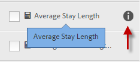
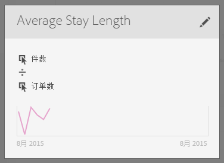

# 生成量度

Adobe Analytics提供了一个画布以将维度、量度、区段和函数拖放到其中，从而根据容器层次结构逻辑、规则和运算符创建自定义量度。 通过这种集成式开发工具，您可以生成并保存简单或复杂的计算量度。

您可以通过以下任意方式开始创建计算量度：

* 在Analysis Workspace中，打开一个项目，然后选择 **[!UICONTROL 组件]** > **[!UICONTROL 创建量度]**.
* 在Analysis Workspace中，打开一个项目，然后选择 **加号** 图标 [!UICONTROL **量度**] 部分。
* In [!DNL Analytics]，转到 **[!UICONTROL 组件]** > **[!UICONTROL 计算量度]**，然后选择 **[!UICONTROL +添加]** “计算量度”页面的顶部。

## 可用字段和区域 {#section_9382AEEBA4244DD6A9F6C1DD3F6D076B}

<table id="table_60A82936321047D1A335331BF83B0972"> 
 <thead> 
  <tr> 
   <th colname="col2" class="entry"> 字段 </th> 
   <th colname="col3" class="entry"> 描述 </th> 
  </tr> 
 </thead>
 <tbody> 
  <tr> 
   <td colname="col2">  标题  </td> 
   <td colname="col3"> 
必须为指标命名。如果没有命名，则无法保存指标。 
 </td> 
  </tr> 
  <tr> 
   <td colname="col2">  描述  </td> 
   <td colname="col3"> 
给指标一个便于用户理解的描述，以展示其用途并区分它与类似的指标。 
 
该描述还会显示在报表内。最好不要在描述中放入公式，而是描述此指标应当用于哪些方面，不应当用于哪些方面。（公式会在您创建指标时生成，它位于“摘要”标题的下面。因此，无需将公式添加到描述中。） 
 </td> 
  </tr> 
  <tr> 
   <td colname="col2">  格式  </td> 
   <td colname="col3"> 
选项包括“小数”、“时间”、“百分比”和“货币”。 
 </td> 
  </tr> 
  <tr> 
   <td colname="col2">  小数位  </td> 
   <td colname="col3"> 
显示将在报表中显示的小数位数。您可以指定的最大小数位数为 10。 
 </td> 
  </tr> 
  <tr> 
   <td colname="col2">  将上升趋势显示为...  </td> 
   <td colname="col3"> 
此指标极性设置显示 Analytics 应当将指标中的上升趋势视为有利（绿色）还是不利（红色）。最终，报表中的图表将在上升时显示为绿色或红色。 
 </td> 
  </tr> 
  <tr> 
   <td colname="col2">  标记  </td> 
   <td colname="col3"> 
标记是一种用于组织指标的好方法。所有用户均可创建标记，并将一个或多个标记应用于指标。但是，您只能查看您所拥有的或与您共享的那些区段的标记。应创建哪种类型的标记？以下是对实用标记的一些建议： 
     <ul id="ul_9A6CE5F179424687A39F2D5C1A953258"> 
      <li id="li_A8815F2D8D284874AD701A7B103D82A3">基于<b>团队名称</b>的标记，如社交营销、移动营销。 </li> 
      <li id="li_A51A4515A541488E9D90296A955E9F4F"><b>项目</b>标记（分析标记），如登录页面分析。 </li> 
      <li id="li_B4605470A7094026AC168420B64BBCC3"><b>类别</b>标记：男士；地理位置。 </li> 
      <li id="li_B6EAB0F2A96C41209C4EC97B9E64390B"><b>工作流程标记：待批准；策划（为特定的业务部门）</b> </li> 
     </ul> 
 </td> 
  </tr> 
  <tr> 
   <td colname="col2">  摘要  </td> 
   <td colname="col3"> 
无论您何时对指标定义进行更改，摘要公式都会随之发生更新。当您将光标悬停在指标上方并单击  图标时，此公式还会显示在左侧的指标边栏中。 
 </td> 
  </tr> 
  <tr> 
   <td colname="col2">  定义  </td> 
   <td colname="col3"> 
在此处，您可以拖入指标/计算指标、区段和/或函数，以生成计算指标。 
 
 
     <ul id="ul_B13401A266354DC594C6176025DB61CB"> 
      <li id="li_01776C32C7C5440AA1F847096CBED92B">如果拖入一个计算指标，则它将自动展开其指标定义。 </li> 
      <li id="li_A483D352522E4572AB43042473053359">您可以通过容器嵌套定义。但是，与区段容器不同的是，这些容器的作用类似于数学表达式，它们决定着运算的顺序。 </li> 
     </ul> 
 </td> 
  </tr> 
  <tr> 
   <td colname="col2">  运算符  </td> 
   <td colname="col3"> 
默认运算符是除以 ()，还有 +、- 和 x 运算符。 
 </td> 
  </tr> 
  <tr> 
   <td colname="col2">  预览  </td> 
   <td colname="col3"> 
提供对可能存在的任何错误的快速阅览。预览涵盖过去 90 天的范围。这种方式可用于初步评估您是否为指标选择了正确的组件。出现意外结果表示您需要重新检查指标定义。 
 </td> 
  </tr> 
  <tr> 
   <td colname="col2">  产品兼容性  </td> 
   <td colname="col3"> 
“产品兼容性”显示指标是与<a href="https://experienceleague.adobe.com/docs/analytics/analyze/reports-analytics/current-data.html?lang=zh-Hans"  >当前数据</a>、“完全处理数据”兼容，还是只与“营销渠道报表”（首次联系分配）兼容。 
注意：“当前数据”并不支持所有指标。包含区段或函数的指标与“当前数据”不兼容。<a href="/help/components/c-calcmetrics/cm-compatibility.md"  > 更多... </a> 
 
 </td> 
  </tr> 
  <tr> 
   <td colname="col2">  添加  </td> 
   <td colname="col3"> 
对于所有类型的计算指标，均可将容器和静态数字添加到定义。对于高级计算指标，您还可以添加区段和函数。 
 
 
     <ul id="ul_607C1B303F334062BC620317667DE490"> 
      <li id="li_53462789B8AF4F1AA9B45565D37CF22B">容器的作用类似于数学表达式，它们决定着运算的顺序。因此，容器中的任何内容都将在下次运算前得到处理。 </li> 
      <li id="li_401A9E0D8B3B468990289DBF66A06F63">将区段拖到容器上，会将该容器中的所有内容分段。（仅限高级计算指标） </li> 
      <li id="li_F191B200D7A944F9ADC0573A9A82A6DA">您可以在一个容器中堆叠多个区段。 </li> 
     </ul> 
 </td> 
  </tr> 
  <tr> 
   <td colname="col2"> 齿轮图标（指标类型、归因） </td> 
   <td colname="col3"> 
选择指标旁边的齿轮图标允许您指定<a href="/help/components/c-calcmetrics/c-workflow/cm-workflow/c-build-metrics/m-metric-type-alloc.md"  >指标类型和归因模型</a>。 
 </td> 
  </tr> 
  <tr> 
   <td colname="col2">  + 新建  </td> 
   <td colname="col3"> 
允许您创建新组件，例如新区段（可使您转到<a href="/help/components/segmentation/segmentation-workflow/seg-build.md"  >区段生成器</a>）。 
 </td> 
  </tr> 
  <tr> 
   <td colname="col2"> 
搜索组件 
 </td> 
   <td colname="col3"> 
通过此搜索栏，您可以搜索维度、指标、区段（仅限高级计算指标）和函数（仅限高级计算指标）。 
 </td> 
  </tr> 
  <tr> 
   <td colname="col2"> 
维度列表 
 </td> 
   <td colname="col3"> 
要在区段生成器中构建简单区段（例如“页面 = 主页”），您无需离开计算指标生成器，而是可以在“页面”中拖动并从计算指标生成器中直接选择“主页”。 
 
这可以极大地简化用于创建分段计算指标的工作流程。 
 </td> 
  </tr> 
  <tr> 
   <td colname="col2"> 
指标列表 
 </td> 
   <td colname="col3"> 
指标有以下 3 种类别： 
 
    <ul id="ul_7BF50F4964EF45858FBA1634FBFA45CF"> 
     <li id="li_90F2312927A6499CA1CE04F8FFC912CF">标准指标 ( ) </li> 
     <li id="li_A3F59083E79B4AC780D6F8CEDFFD20C9">计算指标 ( ) </li> 
     <li id="li_8735E76637ED4C3F983731A66E04C93E">指标模板 () — 位于列表底部。 </li> 
    </ul> 
当您将光标悬停在指标上方时，可以在其右侧看到“信息”图标：。单击此图标会显示以下信息： 
 
    <ul id="ul_DF35DDB9FBFA40C8A93FA0F2286A0BBE"> 
     <li id="li_4215AA9BF93F4C8B941002A7A4D2F50B">有关如何计算指标的公式。 </li> 
     <li id="li_6A8E39EB6DCE4377B0B594B6D4FC0294">指标的预览趋势。 </li> 
     <li id="li_44C1595E4BE64ED69D1DB3BB6655ED55">位于右上角的编辑（铅笔）图标可使您转到计算指标生成器，以便在其中编辑此计算指标。 </li> 
    </ul> 
 
 </td> 
  </tr> 
  <tr> 
   <td colname="col2"> 
区段列表 
 </td> 
   <td colname="col3"> 
（仅限高级计算指标）如果您是管理员，此列表会显示在您的登录公司中创建的所有区段。如果您不是管理员，此列表会显示您拥有的区段以及与您共享的区段。<a href="https://experienceleague.adobe.com/docs/analytics/components/segmentation/segment-reference/seg-rights.html?lang=zh-Hans"  > 更多... </a> 
 </td> 
  </tr> 
  <tr> 
   <td colname="col2"> 
函数列表 
 </td> 
   <td colname="col3"> 
（仅限高级计算指标）函数将分为两个列表：<a href="/help/components/c-calcmetrics/cm-reference/cm-functions.md"  >基本</a>（最常用）和<a href="/help/components/c-calcmetrics/cm-reference/cm-adv-functions.md"  >高级</a>。 
 </td> 
  </tr> 
  <tr> 
   <td colname="col2"> 
报表包选择器 
 </td> 
   <td colname="col3"> 
允许您切换到其他报表包。 
 </td> 
  </tr> 
 </tbody> 
</table>
