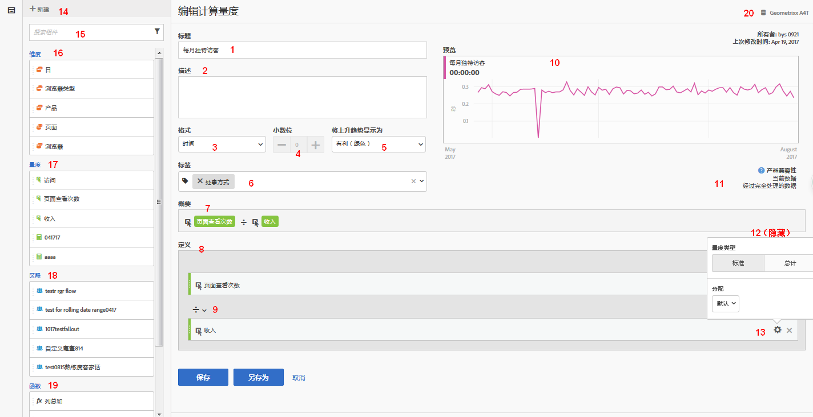

# 生成计算量度 {#build-metrics}

Adobe Analytics 提供了一个画布，用于拖放维度、量度、区段和函数，以基于容器层次结构逻辑、规则和运算符创建自定义量度。通过这种集成式开发工具，您可以生成并保存简单或复杂的计算量度。

您可以使用计算量度生成器来创建或编辑计算量度。以这种方式创建时，计算量度可在组件列表中使用，然后可在整个组织的项目中使用。或者，您可以快速创建仅适用于创建它的项目的计算量度，如[量度](/help/analyze/analysis-workspace/components/apply-create-metrics.md)中[为单个项目创建计算量度](/help/analyze/analysis-workspace/components/apply-create-metrics.md#create-calculated-metrics-for-a-single-project)所述。

[创建计算量度](../cm-workflow.md)介绍了用于创建新计算量度的各类可用选项。

## 计算量度构建器的区域

**[!UICONTROL 计算量度生成器]**&#x200B;对话框用于创建新的或编辑现有的计算量度。对于您在[[!UICONTROL 计算量度]管理器](../cm-manager.md)中创建或管理的量度，该对话框的标题为&#x200B;**[!UICONTROL 新建计算量度]**&#x200B;或&#x200B;**[!UICONTROL 编辑计算量度]**。

>[!BEGINTABS]

>[!TAB 计算量度生成器]

>[!TAB 创建或编辑计算量度]

>[!ENDTABS]

1. 指定以下详细信息（为必要项）：

   | 元素 | 描述 |
   | --- | --- |
   | **[!UICONTROL 报告包]** | 您可以为计算量度选择报告包。您定义的计算量度将在基于所选报告包的 Workspace 项目中可用。 |
   | **[!UICONTROL 仅限于项目的量度]** | 当您编辑为单个项目创建的计算量度时，此对话框顶部会出现一个信息框，如[为单个项目创建计算量度](/help/analyze/analysis-workspace/components/apply-create-metrics.md#create-calculated-metrics-for-a-single-project)中所述。 
如果您希望将此计算量度用于所有项目，请选择以下选项：**[!UICONTROL 将此量度提供给所有项目并将其添加到组件列表中]**。
 |
   | **[!UICONTROL 标题]** | 为计算量度命名，例如，`Conversion Rate`。 |
   | **[!UICONTROL 描述]** | 提供对区段的描述，例如：`Calculated metric to define the conversion rate.` 无需描述计算量度的公式，因为[!UICONTROL 摘要]中已自动提供该公式。 |
   | **[!UICONTROL 格式]** | 选择计算量度的格式：您可以选择&#x200B;**[!UICONTROL 小数]**、**[!UICONTROL 时间]**、**[!UICONTROL 百分比]**&#x200B;和&#x200B;**[!UICONTROL 货币]**。 |
   | **[!UICONTROL 小数位]** | 指定所选格式的小数位数。仅当选择的格式为十进制、货币和百分比时启用。 |
   | **[!UICONTROL 将上升趋势显示为]** | 指定计算量度的上升趋势是否显示为 ▲ **[!UICONTROL 良好（绿色）]**&#x200B;或 ▼ **[!UICONTROL 不良（红色）]**。 |
   | **[!UICONTROL 货币]** | 指定计算量度的货币。仅当选择的格式为货币时才启用。 |
   | **[!UICONTROL 标记]** | 通过创建或应用一个或多个标记来组织计算量度。开始键入，以查找您可以选择的现有标记。或者按&#x200B;**[!UICONTROL 输入]**&#x200B;键添加新的标记。选择  以移除标记。 |
   | **[!UICONTROL 预览]** | 预览涵盖过去 90 天的情况，并且可以衡量您是否正确定义了量度。 |
   | **[!UICONTROL 摘要]** | 显示计算量度定义的摘要。 例如： **[!UICONTROL 总订单]**   **[!UICONTROL 会话]**。 |
   | **[!UICONTROL 定义]** | 使用[定义生成器](#definition-builder)来定义区段。 |

1. 要验证您的计算量度定义是否正确，请使用不断更新的计算量度结果&#x200B;**[!UICONTROL 预览]**。**[!UICONTROL 预览]**&#x200B;涵盖过去 90 天，并会持续评估计算量度的定义。

   **[!UICONTROL 产品兼容性]**&#x200B;表示该计算量度与 Adobe Analytics 各项功能的兼容情况。请参阅[量度兼容性](/help/components/c-calcmetrics/cm-compatibility.md)，以了解更多信息。

1. 选择:
   * **[!UICONTROL 保存]**&#x200B;以保存计算量度。
   * **[!UICONTROL 另存为]**&#x200B;以保存计算量度的副本。
   * **[!UICONTROL 取消]**&#x200B;以取消您对计算量度所做的任何更改，或者取消创建新的计算量度。

## 定义生成器

您可以使用定义生成器来拖放维度、量度、区段和函数，以根据容器层级结构逻辑、规则和运算符来创建自定义量度。在该构造中，您可以使用标准度量、Adobe 定义的度量、计算度量、区段、维度和函数。所有这些组件都可以从计算量度生成器中的组件面板中获得。此外，您还可以在定义中使用运算符和容器。

在&#x200B;**[!UICONTROL 定义]**&#x200B;区域中，仅会将量度定义为单一组件。所有其他组件都会被定义为容器、包装量度或其他容器。有关更多信息，请参阅[容器](#containers)。

### 量度

要添加量度：

* 将**[!UICONTROL 量度]**&#x200B;组件从组件面板拖放到 **[!UICONTROL 将量度、维度、维度项、区段和/或函数拖放到此处]**。您可以使用组件栏中的来搜索特定组件。

当您使用计算量度作为定义的一部分时，计算量度将会展开。

要修改量度：

1. 在区域中的量度组件中选择&#x200B;**[!UICONTROL 设置]**。
1. 在弹出对话框中，您可以定义量度的类型和归因模型。请参阅[量度类型和归因](m-metric-type-alloc.md)。

要删除量度：

* 在量度中选择。

### 运算符

运算符允许您指定组件或容器之间的运算符。运算符自动出现在

* 容器中的两个或多个量度，
* 容器中的两个或多个容器，
* 容器中的一个或多个量度以及一个或多个容器。

您可以选择︰

| 符号 | 运算符 |
|:---:|---|
|  | 除（默认） |
|  | 乘 |
|  | 减 |
|  | 加 |

### 静态数字

您可以向计算量度定义中添加一个静态数字。要添加一个静态数字：

* 从容器内选择  **[!UICONTROL 添加]**。
* 选择&#x200B;**[!UICONTROL 静态数字]**。出现静态数字容器。
* 选择&#x200B;[!UICONTROL *单击以添加值*]&#x200B;并输入一个值。

### 容器

您可以将维度、区段和函数作为容器添加到计算量度定义中。您还可以添加通用容器。容器的作用类似于数学表达式，它们决定着运算的顺序。容器内的任何内容都会在下一个组件或容器之前得导出理。

#### 区段容器

您可以使用区段容器的概念来创建[分段量度](metrics-with-segments.md)。您可以使用区段或者使用从某个维度创建的区段来构建区段容器。

* 要从某个维度添加区段容器：

   1. 将 **[!UICONTROL 维度]**&#x200B;组件从组件面板拖放到 **[!UICONTROL 将量度、维度、维度项、区段和/或函数拖放到此处]**。您可以使用组件栏中的来搜索特定组件。
   1. 在&#x200B;**[!UICONTROL 从维度创建区段]**&#x200B;弹出窗口中，定义该区段的条件。从运算符列表中选择，并选择一个值或输入一个值。例如，**[!UICONTROL 月份]****[!UICONTROL 等于]**  `Sep 2024`。
   1. 选择&#x200B;**[!UICONTROL 完成]**。现在，**[!UICONTROL 定义]**&#x200B;中添加了一个区段容器。

* 要从某个区段添加区段容器，您可以使用：

   * 将**[!UICONTROL 区段]**&#x200B;组件从组件面板拖放到 **[!UICONTROL 将量度、维度、维度项、区段和/或函数拖放到此处]**。您可以使用组件栏中的来搜索特定区段。使用区段的名称，区段容器被自动添加到&#x200B;**[!UICONTROL 定义]**&#x200B;中。

   * 将**[!UICONTROL 区段]**&#x200B;组件从组件面板拖放到通用容器上。该容器变成了一个区段容器。

   * 从容器内选择  **[!UICONTROL 添加]**：

      1. 选择&#x200B;**[!UICONTROL 区段]**。现在，**[!UICONTROL 定义]**&#x200B;中添加了一个区段容器。
      1. 在这个新的区段容器中，从&#x200B;[!UICONTROL *选择……*]&#x200B;下拉菜单中选择一个区段。

  >[!TIP]
  >
  >您可以在一个容器中添加多个区段。

  容器中的区段以区段组件命名。例如， **[!UICONTROL Web 会话]**。选择  可显示一个包含区段详细信息的弹出窗口。在这个弹出窗口中，选择可编辑区段定义。

要从容器中移除某个区段：

* 选择区段名称旁边的。

有关更多详细信息和示例，请参阅[区段化量度](metrics-with-segments.md)。

#### 函数容器

要添加函数容器，您可以使用：

* 拖放：

   1. 将  **[!UICONTROL 函数]**&#x200B;组件从组件面板拖放到 **[!UICONTROL 将量度、维度、维度项、区段和/或函数拖放到此处]**。您可以使用组件栏中的来搜索特定函数。
   1. 使用函数的名称自动将函数容器添加到&#x200B;**[!UICONTROL 定义]**。

* 从容器内选择  **[!UICONTROL 添加]**：

   1. 选择&#x200B;**[!UICONTROL 函数]**。
   1. 在容器中，从&#x200B;[!UICONTROL *选择……*]&#x200B;下拉菜单中选择一个函数。

函数容器以函数组件命名。例如， **[!UICONTROL 平方根（量度）]**。选择  来显示一个带有函数详细信息的弹出窗口。选择&#x200B;**[!UICONTROL 了解更多]**，以了解有关该函数的更多信息。

请参阅[使用函数](cm-using-functions.md)，了解有关如何使用函数以及可以使用哪些函数来创建计算量度的详细信息。

#### 通用容器

要添加通用容器：

* 从容器内选择  **[!UICONTROL 添加]**
* 选择&#x200B;**[!UICONTROL 容器]**。**[!UICONTROL 定义]**&#x200B;中添加了一个新的空容器。您可以使用通用容器在计算量度的定义中嵌套或创建层级结构。

#### 删除容器

要删除容器，请在容器级别选择。

>[!MORELIKETHIS]
>
>[使用函数](cm-using-functions.md)
>>[区段](/help/components/segmentation/seg-overview.md)
>

<!--

Adobe Analytics provides a canvas to drag and drop dimensions, metrics, segments, and functions to create custom metrics based on container hierarchy logic, rules, and operators. This integrated development tool lets you build and save simple or complex calculated metrics.

## Begin building a calculated metric

You can use the calculated metric builder to create or edit calculated metrics. When created in this way, calculated metrics are available in the component list and can then be used in projects throughout your organization. Alternatively, you can quickly create a calculated metric that is available only for the project where it was created, as described in [Create calculated metrics for a single project](/help/analyze/analysis-workspace/components/apply-create-metrics.md#create-calculated-metrics-for-a-single-project) in [Metrics](/help/analyze/analysis-workspace/components/apply-create-metrics.md).

Access the calculated metric builder to begin creating a calculated metric that is available in the component list. 

1. Access the calculated metric builder in any of the follows ways:

   * In Analysis Workspace, open a project, then select **[!UICONTROL Components]** > **[!UICONTROL Create metric]**.
   * In Analysis Workspace, open a project, then select the **Plus** icon next to the [!UICONTROL **Metrics**] section in the left rail.
   * In [!DNL Adobe Analytics], go to **[!UICONTROL Components]** > **[!UICONTROL Calculated metrics]**, then select **[!UICONTROL + Add]** at the top of the Calculated metrics page.

1. Continue with [Areas of the calculated metric builder](#areas-of-the-calculated-metrics-builder).

## Areas of the Calculated metrics builder

The following image and accompanying table explain some of the main areas and features of the Calculated metrics builder.

| Location in image  | Name and function  |
|---|---|
| 1 | **Title:** Naming the metric is mandatory. You cannot save the metric unless it is named.  |
| 2 | **Description:** Give it a user-friendly description to show what it's used for and to distinguish it from similar ones. 
The description also appears within a report. It's best NOT to put the formula into the description - instead, describe what this metric should and should not be used for. (The formula is generated as you build the metric, underneath the Summary heading. As a result, there is no need to add the formula to the description.) 
  |
| 3 | **Format:** Choices include Decimal, Time, Percent, and Currency.  |
| 4 | **Decimal Places:** Shows how many decimal places will be shown in the report. The maximum number of decimal places you can specify is 10.  |
| 5| **Show Upward Trend As:** This metric polarity setting shows whether Analytics should consider an upward trend in the metric as good (green) or bad (red). As a result, the report's graph will show as green or red when it's going up.  |
| 6 | **Tags:** Tagging is a good way to organize metrics. All users can create tags and apply one or more tags to a metric. However, you can see tags only for those segments that you own or that have been shared with you. What kinds of tags should you create? Here are some suggestions for useful tags:<ul><li>**Team names**, such as Social Marketing, Mobile Marketing.</li><li>**Projects** (analysis tags), such as Entry-page analysis.</li><li>**Categories**, such as Women's; Geography.</li><li>**Workflows**, such as To be approved; Curated for (a specific business unit)</li></ul> |
| 7 | **Summary:** 
The Summary formula updates anytime you make a change to the metric definition. This formula also shows up in the metrics rail on the left when you hover over a metric and click the  icon. 
  |
| 8 | **Definition:** This is where you drag in metrics/calculated metrics, segments, and/or functions to build the calculated metric. <ul><li>If you drag in a calculated metric, it will expand its metric definition automatically. </li> <li>You can nest definitions with containers. However, unlike segment containers, these containers function like a math expression and determine the order of operations. </li> </ul>  |
| 9 | **Operator:** Divided by (  ) is the default operator, plus there are the +, -, and x operators. |
| 10 | **Preview:** Provides a quick read on any possible errors. The preview covers the last 90 days. This is a way of initially gauging whether you have selected the right components for your metric. An unexpected result would mean you need to take a second look at the metric definition.  |
| 11 | **Product compatibility:** Product compatibility shows you whether the metric is compatible with <a href="https://experienceleague.adobe.com/docs/analytics/analyze/reports-analytics/current-data.html?lang=zh-Hans"  > Current Data </a>, with Fully Processed Data, or only with Marketing Channel reports (first-touch allocation). 
Note:  Current Data does not support all metrics. Metrics that contain segments or functions are not compatible with current data. <a href="/help/components/c-calcmetrics/cm-compatibility.md"  > More... </a> 
 
  |
| 12 | **Add:** For all types of calculated metrics, you can add containers and static numbers to the definition. For advanced calculated metrics, you can also add segments and functions. <ul><li>Containers function like a math expression and determine the order of operations. So anything in a container will get processed before the next operation.</li><li>Dragging a segment onto a container segments everything in that container. (Advanced calculated metrics only)</li><li>You can stack multiple segments in a container.</li></ul> |
| 13 | **Gear icon (Metric Type, Attribution):** Selecting the gear icon next to a metric lets you specify the <a href="/help/components/c-calcmetrics/c-workflow/cm-workflow/c-build-metrics/m-metric-type-alloc.md"  > metric type and attribution models </a>. |
| 14 | **New:** Lets you create a new component, such as a new segment (which takes you to the <a href="/help/components/segmentation/segmentation-workflow/seg-build.md"  > Segment Builder </a>.) |
| 15 | **Search Components:** This search bar lets you search for dimensions, metrics, segments (advanced calculated metrics only), and functions (advanced calculated metrics only). |
| 16 | **List of Dimensions:** Rather than leaving the Calculated Metric Builder in order to build a simple segment (in the Segment Builder), e.g. "Page = Homepage", you can drag in Page and select Homepage directly from the Calculated Metric Builder.
This results in a much more streamlined workflow for creating segmented calculated metrics.
 |
| 17 | **List of Metrics:** Metrics come in 3 categories: <ul> <li>Standard metrics () </li><li>Calculated metrics ( ) </li><li id="li_8735E76637ED4C3F983731A66E04C93E">Metrics templates ( ) - at the bottom of the list. </li> </ul> 
When you hover over a metric, you can see the Info icon to the right of it: . Clicking this icon gives you the following information: 
<ul> <li>The formula of how it is calculated. </li><li>A preview trend of the metric. </li><li>An edit (pencil) icon  at the top right that will take you to the Calculated Metrics Builder where you can edit this calculated metric. </li></ul> |
| 18 | **List of Segments:** (Advanced calculated metrics only) As an Admin, this list shows all segments created in your login company. If you are a non-Admin user, this list shows segments you own and those shared with you. <a href="https://experienceleague.adobe.com/docs/analytics/components/segmentation/segment-reference/seg-rights.html?lang=zh-Hans"  > More... </a> |
| 19 | **List of Functions:** (Advanced calculated metrics only) Functions are divided into two lists: <a href="/help/components/c-calcmetrics/cm-reference/cm-functions.md"  > Basic </a> (used most often) and <a href="/help/components/c-calcmetrics/cm-reference/cm-adv-functions.md"  > Advanced </a>. |
| 20 | **Report Suite selector:** Lets you switch to a different report suite. |

{style="table-layout:auto"}

-->
