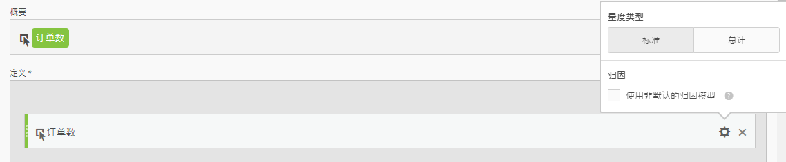
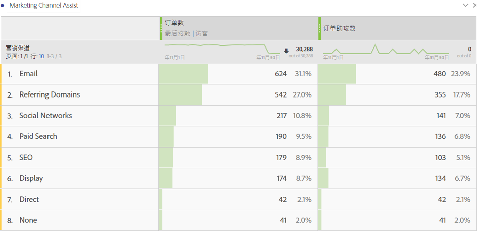

# 订购协助量度

有关如何创建量度以显示哪个营销渠道有助于提高订购数量的说明。此说明适用于任何感兴趣的维度或成功事件。

1. 在计算量度生成器中，将度量命名为“辅助订购”。
1. 在“定义”画布中，拖入“订购”量度。然后，选中&#x200B;**[!UICONTROL 使用非默认归因模型]复选框，以通过“设置”齿轮调整归因模型。**

   

1. 选择&#x200B;**[!UICONTROL 自定义]作为归因模型。**&#x200B;将权重更改为 0（首次接触），100（中间接触）和 0（最后接触）。

   

1. 保存该量度。
1. 在 Analysis Workspace 中使用营销渠道维度、订购以及新增的辅助订购量度创建一个自由格式表。

   

这种方法可轻松显示哪些营销渠道有助于提高订购数量。或者，在自由格式表中，您可以右键单击任意量度并直接从表中调整归因模型。
