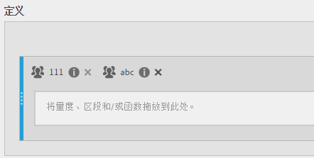
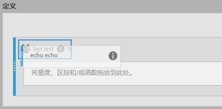

# 堆栈和替换区段

显示如何在计算量度生成器内堆叠和替换区段。

## 堆叠区段 {#section_3FC1118FEE2B40B7BB90F29C8521AF53}

在“定义”画布中，只需将新区段拖放到现有区段旁边：

## 将一个区段替换为另一个区段 {#section_3DA899DF522A44D7A583C5DC8C0A033E}

在“定义”画布中，只需将新区段拖放到现有区段上方：

