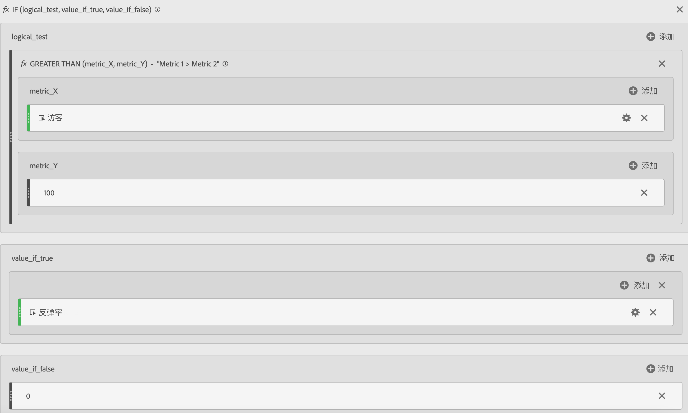
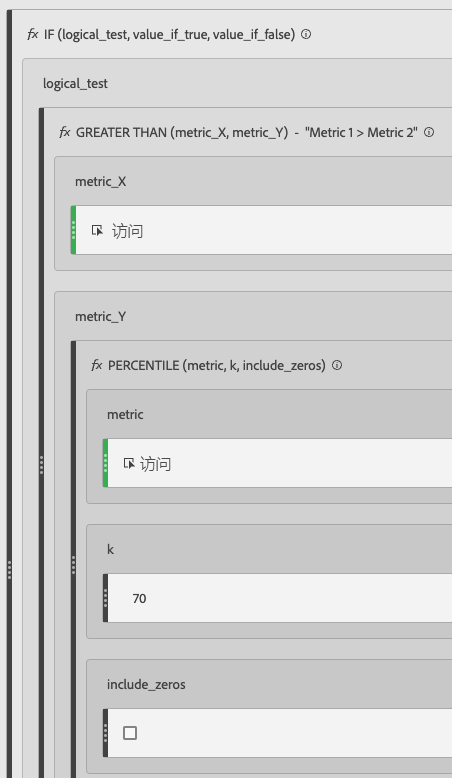
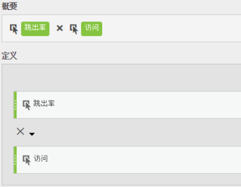

# 筛选和加权指标

显示过滤和加权量度的示例。

## 过滤跳出率 {#section_D42F2452E4464948934063EB6F2DAAB4}

这个简单的过滤量度仅显示访问次数超过 100 的页面的跳出率：

请记住，此公式依赖于一致的时间范围。如果您运行报表的时间范围为一天，则任何访问次数超过 20 的页面都值得查看。如果您运行报表的时间范围为一个月，则可能希望过滤器包含更多的访问次数。

## 通过百分位数过滤的跳出率 {#section_4F3E6D33A1FD438A932FA662B3510552}

此过滤器显示前 30% 的页面（按访问次数排序）的跳出率。

## 加权量度 {#section_F2D16B14569948289CF1310F9E6E3FC2}

假定您希望大致按跳出率排序，但具有更多访问次数的页面应当在列表中的排位更高。您可以创建与如下所示类似的加权跳出率：

