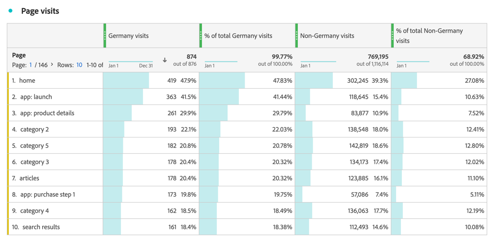

# 分段指标

在[计算量度生成器](cm-build-metrics.md#definition-builder)中，您可以在量度定义中应用区段。 如果您希望在分析中为数据子集使用量度，应用区段会很有帮助。

>[!NOTE]
>
>区段定义通过[区段生成器](/help/components/segmentation/segmentation-workflow/seg-build.md)更新。 如果您对区段进行了更改，则该区段将在任何使用它的地方自动更新，包括如果该区段是计算指标定义的一部分。
>

您希望比较与您的品牌互动的德国人员与德国以外人员的量度。 因此，您可以回答类似下面的问题：

1. 有多少德国和国际人士访问您最受欢迎的[页面](#popular-pages)。
1. 本月[总计](#totals)有多少德国和国际人员与您的品牌进行了在线互动。
1. 访问您热门页面的德国人和国际人士的[百分比](#percentages)是多少？

请参阅以下部分，以说明分段量度如何帮助您回答这些问题。 在适当的情况下，会参考更详细的文档。

## 受欢迎页面

1. [从名为`Germany`的Workspace项目创建计算量度](../cm-workflow.md)。
1. 在[计算量度生成器](cm-build-metrics.md)中，[创建一个名为`Germany`的区段](/help/components/segmentation/segmentation-workflow/seg-build.md)，该区段正在使用“国家/地区”字段。

   >[!TIP]
   >
   >在计算量度生成器中，您可以使用组件面板直接创建区段。
   >   

   您的区段可能如下所示。

   

1. 返回计算指标生成器，使用该区段更新计算指标。

   

对计算指标的国际版本重复上述步骤。

1. 从您的Workspace项目创建一个名为`Non Germany visits`的计算指标。
1. 从计算量度生成器中，创建一个名为`Not Germany`的区段，该区段使用您CRM数据中的CRM国家/地区字段来确定人员的来源。

   您的区段应当如下所示。

   

1. 返回计算指标生成器，使用该区段更新计算指标。

   

1. 在Analysis Workspace中创建一个项目，该项目可让您查看德国和非德国访客访问的页面。

   

## 总计

1. 创建两个基于总计的新计算指标。 打开之前创建的每个区段，重命名该区段，将&#x200B;**[!UICONTROL 人员]**&#x200B;的&#x200B;**[!UICONTROL 度量类型]**&#x200B;设置为&#x200B;**[!UICONTROL 总计]**，并使用&#x200B;**[!UICONTROL 另存为]**&#x200B;以使用新名称保存该区段。 例如：

   德国

1. 在您的Workspace项目中添加一个新的自由格式表可视化图表，以显示今年的总页面数。

   

## 百分比

1. 创建两个新的计算量度，以根据您之前创建的计算量度计算百分比。

   

1. 更新您的Workspace项目。

   

