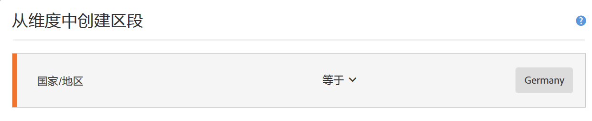
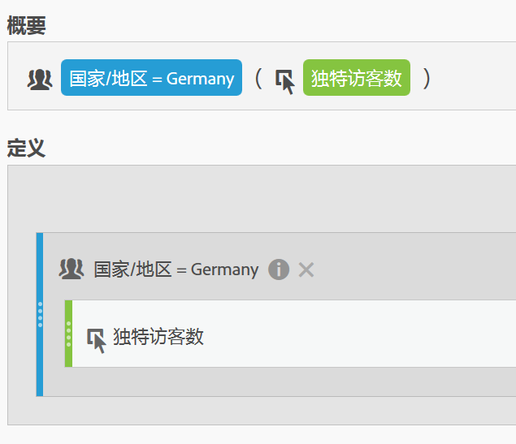
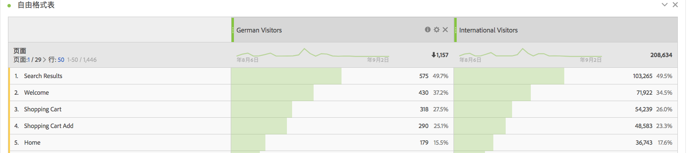
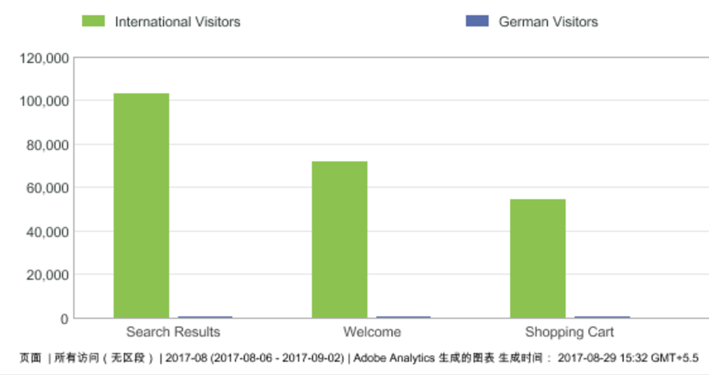
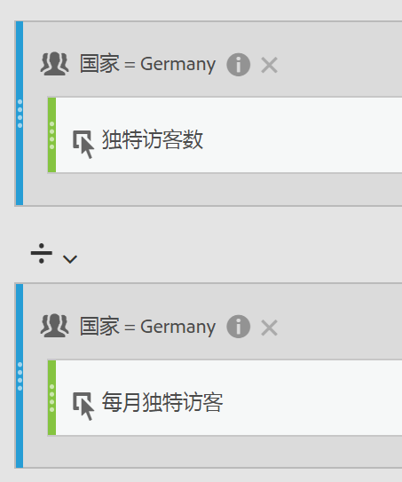
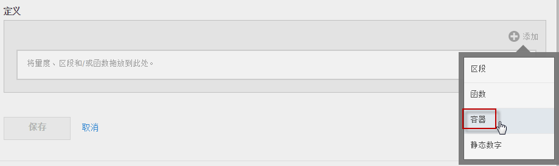
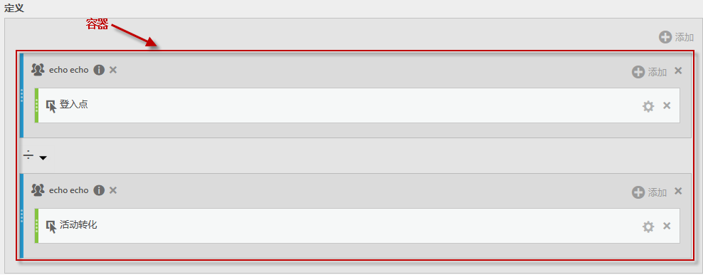
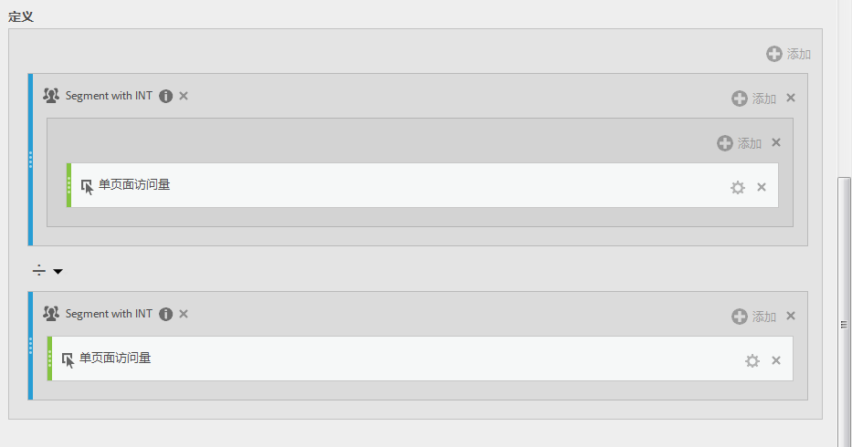

# 分段量度

对单个量度分段允许您对同一报表内的量度进行比较。（仅限派生量度）

## 比较区段 {#section_29A6E0070F084BFDB6228FA9CE106F48}

如果您要将“美国访客”区段的各个方面与“国际访客”区段的各个方面进行比较，您可以创建量度为您提供如下分析：

* 两个群组之间的内容浏览行为是如何比较的？（另一个示例为：两个区段之间的转化率是如何比较的？）
* 以占总访客数的百分比来表示，有多少美国访客浏览了特定页面，同时又有多少国际访客浏览了特定页面？
* 在这些不同区段所访问的内容方面，存在的最大差别是什么？

让我们探讨第一个问题：两个群组之间的内容浏览行为是如何比较的？

1. 如果您没有可比较的区段，请在计算量度生成器中创建一个名为“德国访客”的内部区段，其中“国家/地区”等于“德国”。将“国家/地区”维度拖动到“定义”画布中，并选择“德国”作为值：

   

   >[!NOTE]
   >
   >您也可以在[区段生成器](https://marketing.adobe.com/resources/help/zh_CN/analytics/segment/seg_build.html)中执行此操作，但是我们已在计算量度生成器中提供了维度，从而简化了工作流程。

   >[!NOTE]
   >
   >“内部”表示该区段在左边栏的&#x200B;**[!UICONTROL 区段]**&#x200B;列表中不可见。但是，您可以将鼠标悬停在该列表旁边的“i”图标上，然后单击&#x200B;**[!UICONTROL 设为公用]**。

1. 如果您没有可比较的区段，请创建一个名为“国际访客”的区段，其中“国家/地区”不等于“德国”。
1. 通过将“德国”区段拖到“定义”画布中，并将独特访客量度拖到其内部，生成并保存名为“德国访客”的量度。

   

1. 对国际访客区段和独特访客量度重复执行步骤 3，以便创建“国际访客”量度。
1. 在 Analysis Workspace 中，将&#x200B;**[!UICONTROL 页面]**&#x200B;维度拖动到自由格式表中，并将两个新的计算量度拖动到顶部且使它们彼此相邻：

   

1. 或者，在 [!UICONTROL Reports &amp; Analytics] 中，打开[!UICONTROL 页面]报表，并单击&#x200B;**[!UICONTROL 显示量度]**，然后应用新的“美国访客”和“国际访客”分段量度，以查看他们的内容浏览行为是如何比较的。

   

## 比较合计百分比 {#section_846CB89725F04388AE0352DB20189EE8}

您可以通过比较以正常百分比表示的访客浏览行为，引入另一级别的查询。为此，请创建两个新量度：“德国访客总数 %”和“国际访客总数 %”：

1. 将德国（或国际）访客区段拖放到画布中。
1. 将另一个德国（或国际）访客区段拖放到下方。但这一次，请单击其配置（齿轮）图标以选择量度类型“合计”。格式应当为“百分比”。运算符应当为“除以”。您最终会获得以下量度定义：

   

1. 将此量度应用于您的项目：

   

## 以百分比形式比较差别（使用容器）{#section_13D6353259B74C09B37BA6378A501938}

如果您要快速了解美国和国际浏览行为之间的最大差别，则可以创建另一个可减去彼此百分比的量度。为此，您可以使用容器功能，以有效地使用圆括号括住 2 组量度。

1. 在“[!UICONTROL 定义]”画布中，单击&#x200B;**[!UICONTROL 添加]** &gt; **[!UICONTROL 容器]**：

   

1. 将之前创建的“美国访客总数 %”量度放入第一个容器中 - 它会扩展为以下完整定义：

   

1. 在下方创建另一个容器，并将“国际访客总数 %”量度拖放到其中。
1. 将 2 个容器之间的运算符更改为减号 (-)。

   

1. 保存量度（确保您已将其命名为“美国和国际之间以 % 形式表示的差别”）。
1. 在应用于报表后，您可以轻松地了解以百分比形式表示的最大差别所在，并且可以对报表进行相应的排序。

   

