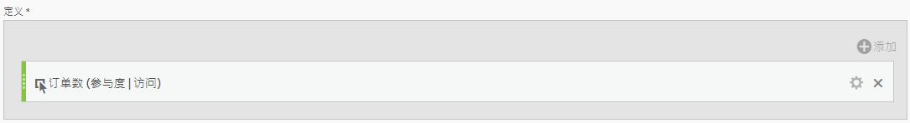
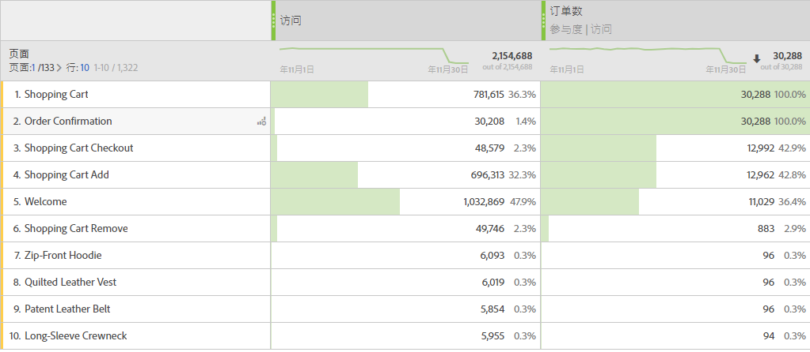

# 参与量度

下面是一个简单的用例：您是内容所有者，并且希望查看包含订单的访问(参与)访问的页面。以下是具体操作方法：

>[!NOTE]
>
>您过去必须通过Admin Tools执行此操作。您仍然可以在“管理员工具”中启用参与量度，但是仅限于自定义事件 1 - 100。

以下是一个简单的使用案例：假设您是一位内容的所有者，您希望了解一下有哪些页面促成了（参与了）包含电子邮件注册的访问。操作步骤如下：

1. 在计算量度生成器中创建新量度。
1. 将成功事件“订单”拖到定义画布中。
1. Change the [attribution model](../../../../../components/c-calcmetrics/c-workflow/cm-workflow/c-build-metrics/m-metric-type-alloc.md#concept_B7A1FCFEFA9D4C4883208ACE8C9C8E5E) of that event to **[!UICONTROL Participation]** under the **[!UICONTROL Settings]** gear. Select **[!UICONTROL Visit]** lookback. 定义应该类似于：

   

1. 保存该量度。
1. Use the calculated metric in a **[!UICONTROL Pages]** report.

   

1. (可选)与组织中的其他用户共享量度。

