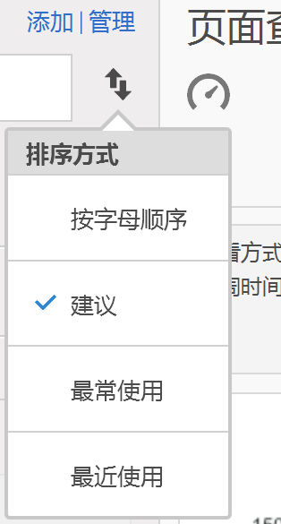
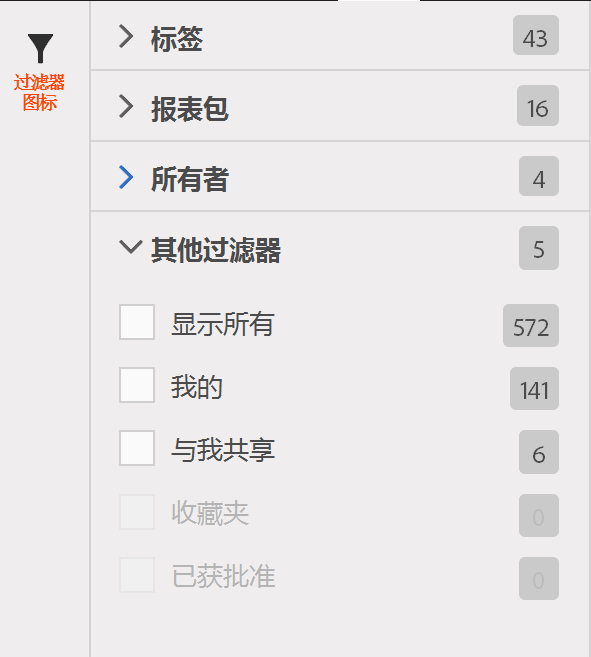

# 查找指标

描述用于查找量度的两种主要方式：排序和过滤。

## 排序 {#section_89F9C4D515084F5796F2A54D468BF6C8}

当您打开报表并单击报表左侧的“量度”图标  以调出“量度”边栏时，“量度选择器”中的&#x200B;**排序方式]下拉菜单中会选择四个排序选项：[!UICONTROL **

| 选项 | 何时使用 |
|---|---|
| 按字母顺序 | 当您知道名称时，此选项非常有用。 |
| 推荐 | 报表中的常用量度 - 它由后端从用户经常在此报表中使用的量度收集而来。 |
| 经常使用 | 当您是新用户并需要查看报表中经常使用的量度时，此选项非常有用。 |
| 最近使用 | 当您正在处理项目且反复使用相同的量度集时，此选项非常有用。 |

## 过滤 - 高级选择 {#section_33818CC048C04F098703AC229693F8CA}

When you open a report and click the Metrics icon, then click **[!UICONTROL Manage]**. 现在，单击“过滤器”图标。您可以通过多种方式进行过滤。

<table id="table_269081BC9DF54FFDA4E949FFC7488F42"> 
 <thead> 
  <tr> 
   <th colname="col1" class="entry"> 如果您希望 </th> 
   <th colname="col2" class="entry"> 则按以下方式排序 </th> 
  </tr>
 </thead>
 <tbody> 
  <tr> 
   <td colname="col1"> 显示该报表包中的所有量度 </td> 
   <td colname="col2"> 其他过滤器 &gt; 显示所有 </td> 
  </tr> 
  <tr> 
   <td colname="col1"> 仅显示您拥有的量度 </td> 
   <td colname="col2"> 其他过滤器 &gt; 我的 </td> 
  </tr> 
  <tr> 
   <td colname="col1"> 显示他人与我共享的量度 </td> 
   <td colname="col2">所有者或 
 其他过滤器 &gt; 与我共享 
 </td> 
  </tr> 
  <tr> 
   <td colname="col1"> 仅显示已获公司批准的量度 </td> 
   <td colname="col2"> 已批准 </td> 
  </tr> 
  <tr> 
   <td colname="col1"> 过滤您正在处理的项目的量度 </td> 
   <td colname="col2">标记之一 </td> 
  </tr> 
 </tbody> 
</table>

