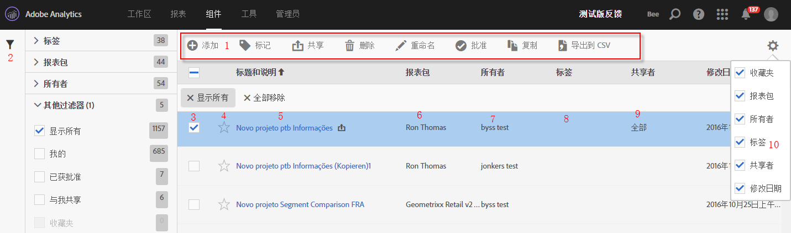

# 计算量度管理器

计算量度管理器提供了多种管理量度的方式，如共享、过滤、标记、批准、复制、删除和标记为收藏。

计算量度管理器显示了您拥有的所有区段以及与您共享的区段。管理员级别的用户可以查看组织内的所有自定义量度。此概述说明了计算量度管理器的用户界面和功能。其访问方式如下：

* Going to **[!UICONTROL Analytics]** &gt; **[!UICONTROL Components]** in the left navigation. Then click **[!UICONTROL Calculated Metrics]**.

| UI 功能 | 描述 |
|---|---|
| 计算量度管理工具栏 | 选中某个量度后，此工具栏即会显示。大多数管理任务都可以通过此工具栏完成。 |
| 显示/隐藏过滤器 | 单击“显示过滤器”，即会出现过滤器菜单。您可以按“标记”、“报表包”、“所有者”、“显示所有”（仅管理员）、“与我共享”、“我的”、“收藏夹”和“已批准”进行过滤。 |
| 复选框 | 选中某个自定义量度可管理该量度。 |
| 收藏次数 | 单击某量度旁边的星形标记可将该标记变为黄色并将此量度标记为收藏。 |
| 区段标题和描述 | 在计算量度生成器中提供。要编辑标题和描述，请单击标题链接，这可以让您返回计算量度生成器。 |
| 报表包 | 此列指示量度最后保存时所在的报表包。 |
| 所有者 | 指示谁拥有该自定义量度。如果您不是管理员，则只能看到您拥有的量度或与您共享的量度。 |
| 标记 | 显示应用到量度的标记，这些标记由您自己或与您共享该区段的人添加。 |
| 共享人 | 列出您共享该区段的个人或组（仅管理员）或所有人（仅管理员）。 |
| 列选择器 | 允许您选择或取消选择计算量度管理器中的列，以便您能够自定义视图。 |
| 共享图标(未显示) | 指示该自定义量度是由您共享，还是由他人与您共享。 |
| 已批准图标(未显示) | 指示该自定义量度已获管理员批准。 |