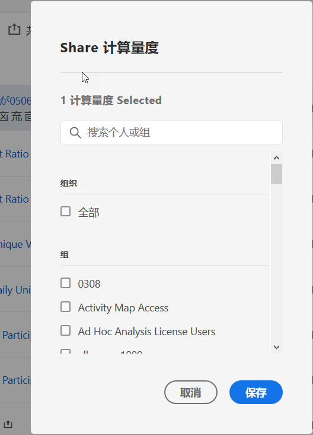

# 共享计算指标

根据您的权限，您可以与整个组织、群组或个人用户共享量度。

| 角色 | 权限 |
|---|---|
| 管理员 | 可以与“所有人”、“群组”和“用户”共享量度。组在管理控制台内设置为权限组。 |
| 非管理员 | 可以仅与个人用户共享量度。 |

相比于与用户群组或个人用户共享，什么时候应当与整个公司共享量度？下面是可能需要遵循的一些最佳实践：

* 作为管理员，如果某个量度对整个公司都有用，或者每个人都能熟练使用，那么就应当与&#x200B;**[!UICONTROL 所有人]共享该量度。**&#x200B;这种情况下，还应当考虑将其设为已批准的量度。
* 作为管理员，如果某个量度为团队带来良好的商业价值，那么就应当将该量度与特定&#x200B;**[!UICONTROL 群组]共享。**
* 作为管理员或个人用户，可将量度与其他个人用户共享，以便审查和验证该量度。如果经证实没有用处，则可以放弃。请不要正式批准此类型的量度。

1. 在计算量度管理器中，选中要共享的量度旁边的复选框。此时将显示任务栏：

   

1. 单击&#x200B;**[!UICONTROL 共享]图标。**

   

   如果您是管理员，则可以选择&#x200B;**[!UICONTROL 所有人]**&#x200B;或组织中的&#x200B;**[!UICONTROL 群组]和（向下滚动到）**&#x200B;用户&#x200B;**。**&#x200B;如果您不是管理员，则只能看到个人用户。可使用&#x200B;**[!UICONTROL 搜索]字段搜索群组或用户。**

1. 单击&#x200B;**[!UICONTROL 共享]**。

   “共享”图标显示在量度旁边：

1. You can filter on metrics shared with you by going to **[!UICONTROL Filters]** &gt; **[!UICONTROL Other Filters]** &gt; **[!UICONTROL Shared with Me]**.

