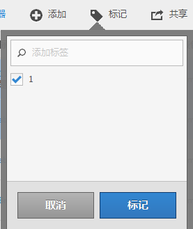

# 标记计算量度

在计算量度管理器中，您可以通过标记区段来组织区段。

所有用户均可为计算量度创建标记，并将一个或多个标记应用于量度。但是，您只能查看您所拥有的或与您共享的那些计算量度的标记。

>[!TIP]
>
>最有用的标记类型通常是基于以下条件的标记：
>
>* **团队名称**，例如社交媒体营销或移动营销。
>* **项目** （分析标记），例如登入页面分析。
>* **类别**，例如“女性”或“地理”。
>* **工作流**，如要批准或策划的（特定的业务部门）

## 将标记应用到计算量度

1. 在Adobe Analytics中，选择 [!UICONTROL **组件**] > [!UICONTROL **计算量度**].

1. 在计算量度管理器中，选中要标记的任何量度旁边的复选框。

   

1. 在 **[!UICONTROL 标记计算量度]** 对话框：

   * 添加新标记。 在中键入名称 [!UICONTROL **添加标记**] 字段，然后按Enter。
   * 选择一个或多个要应用于所选量度的现有标记。

1. 选择 [!UICONTROL **保存**] 以应用标记。

## 查看应用的标记

1. 在Adobe Analytics中，选择 [!UICONTROL **组件**] > [!UICONTROL **计算量度**] 以转到计算量度管理器。

1. 在计算量度管理器中，标记显示在 [!UICONTROL **标记**] 列。 （单击右上角的齿轮图标可管理您的列。）

## 按标记过滤量度

1. 在Adobe Analytics中，选择 [!UICONTROL **组件**] > [!UICONTROL **计算量度**] 以转到计算量度管理器。

1. 在计算量度管理器中，选择 **筛选** 图标，然后选择要作为筛选依据的标记。

   仅显示具有您选择的过滤器的量度。
