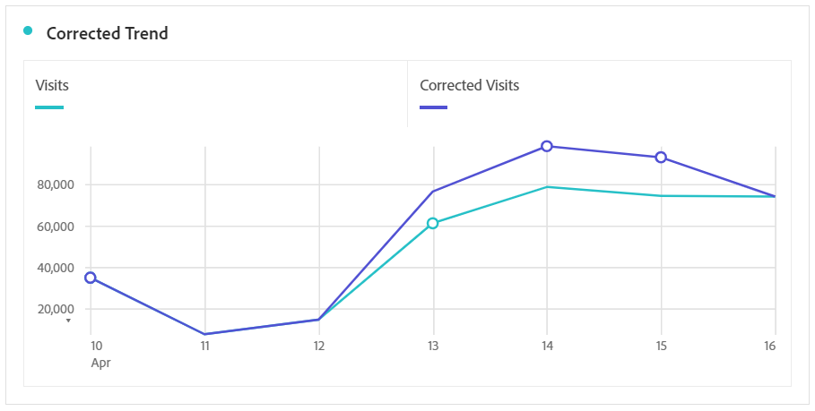

# 派生受事件影响的数据

如果数据受 [到事件影响](/help/technotes/event-impacted.md)，则可以使用计算量度在事件持续期间派生趋势值。 例如，如果您的事件导致数据下降25%，则可以将该数据用作计算量度中的乘数。 如果您没有时间或资源使用数据源或数据插入API将数据插入Adobe Analytics [，则此方](/help/import/c-data-sources/datasrc-home.md) 法很有帮助 。

>[!NOTE] 当您从细分和日期比较角度了解事件的影响时，这些步骤最有效。 确保在此页 [面之前，将受事件影响的日期与之前的进行比较](/help/analyze/analysis-workspace/components/calendar-date-ranges/compare-event.md) ,  并排除分析中的特定日期。

1. 如排除分析中的特定日期中所述，为“受影响的日期”和“排除受影响的日 [期”创建两个区段](../c-segmentation/use-cases/exclude-date-range.md)。
2. 导航到 **[!UICONTROL 组件]** >计 **[!UICONTROL 算量度]**。
3. 单击&#x200B;**[!UICONTROL 添加]**。
4. 将以上两个区段拖动到定义画布。 将它们之间的运算符更改 `+` 为总和。
5. 在两个区段内添加所需的量度。 例如，您可以使用“访问”量度。

   

6. 单 **[!UICONTROL 击]** “受影响的天数”容器右上角的“添加”，然后单击“静 **[!UICONTROL 态”编号]**。 将静态数字设置为要偏移数据的百分比，如将受事件影响的日期与先前范围 [进行比较下所述](/help/analyze/analysis-workspace/components/calendar-date-ranges/compare-event.md)。 在此示例中，偏移量为25%或1.25。

   

7. 在趋势自由格式表中并排应用“已更正”的度量。 事件以外的所有日期都反映其正常度量计数，而所有受影响的日期都使用乘数偏移。

   

8. 视图行可视化中的数据，查看更正的度量的效果。

   
